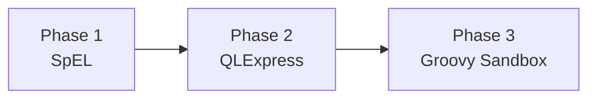
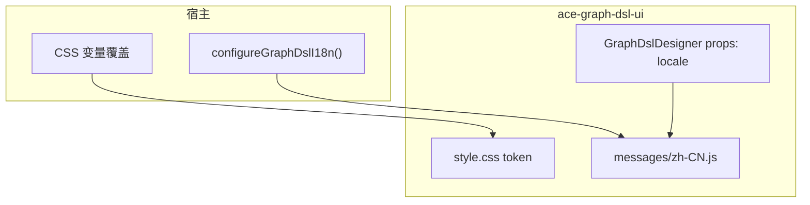

# Ace Graph DSL — 剩余规划项说明与落地方案

> 版本：v1.0  
> 日期：2026-07-01  
> 基于：[FUTURE_OPTIMIZATION_PLAN.md](./FUTURE_OPTIMIZATION_PLAN.md) v1.5  
> 适用范围：`ace-graph-dsl-backend` / `ace-graph-dsl-ui`

---

## 1. 文档目的

在 [FUTURE_OPTIMIZATION_PLAN.md](./FUTURE_OPTIMIZATION_PLAN.md) 整体进度梳理基础上，对**尚未完成或需进一步说明**的规划项给出具体方案、现状说明与建议落地顺序。

部分项经团队决策**暂缓**，本文一并记录，避免与「未实施」混淆。

---

## 2. 暂缓项（记录即可）

| 项 | 编号 | 处理 |
|----|------|------|
| 前端 dist / `.d.ts` / npm 私服 | 3.2 | **暂缓** — 现有 `file:` 依赖 + `dist` 构建链路可继续用于本地联调 |
| Spring Security 集成示例文档 | 4.4 | **暂缓** — `MENU_PERMISSION_INTEGRATION.md` 已有片段可参考 |
| 单元 / 集成测试扩展 | P3 | **暂缓** — 维持现有 3 个单测类（约 12 用例）现状 |

---

## 3. 7.2 多脚本引擎 — 具体方案

### 3.1 现状

- 已有 `ScriptEngine` 接口 + `ScriptEngineRegistry`（自动收集 Spring `ScriptEngine` Bean）
- 默认仅注册 `AviatorScriptEngine`（含共享线程池 + 执行超时）
- 脚本节点、条件边均通过 `engine` / `conditionEngine` 字段选择引擎
- 前端 `ScriptNodeEditor` 写死 `engine: 'aviator'`

### 3.2 推荐分期（由轻到重）



| 阶段 | 引擎 | 定位 | 预估工作量 | 依赖 |
|------|------|------|------------|------|
| **Phase 1** | **SpEL** | 单行表达式、Spring 原生、零重型依赖 | 2–3 人日 | 无（Spring 内置） |
| **Phase 2** | **QLExpress** | 多行业务规则、阿里系生态 | 3–5 人日 | `com.alibaba:QLExpress` |
| **Phase 3** | **Groovy Sandbox** | 复杂脚本、集合/闭包 | 5–8 人日 | `groovy` + 沙箱配置 + 安全评审 |

> **不建议一期全上**：先 SpEL + QLExpress 覆盖约 90% 场景，Groovy 单独安全评审后再启用。

### 3.3 后端实现要点

#### 3.3.1 统一引擎契约（复用现有接口）

```java
// ace-graph-dsl-core/.../script/ScriptEngine.java（已有）
public interface ScriptEngine {
    String engineId();           // "aviator" | "spel" | "qlexpress" | "groovy"
    void validate(String script);
    Object compile(String script);
    Object execute(Object compiled, ScriptExecutionContext ctx);
}
```

#### 3.3.2 各引擎实现模式（对齐 AviatorScriptEngine）

- **共享能力**：`executionTimeoutMs`、`executionPoolSize`（可抽 `AbstractTimeoutScriptEngine` 基类）
- **上下文白名单**：仅暴露 `state` / `config` / `vars`，禁止反射、IO、网络
- **SpEL**：`StandardEvaluationContext`，注册 `state` 为 root，`#config` 为变量
- **QLExpress**：`ExpressRunner` + `QLExpressRunStrategy`，关闭 `import`、自定义 `Operator`
- **Groovy**：`GroovyShell` + `SecureASTCustomizer`（禁止 `System`、`Runtime`、`File` 等）

#### 3.3.3 模块与注册建议

```
ace-graph-dsl-core               → ScriptEngine 接口 + Aviator（默认）
ace-graph-dsl-script-spel        → SpelScriptEngine（optional 依赖）
ace-graph-dsl-script-qlexpress   → QLExpressScriptEngine（optional）
ace-graph-dsl-script-groovy      → GroovyScriptEngine（optional，默认不引入 starter）
```

starter 中按开关注册：

```java
@Bean @ConditionalOnProperty("ace.graph.dsl.script.spel-enabled")
ScriptEngine spelScriptEngine(...) { ... }

@Bean @ConditionalOnProperty("ace.graph.dsl.script.qlexpress-enabled")
ScriptEngine qlExpressScriptEngine(...) { ... }
```

#### 3.3.4 新增元数据 API（供前端下拉）

```
GET {base}/script/engines
→ [
     { "id": "aviator", "label": "Aviator 表达式", "multiLine": false },
     { "id": "spel", "label": "SpEL", "multiLine": false },
     { "id": "qlexpress", "label": "QLExpress", "multiLine": true }
   ]
```

在 `ScriptEngineRegistry` 增加 `listEngines()` 即可，**无需改 DSL 模型**。

#### 3.3.5 脚本契约差异（文档 + 校验）

| 引擎 | 返回值约定 | 示例 |
|------|-----------|------|
| aviator | `Map` 或标量 → 包装为 outputKeys | 现有逻辑 |
| spel | SpEL 表达式结果 → 同 aviator 包装 | `#state.score > 60` |
| qlexpress | 脚本最后表达式或 `return` map | 多行 `if/else` |
| groovy | `binding.result` 或 closure 返回值 | 复杂集合操作 |

`GraphValidator` / `ScriptNodeService.validate` 按 `engineId` 分发校验。

### 3.4 前端改动（小）

- `ScriptNodeEditor`：`engine` 下拉改为调用 `GET /script/engines`
- 按 `multiLine` 切换单行 `el-input` / 多行 `el-input type="textarea"`
- 条件边 `PropertyPanel` 同步支持 `conditionEngine` 选择

### 3.5 安全清单（上线前必过）

- [ ] 脚本大小上限（已有 `maxScriptSizeBytes`）
- [ ] 执行超时 + 线程池隔离（已有模式可复用）
- [ ] 引擎级开关（`spel-enabled` / `qlexpress-enabled` / `groovy-enabled`）
- [ ] Groovy 单独安全评审 + **默认关闭**

### 3.6 参考文档

- [NODE_FLEXIBILITY_EXPLORATION.md](./NODE_FLEXIBILITY_EXPLORATION.md) — 引擎对比与分层策略（§3.2–3.3）

---

## 4. 6.4 主题 token 与 i18n — 方案

### 4.1 现状

- 文案硬编码中文（如 Toolbar「保存草稿」「发布确认」）
- 颜色写死在 scoped CSS（`#e4e7ed`、`#303133`）
- 宿主嵌入时风格/语言难以与业务系统统一

### 4.2 目标

**宿主可换肤、可换语言，且不强制引入重型 i18n 框架。**

### 4.3 方案结构



### 4.4 主题 token（CSS 变量）

在 `src/style.css` 根容器定义：

```css
.ace-graph-dsl-designer,
.ace-graph-dsl-manager {
  --agd-color-primary: var(--el-color-primary, #409eff);
  --agd-color-border: var(--el-border-color, #e4e7ed);
  --agd-color-text: var(--el-text-color-primary, #303133);
  --agd-color-bg-toolbar: var(--el-bg-color, #fff);
  --agd-spacing-toolbar: 8px 16px;
  --agd-font-size-title: 14px;
}
```

组件内将硬编码色值替换为 `var(--agd-*)`；默认 fallback 到 Element Plus 变量，宿主只改 `--agd-*` 即可。

### 4.5 i18n（轻量、可扩展）

**不强制 peer `vue-i18n`**，采用「内置默认 + 宿主覆盖」：

```js
// src/i18n/index.js
const messages = { 'zh-CN': { ...defaultZh }, 'en-US': { ...defaultEn } }
let locale = 'zh-CN'

export function configureGraphDslI18n({ locale: l, messages: extra }) {
  if (l) locale = l
  if (extra) merge(messages, extra)
}

export function t(key, params) { /* ... */ }
```

组件内：`t('toolbar.save')` 替代硬编码。

**`GraphDslDesigner` props：**

```js
defineProps({
  locale: { type: String, default: 'zh-CN' },
  title: { type: String, default: undefined }  // 仍支持宿主直传标题
})
```

### 4.6 实施分期

| 阶段 | 内容 | 工作量 |
|------|------|--------|
| P1 | CSS 变量 + Toolbar/Manager 文案外置（zh-CN） | 2–3 人日 |
| P2 | en-US 默认包 + `configureGraphDslI18n` 导出 | 1–2 人日 |
| P3 | 全组件扫一遍（PropertyPanel、ScriptNodeEditor 等） | 2–3 人日 |

### 4.7 宿主接入示例

```js
import { configureGraphDslI18n } from '@acelance/graph-dsl-ui'
import '@acelance/graph-dsl-ui/style'

configureGraphDslI18n({ locale: 'en-US' })

// 自定义覆盖
configureGraphDslI18n({
  messages: { 'en-US': { 'toolbar.save': 'Save Draft' } }
})
```

```css
/* 宿主全局 */
.ace-graph-dsl-designer {
  --agd-color-primary: #1677ff;
}
```

---

## 5. 6.3 版本 diff / 回滚 UI — 具体方案

### 5.1 现状（后端已就绪）

| API | 路径 | 状态 |
|-----|------|------|
| 版本列表 | `GET /definitions/{graphId}/versions` | ✅ |
| 指定版本 | `GET /definitions/{graphId}/versions/{version}` | ✅ |
| 回滚 | `POST /definitions/{graphId}/rollback` | ✅ |
| 当前启用 | `GET /definitions/{graphId}/enabled` | ✅ |

前端：`graphEditor.fetchVersions()` 已在 store 中实现，**无 UI 组件**；Toolbar 无「版本历史」入口；权限 key `graph:rollback` 已定义。

### 5.2 UI 设计

```
Toolbar [保存] [校验] [预览] [发布] [版本历史 ▼]
                              │
                              ▼
                    ┌─────────────────────────┐
                    │ VersionHistoryDrawer    │
                    │ ┌─────────────────────┐ │
                    │ │ v1.2.0  2026-06-30  │ │ ← 当前启用 ★
                    │ │ v1.1.0  2026-06-28  │ │
                    │ │ v1.0.0  2026-06-25  │ │
                    │ └─────────────────────┘ │
                    │ [与当前对比] [回滚到此版本] │
                    │ ┌─ Tab: 结构 diff ─────┐ │
                    │ │ 节点 +2 / -1 / ~3    │ │
                    │ │ 边   +1 / -0 / ~2    │ │
                    │ └──────────────────────┘ │
                    │ ┌─ Tab: JSON diff ─────┐ │
                    │ │ (monaco-diff / 简易) │ │
                    │ └──────────────────────┘ │
                    └─────────────────────────┘
```

### 5.3 组件拆分

| 文件 | 职责 |
|------|------|
| `Designer/VersionHistoryDrawer.vue` | 版本列表 + 操作入口 |
| `Designer/VersionDiffPanel.vue` | 结构 diff + JSON diff |
| `utils/graphDiff.js` | 纯函数 diff 逻辑 |

### 5.4 `graphDiff.js` 核心逻辑（无需后端新接口）

```js
// 输入：baseDef, targetDef（GraphDefinition JSON）
export function diffGraphStructure(base, target) {
  return {
    nodes: diffByKey(base.nodes, target.nodes, n => n.nodeId),
    edges: diffByKey(base.edges, target.edges, e => `${e.from}|${e.type}|${e.to ?? ''}`),
    compile: shallowDiff(base.compile, target.compile),
    meta: { displayName, description, keyStrategies }
  }
}
```

- **结构 diff**：按 `nodeId` / 边签名对比增删改，列表展示「节点 `foo`：config 变更」
- **JSON diff**：`JSON.stringify(def, null, 2)` 两侧对比；可选 `diff` 库或 Monaco Diff Editor（若不想加依赖，用左右两栏 + 高亮行即可）

### 5.5 交互流程

1. 点击「版本历史」→ `editor.fetchVersions()` + `GET /enabled` 标星当前运行版本
2. 选择版本 → `getVersion(graphId, version)` 拉取完整定义
3. 「与当前对比」→ 左侧为 editor 当前草稿或 enabled 版本，右侧为选中版本
4. 「回滚」→ `ElMessageBox.confirm` → `rollback(graphId, version)` → `editor.loadLatest()` + 刷新画布

权限：`perm.can(MENU.GRAPH_ROLLBACK)` 控制回滚按钮；只读用户可查看 diff。

### 5.6 API 层补充（`graph.js`）

```js
getVersion: (graphId, version) =>
  http.get(`${p}/definitions/${graphId}/versions/${version}`).then(r => r.data),
getEnabled: (graphId) =>
  http.get(`${p}/definitions/${graphId}/enabled`).then(r => r.data),
```

（`rollback` 已存在，无需新增。）

### 5.7 工作量估算

| 任务 | 人日 |
|------|------|
| Drawer + 版本列表 | 1 |
| 结构 diff | 1.5 |
| JSON diff（简易双栏） | 1 |
| 回滚流程 + 权限 | 0.5 |
| Toolbar 接入 | 0.5 |
| **合计** | **约 4–5 人日** |

> **纯前端工作，后端零改动。**

---

## 6. 6.2 多租户隔离 — 情况与预期收益

### 6.1 当前情况

- `graphId` **全局唯一**，持久化 key 形如 `graph:def:{graphId}`（Redis）或表主键 `graph_id`
- API 无 `tenantId` 入参；权限 SPI 仅有 `currentPrincipal()`，无租户维度
- 前端 `createGraphApi` 支持透传 `X-Tenant-Id` 请求头，但**后端未消费**
- 脚本节点、checkpoint、审计日志均无租户命名空间

**结论**：适合「一业务一实例」或「单租户私有化」部署；**不适合**多业务线 / SaaS 共用一套实例。

### 6.2 改造范围（架构级，需独立设计评审）

| 层 | 改动 |
|----|------|
| 模型 | `GraphDefinition` 增加 `tenantId`（可选，默认 `default`） |
| 持久化 | Redis key → `{prefix}{tenantId}:graph:{graphId}`；JDBC 增加 `tenant_id` 列 + 联合唯一索引 |
| API | 从 Header `X-Tenant-Id` 或 JWT claim 解析，Repository 查询自动带 tenant 过滤 |
| 权限 | `GraphNodeAccessControl` / `GraphMenuAccessControl` 入参增加 `TenantContext` |
| 运行时 | `GraphRuntime.enabledGraphs` key 改为 `tenantId:graphId` |
| checkpoint | `threadId` 建议加 tenant 前缀，防止跨租户 HITL 状态串线 |

### 6.3 预期收益

| 收益 | 说明 |
|------|------|
| **成本** | 一套集群服务多个业务线 / 租户，降低运维与 license 成本 |
| **隔离** | 图定义、脚本节点、版本、checkpoint 按租户隔离，误操作不跨租户 |
| **权限** | 租户 A 的管理员看不到租户 B 的图与节点 |
| **合规** | 审计日志带 `tenantId`，满足多租户审计要求 |
| **扩展** | 为按租户配额（图数量、脚本节点数）打下基础 |

### 6.4 风险与成本

- 跨切面改造，涉及 persistence / web / security / runtime，**预估 2–3 周 + 数据迁移方案**
- 需明确：租户 ID 来源（网关透传 vs 库内解析）、默认租户兼容策略、历史数据迁移路径

### 6.5 建议

若近期只有单租户部署，可继续采用「一实例一租户」；确有 SaaS 需求再单独立项。与 6.3 / 6.4 **无强依赖**，可并行规划。

---

## 7. SemVer 发布 — 情况说明

### 7.1 当前状态

| 制品 | 版本 | 消费方式 |
|------|------|----------|
| `ace-graph-dsl-backend` | `1.0.0-SNAPSHOT` | demo `pom` 写死 SNAPSHOT |
| `ace-graph-dsl-ui` | `1.0.0`（package.json） | demo `file:../../../ace-graph-dsl-ui` |
| 两者版本号 | **未对齐** | 无 CHANGELOG、无 git tag 发布流程 |

### 7.2 为何标为「待办」

SemVer 不仅是代码问题，更是**发布策略 + 制品仓库**的团队决策：

1. **版本对齐**：backend `1.x.y` 与 UI `1.x.y` 是否同号（建议 major.minor 对齐，patch 可独立）
2. **私服**：Maven（Nexus/Artifactory）+ npm 私服地址与账号
3. **SNAPSHOT → Release**：`mvn deploy` 与 `npm publish` 流程
4. **demo 切换**：`file:` / `SNAPSHOT` → 固定版本号如 `1.0.0`
5. **破坏性变更**：DSL / API 变更时升 major，并编写 migration guide

### 7.3 建议最小发布路径（待团队决策后执行）

```
1. 定版 1.0.0（backend 去 SNAPSHOT，UI 已是 1.0.0）
2. 打 git tag：v1.0.0-backend / v1.0.0-ui
3. mvn deploy + npm publish（需私服配置）
4. demo 依赖改为正式坐标
5. 维护 CHANGELOG.md（按 Conventional Commits）
```

> 在 3.2（npm 私服）暂缓期间，UI 仍可 `file:` 联调；SemVer 主要影响**对外交付**与**多项目版本锁定**，不影响本地开发。

---

## 8. CI 流水线 — 情况说明

### 8.1 文档 vs 仓库

[FUTURE_OPTIMIZATION_PLAN.md](./FUTURE_OPTIMIZATION_PLAN.md) v1.5 记载：

> `.github/workflows/ace-graph-dsl-ci.yml` — backend `mvn verify` + frontend `npm ci && build`

**当前工作区未找到该文件**（`ace-graph-dsl-backend` 与仓库根目录均无 `.github/workflows`）。

可能原因：

1. 文档先行，workflow **尚未提交**到本仓库
2. workflow 位于**其他远程仓库**或 monorepo 上层
3. 使用**内网 CI**（Jenkins / GitLab CI）未同步到 git

### 8.2 文档预期内容（便于补建）

```yaml
# 触发路径：ace-graph-dsl-backend/**、ace-graph-dsl-ui/**
jobs:
  backend:
    - JDK 17 temurin
    - mvn -B verify（core 模块 skipTests=false 会跑约 12 个单测）
  frontend:
    - Node 20
    - npm ci && npm run build
```

### 8.3 现状影响

- **无自动化门禁**：PR 可能引入编译失败或单测回归而不自知
- **与文档不一致**：新人按 FUTURE_OPTIMIZATION_PLAN 会以为 CI 已存在

### 8.4 建议选项

| 选项 | 说明 |
|------|------|
| **A. 补提交 GitHub Actions** | 与文档一致，适合开源 / 对外仓库 |
| **B. 改用 GitLab / Jenkins** | 更新文档路径，避免误导 |
| **C. 继续暂缓** | 在 README 注明「CI 未配置，请本地执行 verify + build」 |

### 8.5 本地验证命令

```bash
cd ace-graph-dsl-backend && mvn -B verify
cd ace-graph-dsl-ui && npm ci && npm run build
```

---

## 9. 建议落地顺序（暂缓项之外）

| 优先级 | 项 | 理由 |
|--------|-----|------|
| 1 | **6.3 版本 UI** | 纯前端、后端 API 已就绪、运维价值高，约 1 周 |
| 2 | **6.4 主题 / i18n P1** | 嵌入体验明显提升，可与 6.3 并行 |
| 3 | **7.2 Phase 1 SpEL** | 复用现有 SPI，改动可控 |
| 4 | **CI 补建或更新文档** | 低成本，消除文档与仓库不一致 |
| 5 | **6.2 多租户** | 有明确 SaaS 需求再立项 |
| 6 | **SemVer** | 对外正式发布前一次性处理 |

---

## 10. 相关文档

| 文档 | 说明 |
|------|------|
| [FUTURE_OPTIMIZATION_PLAN.md](./FUTURE_OPTIMIZATION_PLAN.md) | 总体规划与 v1.5 已实施记录 |
| [NODE_FLEXIBILITY_EXPLORATION.md](./NODE_FLEXIBILITY_EXPLORATION.md) | 脚本引擎对比与节点灵活性设计 |
| [MENU_PERMISSION_INTEGRATION.md](./MENU_PERMISSION_INTEGRATION.md) | 菜单权限 SPI（含 Spring Security 片段） |
| [LIBRARY_EMBEDDING_ROADMAP.md](./LIBRARY_EMBEDDING_ROADMAP.md) | 库化嵌入路线图 |
