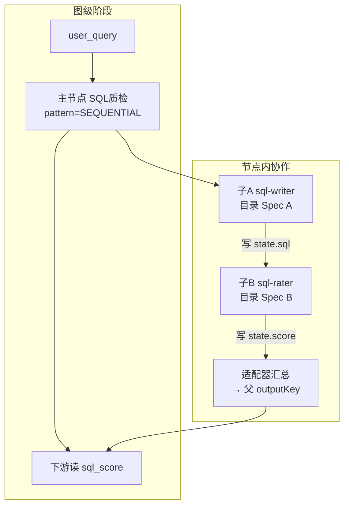

# ACE Graph DSL：多智能体高阶模式 FAQ 与统一口径

> 文档类型：疑问澄清 / 统一口径（问答整理）  
> 状态：生效口径  
> 日期：2026-09-28  
> 读者：产品、业务编排、平台研发、评审  
> 关联文档：  
> - [ACE-Graph-DSL-高阶模式集成目标说明.md](./ACE-Graph-DSL-高阶模式集成目标说明.md)（四模式 × 图级边分层详解）  
> - [ACE-Graph-DSL-多智能体中期规划.md](./ACE-Graph-DSL-多智能体中期规划.md)  
> - [ACE-Graph-DSL-多智能体初步技术方案.md](./ACE-Graph-DSL-多智能体初步技术方案.md)  
> - [ACE-Graph-DSL-多智能体内核选型.md](./ACE-Graph-DSL-多智能体内核选型.md)

本文汇总讨论中已澄清的疑问，避免同一问题在评审、设计器文案、实现分工上再次漂移。

---

## 0. 总口径（先背这三句）

1. **图管阶段，节点管内协作。** 图边 / FanOut / 条件边管业务阶段；SAA 四种模式管某一阶段内部的多子 Agent 协作。  
2. **四种 pattern 由框架内置；业务只在设计器配骨架 + 引用已注册子 Agent，不必手写 `*.builder()`。**  
3. **主节点 Spec ≠ 子 Agent Spec 的整份拷贝。** 父管编排；子各有能力 Spec；绑定层只写本次协作的 instruction / outputKey。  
4. **高阶节点挂载现行 = NodeAction（方式 A）；确认可导出再升 B。** 始终是 ACE 图上一个节点，不是第二套编排。  
5. **GenericAgent → subAgent：优先官方 Agent 接口薄适配**；禁止默认走反射/内部 API。  
6. **ROUTING：用 Framework 自带路由类，不造轮子**；类名以 BOM 为准，不拿图条件边冒充。  
7. **AgentScope 子 Agent：优先官方 `spring-ai-alibaba-starter-agentscope`**；不是换成 AgentScope 主编排。  
8. **子 Agent 记忆：中期不做 READ_WRITE**；默认 `NONE`（父图记忆约定不变）。  
9. **M1 不改 SSE**；子步骤先靠日志；是否扩展子步骤事件留 **M4 再定**。

---

## 1. 图级并行 vs 节点内 Parallel，是不是一回事？

### 问

> SAA Parallel 是不是管节点内部并行？ACE 现有 `parallel=true` FanOut 是不是管图中节点之间的并行？

### 答

**是。** 两层并行，效果可能像，抽象层不同。

| | 图级（ACE 已有） | 节点内（SAA Parallel，要集成） |
|--|------------------|-------------------------------|
| 对象 | 图上多个 **业务节点** | 一个高阶节点里的多个 **子 Agent** |
| 配置 | 边 `parallel=true` + `FanOutNodeAction` | `pattern=PARALLEL` + `subAgents[]` |
| 画布 | 能看到多条分支节点 | 通常只看到 **一个** 复合节点 |
| 职责 | **阶段之间**谁和谁一起跑 | **阶段内部**多专家怎么并发、怎么合并 |

```text
图级 FanOut（已有）:
  START → 调度
             ├─[parallel]→ 节点「客服话术」 ─┐
             └─[parallel]→ 节点「排查清单」 ─┴→ 汇总 → END

节点内 Parallel（集成目标）:
  START → 节点「并行调研」(SAA_WORKFLOW / PARALLEL)
                ├─ 子Agent 网搜
                ├─ 子Agent 库查
                └─ merge → research_result
          → 分析节点 → END
```

**禁止：** 「接了 ParallelAgent = 重做图并行」；「有了 FanOut 就不用 Parallel」。二者分层并存，可叠用，中期不必一上来叠很深。

四模式完整对照见 [高阶模式集成目标说明](./ACE-Graph-DSL-高阶模式集成目标说明.md)。

---

## 2. 「节点内协作，不替代图边」是中期临时口径，还是长期目标？

### 问

> 中期规划 §3 / §5「必达四种模式 → 节点内协作，不替代图边」——这是 SAA 集成的长期目标吗？

### 答

**是长期分层架构原则；中期是按该原则把四种模式做出来。**

| 时间盒 | 含义 |
|--------|------|
| **中期必达** | 设计器可配 Sequential / Parallel / Routing / Loop；子 Agent 默认可引用 GenericAgent |
| **长期仍坚持** | 图边继续管跨阶段主编排；Framework 继续管节点内协作——**不会**演变成「用 SequentialAgent 替换整张业务图」 |
| **远期加的** | Supervisor / Handoff / Debate、模式模板市场等——仍是多一种 pattern / 模板，**不推翻分层** |

不是「中期先这样、长期再换编排内核」。

---

## 3. 高阶节点：只能代码内置，还是设计器可配？

### 问

> 业务同学拖一个高阶节点——模式只能框架代码内置吗？还是 UI 也能配置注册？

### 答

**拆两层，不要混：**

| 层级 | 谁做 | 业务在设计器里 |
|------|------|----------------|
| **模式类型** `pattern`（SEQUENTIAL / PARALLEL / ROUTING / LOOP） | **平台代码内置**（Factory → FlowAgent；未知 pattern 校验拒绝） | 只能 **下拉选择** 已开放的四种；**不能**自己注册第五种类型 |
| **节点实例配置**（选哪个 pattern、哪些子 Agent、键、循环条件） | 写入图 JSON `saaSpec` | **可配、可保存、可发布** |
| **子 Agent 能力** | 现有 GenericAgent **注册目录**（UI 可维护） | 高阶节点里 **引用** `generic:{id}` |

中期不做：UI 发明新 pattern、父节点内再开子画布、「模式模板市场」（远期；中期最多内置示例 JSON）。

---

## 4. 业务侧还要不要写 `SequentialAgent.builder()` 一类代码？

### 问

> 是否只需 ace-graph-dsl 内置模式模板，业务无需重复实现节点代码，设计器填骨架配置即可？

### 答

**对，就是这个目标。**

| 谁 | 做什么 |
|----|--------|
| **框架**（`ace-graph-dsl-saa-agent` 等） | 四种 pattern 实现、校验、编译挂载、状态/流式/轨迹桥接；内部调用 `SequentialAgent.builder()` 等 |
| **业务** | 设计器选 pattern、填 `subAgents` 引用与键、注册/维护子 Agent；**不**手写 FlowAgent 构建 |

例外（仍可能写代码，但不是「再实现一遍模式」）：

- 平台要新开第五种 pattern → 框架扩展  
- 宿主未引入 saa-agent 模块 → 图中出现 `SAA_WORKFLOW` 编译失败  
- 自定义 NodeAction / 脚本 → 与四种模式无关的扩展点  

---

## 5. 子 Agent 的 Spec 怎么定？跟主节点什么关系？

### 问

> 有没有标准/最佳实践（SAA、Claude、Cursor 等）？子 Agent 是沿用主节点全部 Spec、只用一部分，还是可以完全不同？

### 答

**业界主流：主节点只持编排 Spec；每个子 Agent 有自己的能力 Spec；少数字段可 inherit，工具/提示通常不同甚至更窄。**

| 做法 | 是否推荐 |
|------|----------|
| 子 Agent **整份拷贝**主节点 Spec | **不推荐** |
| 少数字段 **inherit**（如 model / 会话权限） | **常见**（Claude/Cursor 默认 `model: inherit`） |
| 每个子 Agent **可有不同于主/兄弟的完整 Spec** | **主流 + ACE 默认** |

### ACE 三层 Spec

```text
父节点 saaSpec     = 编排骨架（pattern、inputKeys、outputKey、Loop 条件…）
子 Agent ref→目录  = 各自完整 GenericAgentSpec（prompt / model / MCP / Skill…）
subAgents[] 绑定层 = 仅协作覆盖：name、instruction、outputKey、impl
```

| Spec 类别 | 放哪 | 子能否 ≠ 父 |
|-----------|------|-------------|
| 编排（pattern、汇合键、maxIterations…） | **仅父** | 子没有这层 |
| 角色能力（prompt、MCP、Skill、专属模型） | **子（目录 ref）** | **应当可以不同** |
| 本次协作输入（instruction + `{stateKey}`） | **绑定层** | 必不同 |
| 会话级默认（可选 inherit） | 父可声明 default | 中期可先不做，全靠子自己的 Spec |

**明确不做：** 在 `subAgents` 里再嵌一整份 `GenericAgentSpec`（防双份漂移）；也不把父的 prompt/MCP 整包套到每个子。

### 与外部实践对齐（摘要）

| 来源 | 做法 |
|------|------|
| **SAA** | 父 = FlowAgent 壳；子 = 各自 ReactAgent（独立 instruction / outputKey / model / 工具） |
| **Claude Code** | 子 = 独立 frontmatter + prompt；`tools` 可收窄；`model` 默认 inherit |
| **Cursor** | `.cursor/agents/*.md` 独立 Spec；可不同 model / readonly；上下文隔离 |

---

## 6. 明确例子：主节点 vs 子 Agent 配置效果

### 场景

用户：「把本月销售额按门店汇总」。  
图上一个高阶节点「SQL 质检」：子 A 生成 SQL，子 B 打分；下游只读父 `sql_score`。

### 分层示意（txt）

```text
┌─────────────────────────────────────────────────────────────────┐
│  ACE 图（阶段）                                                  │
│                                                                  │
│   START ──► [意图] ──► 【SQL质检 / SAA_WORKFLOW】 ──► [输出] ──► END
│                              │                                   │
│                              │ 对外只暴露：                       │
│                              │   inputKeys = user_query          │
│                              │   outputKey = sql_score           │
└──────────────────────────────┼───────────────────────────────────┘
                               ▼
┌─────────────────────────────────────────────────────────────────┐
│  主节点 saaSpec =「怎么协作」（编排壳）                            │
│                                                                  │
│    pattern     = SEQUENTIAL                                      │
│    inputKeys   = user_query                                      │
│    outputKey   = sql_score                                       │
│    streamKind  = BIZ                                             │
│    （一般不写完整 prompt / mcpKeys）                              │
│                                                                  │
│    subAgents[]：                                                 │
│      ┌─ name=sql_gen   ref=generic:sql-writer   instruction=…    │
│      └─ name=sql_rate  ref=generic:sql-rater    instruction=…    │
└───────────────┬─────────────────────────────┬────────────────────┘
                ▼                             ▼
┌──────────────────────────┐    ┌──────────────────────────┐
│ 子 A（目录规格）          │    │ 子 B（目录规格）          │
│ generic:sql-writer       │    │ generic:sql-rater        │
│ prompt: 你是 SQL 专家…   │    │ prompt: 你是 SQL 质检…   │
│ model:  gpt-4o           │    │ model:  qwen-plus        │
│ mcp:    [db-meta-mcp]    │    │ mcp:    []               │
│ skill:  [sql-style]      │    │ skill:  [sql-score-rubric]│
│ 绑定 outputKey → sql     │    │ 绑定 outputKey → score   │
└──────────────────────────┘    └──────────────────────────┘
```

### 执行流（flowchart）



### 配置效果表

**主节点（设计器「多智能体模式」）**

| 字段 | 示例 | 效果 |
|------|------|------|
| `pattern` | `SEQUENTIAL` | 先 A 后 B |
| `inputKeys` | `user_query` | 从全局 state 取用户问题 |
| `outputKey` | `sql_score` | 下游边只依赖此键 |
| `subAgents[0]` | ref=`generic:sql-writer`，instruction 含 `{user_query}`，outputKey=`sql` | 用 A 的能力 Spec + 本次指令 |
| `subAgents[1]` | ref=`generic:sql-rater`，instruction 含 `{sql}`，outputKey=`score` | 用 B 的能力 Spec；可读 A 的结果 |

**子 A / B（注册目录，可事先配好）**

| | 子 A | 子 B | 相对主节点 |
|--|------|------|------------|
| prompt | 生成规范 SQL | 按量表打分 | **都不同**；主无专家 prompt |
| model | 强模型 | 便宜模型 | **可不同** |
| MCP | 有库表元数据 | 无（防乱改库） | **不是照抄主节点** |
| Skill | sql-style | sql-score-rubric | **各管各的** |

### 跑一轮 state（txt）

```text
进主节点前:
  user_query = "把本月销售额按门店汇总"

子A 跑完:
  sql = "SELECT store_id, SUM(amount) ..."

子B 跑完:
  score = "0.82"

出主节点后（图下游）:
  sql_score = { "sql": "...", "score": "0.82" }   # 或按适配器策略只写约定结构

下游 [输出]:
  读 sql_score；不建议直接依赖子中间键 sql / score（校验警告）
```

### 错误 vs 正确

```text
❌ 主节点配齐 prompt+MCP+模型，两个子「全部继承主 Spec」
   → 角色糊在一起；评分 Agent 也连写库 MCP

✅ 主节点只配 SEQUENTIAL + 键 + 子引用
   子 A / B 各自目录 Spec（可完全不同）
   绑定层用 instruction 串 {user_query} → {sql} → score
```

### Parallel 时主/子关系同样成立

```text
主节点: pattern=PARALLEL, outputKey=research_bundle
  ├─ 子A ref=generic:web-search   （网搜 MCP）
  └─ 子B ref=generic:kb-search    （知识库 MCP）
合并 → research_bundle

主节点仍无「网搜+知识库」超级 Spec；
并行的是两个不同 Spec 的子 Agent。
```

---

## 7. 四模式 × 图级能力速查

| 模式 | 节点内（集成） | 图级已有近似 | 互相替代？ |
|------|----------------|--------------|------------|
| Sequential | 子 Agent 固定顺序 | `normal` 边串多节点 | **否** |
| Parallel | 子 Agent 并发+合并 | FanOut `parallel=true` | **否** |
| Routing | 子 Agent 间分流 | 条件边 `conditional` | **否** |
| Loop | 退出条件+最大轮次 | 工具自循环 / 弱自环边 | **否**（HITL 驳回回流用图+HITL） |

详解与防偏清单：[高阶模式集成目标说明](./ACE-Graph-DSL-高阶模式集成目标说明.md)。

---

## 8. 设计器 / 评审一句话纠偏

| 偏差说法 | 纠正 |
|----------|------|
| Parallel 集成 = 做图并行 | 图并行已有；集成的是节点内 Parallel |
| 有了 FanOut 就不用 Parallel | FanOut 管阶段；Parallel 管节点内协作 |
| Sequential 把 ztc 三节点合成一个 | **禁止**整图收成 Sequential |
| Routing = 条件边换实现 | 条件边跳图节点；Routing 选 subAgent |
| Loop 用边指回自己就行 | 一等能力是 Loop 模式，不是裸自环 |
| 子 Agent 必须继承主节点全部 Spec | 父编排、子能力；子 Spec 可不同 |
| 业务还要写 builder 才能用四种模式 | 框架内置；业务 UI 配骨架即可 |
| 「节点内不替代图边」只是中期权宜 | **长期架构原则** |

建议 UI 分组并列，禁止合成一个「并行」菜单：

- **图编排**：串行边 / 并行边 / 条件边 / 子图 / HITL  
- **高阶多智能体（节点内）**：Sequential / Parallel / Routing / Loop  

---

## 9. 高阶节点如何挂进 ACE 图？（Q1：A vs B）

### 问

> FlowAgent 是否暴露 `asNode` / `CompiledGraph`？是不是还要用另一套方式挂到图里？

### 答（定案 2026-09-28）

**不是另开编排。** 高阶模式节点始终是 ACE 图上的 **一个** `addNode(nodeId, …)`。  
Q1 只选该节点内部的 **技术胶水**：

| 方式 | 含义 | 地位 |
|------|------|------|
| **A. NodeAction 适配器** | `toAction()` 里调 `flowAgent.invoke/stream`，读写 `OverAllState` | **现行必达（M0～M2）** |
| **B. 子图 CompiledGraph** | 若可 `asNode()` / 导出图，则 `addNode(id, compiled)`，类 SUBGRAPH | **后续增强**；确认可导出且收益明确后再升 |

```text
ACE StateGraph
  ├─ 普通节点 → NodeAction
  └─ SAA_WORKFLOW
        ├─【A 现行】NodeAction { flowAgent.invoke…; 写 outputKey }
        └─【B 增强】挂 FlowAgent 导出的 CompiledGraph
```

| 易混说法 | 纠正 |
|----------|------|
| 「先 A = 高阶节点不进图」 | 错。进图；只是用 NodeAction 包一层 |
| 「升 B = 换成 Framework 主编排」 | 错。仍是 ACE 图上同一 nodeId |
| 「M0 必须先能导出 B 才能做模式」 | 错。M0 验 **A 可跑**；不能 B **不阻** M1 |
| 「A→B 要改设计器 / DSL」 | 错。只换挂载实现 |

详解与适配器职责：[开发设计与计划 §4.4](./ACE-Graph-DSL-SAA高阶模式节点-开发设计与计划.md)。

---

## 10. GenericAgent 怎么变成 FlowAgent 的子 Agent？（Q2）

### 问

> 「GenericAgent 包成 subAgent 的官方接口形态」是什么意思？是不是高阶节点又变花样了？

### 答（定案 2026-09-28）

**不是改产品形态。** 高阶节点还是 `SAA_WORKFLOW`；子 Agent 仍引用 `generic:{id}`。  
Q2 只解决：**SAA 的 `subAgents(...)` 要 Framework 认的类型，ACE 的 GenericAgent 不是那个类型——用哪张包装纸。**

| 路径 | 做法 | 地位 |
|------|------|------|
| **官方 Agent 接口** | 实现/包装为 BOM 文档要求的 `Agent`（或等价 subAgent 类型），内部仍调 GenericAgent | **现行优先** |
| **非官方变通** | 反射、内部 API、绕过 GenericAgent 自拼 | **禁止默认可发布**；仅官方不可行时附录 A + 评审 |

```text
Q1（外面）: ACE 图 ──NodeAction──► FlowAgent
Q2（里面）: FlowAgent.subAgents ──官方 Agent 壳──► 内委 GenericAgent
```

| 易混说法 | 纠正 |
|----------|------|
| 「Q2 = 不用 GenericAgent 了」 | 错。还用；只是外面多一层官方类型 |
| 「Q2 = 和 Q1 二选一」 | 错。Q1 管挂图，Q2 管子 Agent 变身，同时生效 |
| 「官方接不上就偷偷反射上线」 | 禁止。须附录记录并评审 |
| 「要在 subAgents 里再写一份完整 Spec」 | 禁止。仍只 `ref` + instruction/outputKey |

详解：[开发设计与计划 §5.2](./ACE-Graph-DSL-SAA高阶模式节点-开发设计与计划.md)。

---

## 11. Routing 用哪个类？（Q3）

### 问

> 「Routing 实现类名（LlmRoutingAgent 等）」是什么意思？是不是还要自己写一套路由？

### 答（定案 2026-09-28）

**不要自己写选路。** `pattern=ROUTING` 时，Factory 组装 **SAA Framework 自带的路由 Agent**。  
`LlmRoutingAgent` 只是文档里常见叫法；**确切类全名以所用 BOM 为准**，M2 写入附录 A——**原则已定，不因类名微调重开产品讨论。**

| 做法 | 是否允许 |
|------|----------|
| Framework 路由类 + Q2 包装后的 subAgents | **现行必达** |
| 自研 LLM+if-else 选子 Agent 当作 ROUTING | **禁止** |
| 图 `conditional` 边做阶段分流 | **允许（图级）**，不要标成节点内 ROUTING |
| 条件边冒充 `SAA_WORKFLOW`+ROUTING | **禁止** |

```text
图条件边:  分流 → 不同【图节点/阶段】
节点内 ROUTING: Framework 路由类 → 选不同【subAgent】（同一高阶节点内）
```

详解：[开发设计与计划 §4.6](./ACE-Graph-DSL-SAA高阶模式节点-开发设计与计划.md)。

---

## 12. AgentScope 桥接坐标？（Q4）

### 问

> 「AgentScope 桥接坐标」是什么？是不是要用 AgentScope 换掉 ACE 图？

### 答（定案 2026-09-28）

**不是换主编排。** 「坐标」= Maven 依赖（`groupId:artifactId`）。  
仅当子 Agent `impl=AGENTSCOPE` 时，**优先引官方 `spring-ai-alibaba-starter-agentscope`**（与 graph-core 同一 BOM），少自研 Msg 桥。

| 路径 | 地位 |
|------|------|
| `spring-ai-alibaba-starter-agentscope` | **现行优先（M3）** |
| 直接 `agentscope-core` + 自写桥 | **仅兜底**（starter 不够用时附录+评审） |
| AgentScope Pipeline 替换图边 | **禁止** |

```text
subAgents
  GENERIC_AGENT → 默认（M1）
  AGENTSCOPE    → starter-agentscope 包装 → 仍读 ACE 目录 + 按 key 取资源
```

详解：[开发设计与计划 §5.4](./ACE-Graph-DSL-SAA高阶模式节点-开发设计与计划.md)。

---

## 13. 子 Agent 要不要 READ_WRITE 记忆？（Q5）

### 问

> 高阶节点里的子 Agent，要不要也像业务节点一样 `READ_WRITE` 写记忆？

### 答（定案 2026-09-28）

**中期先不做。** 子 Agent 默认 **`NONE`**（不写 remote）。  
多个子各自 READ_WRITE 容易和父图 thread 形成双记忆源、假 USER，和 ace-graph「按节点即时落盘」也难对齐。

| 项 | 结论 |
|----|------|
| 子 Agent READ_WRITE | **不做（本计划）** |
| 默认 | `NONE` |
| 可选弱能力 | 只读沿用父 thread（不写）；成本高可一律 NONE |
| 父图 / 高阶节点自身记忆 | **不变**，仍按项目记忆落盘约定 |
| 再开时机 | 中期后专项（合并策略、writeUser、display_content 等） |

```text
父图落盘：继续按节点即时 remote
子 A/B/C：中期不各自 READ_WRITE
```

详解：[开发设计与计划 §5.5](./ACE-Graph-DSL-SAA高阶模式节点-开发设计与计划.md)。

---

## 14. SSE 要不要加子步骤事件？（Q6）

### 问

> 高阶节点内部有多个子 Agent，SSE 要不要改协议，让前端能收到「子步骤开始/结束」？

### 答（定案 2026-09-28）

| 阶段 | 结论 |
|------|------|
| **M1** | **只打服务端日志**；**不修改 SSE 协议**；流式仍以父节点聚合 |
| **M4** | **再定**是否扩展 SSE；不预设必须扩展；试运行子步骤树可先做、不依赖改协议 |

```text
M1:  SSE → 父增量（现有协议）    日志 → 子步骤
M4:  再选 不扩展 / 扩展（须契约评审）
```

| 易混说法 | 纠正 |
|----------|------|
| 没 SSE 子事件就看不到子步骤 | M1 有日志；M4 可有试运行树 |
| M1 先改一点字段 | **禁止** |
| M4 一定要改 SSE | **否**，再定 |

详解：[开发设计与计划 §7.1](./ACE-Graph-DSL-SAA高阶模式节点-开发设计与计划.md)。

---

## 15. 文档索引

| 想查什么 | 去哪 |
|----------|------|
| 四模式分层拓扑与选用场景 | [高阶模式集成目标说明](./ACE-Graph-DSL-高阶模式集成目标说明.md) |
| 中期必达 / 非目标 / M1–M4 | [中期规划](./ACE-Graph-DSL-多智能体中期规划.md) |
| `saaSpec` JSON、Factory、校验 | [初步技术方案](./ACE-Graph-DSL-多智能体初步技术方案.md) |
| 为何选 SAA Framework、AgentScope 角色 | [内核选型](./ACE-Graph-DSL-多智能体内核选型.md) |
| 本文这类「问过什么、统一怎么答」 | **本文** |
| Q1～Q6 定案与排期 | [开发设计与计划](./ACE-Graph-DSL-SAA高阶模式节点-开发设计与计划.md) |

---

## 16. 修订记录

| 日期 | 说明 |
|------|------|
| 2026-09-28 | 初版：汇总图级/节点内分层、中长期目标、设计器可配边界、业务免 builder、子 Spec 最佳实践与 SQL 质检示例 |
| 2026-09-28 | 增补 §9：Q1 挂载定案（先 A，确认可导出再升 B） |
| 2026-09-28 | 增补 §10：Q2 定案（优先官方 Agent 接口包装 GenericAgent） |
| 2026-09-28 | 增补 §11：Q3 定案（Framework 自带路由类，不造轮子） |
| 2026-09-28 | 增补 §12：Q4 定案（优先 spring-ai-alibaba-starter-agentscope） |
| 2026-09-28 | 增补 §13：Q5 定案（子 Agent READ_WRITE 记忆中期先不做） |
| 2026-09-28 | 增补 §14：Q6 定案（M1 不改 SSE；扩展与否 M4 再定） |
