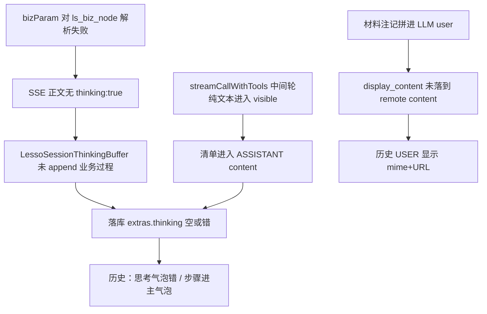

# 历史回放错乱 + `write_file` 无回调：根因与方案

| 项 | 内容 |
|---|---|
| 状态 | **问题一 P0/P1 已实现（1.1.1）；问题二 A1 配置 + B1 代码已完成，其余待拍板/实现** |
| 日期 | 2026-09-23（A1/B1 进度更新同日） |
| 证据 | 截图三张 + `lesso-ai-platform-agent-74d7d68857-4tqtx_….log`（runId≈`6c8301fd…` / session≈`034cf130…`、`80211fd7…`） |
| 图 | `ls-vertical-agent-dsl-test`（节点 `agent:intent_node` / `agent:ls_biz_node` / `agent:ls_out_put_node`） |
| 原则 | 对齐 Vertical 的是 **role / extras 语义**；落盘节奏仍按 ace-graph **每节点即时 remote** |

---

## 0. 现象对照（截图）与问题归属

| # | UI 现象 | 归属 | 对应运行态 |
|---|---|---|---|
| A | 实时：`ls_biz_node` 深度思考里「步骤 1/2/3…」，正文少或中断 | **问题二**（过程通道）+ 曾被问题一放大 | 中间轮文本进 visible；thinking 通道未通 |
| B | 实时尾：`No ToolCallback found for tool name: write_file` | **问题一** | 模型幻觉未注册工具名 → 图级失败 |
| C | 历史：USER 区变成 mime + moss URL | **问题二** | remote USER `content` 被材料注记污染 |
| D | 历史：深度思考不对；步骤落在主气泡 | **问题二** | buffer / extras.thinking 空或错；清单进 ASSISTANT `content` |

**结论一句话**：问题一 = 模型幻觉工具名硬失败；问题二 = SSE thinking + 记忆 extras + 可见正文三者串道。二者独立，勿混进同一修复清单。

---

## 1. 问题一：`No ToolCallback found for tool name: write_file`

### 1.1 事实（日志）

本轮 `agent:ls_biz_node` 实际挂载工具（`ToolDeduper` / Local+MCP+Skill）：

| 来源 | 工具名 |
|---|---|
| LOCAL `lesso-skill-shell` | `read_skill`, `execute_command` |
| MCP | `mcp__cc_history_search__…`, `mcp__time-mcp__…`, `mcp__email_or_chat_summary__…` |
| 内置 Skill | `ace__skill__load_skill`, `ace__skill__read_skill_resource` |

**没有任何 `write_file` / `read_file` / 通用文件系统工具。** Skill 写文件一直靠 `execute_command`（shell + python 脚本）。

关键日志（修复前）：

```text
DefaultToolCallingManager : LLM may have adapted the tool name 'write_file'...
StreamingLlmTemplate      : 流式+工具完成: chars=1262, kind=BIZ
AceGraphExecutionController : IllegalStateException: No ToolCallback found for tool name: write_file
  at DefaultToolCallingManager.executeToolCall
  at StreamingToolCallMergingManager.executeToolCalls
  at StreamingLlmTemplate.streamCallWithTools
```

### 1.2 根因

1. **模型幻觉**：长轮次后唤起 Cursor/Claude Code 风格的 `write_file`，本会话从未声明该工具。
2. **框架硬失败**（修复前）：`DefaultToolCallingManager` 找不到 callback → 图中断。
3. **非回归「工具丢了」**：以前能走通是因为模型一直用 `execute_command` 写文件。

### 1.3 解决办法（仅问题一）

| 优先级 | 方案 | 归属 | 状态 |
|---|---|---|---|
| **P0** | **未知工具软降级**：未注册名挂占位 callback，回 `unknown_tool` 提示，继续多轮 | 框架 `StreamingToolCallMergingManager` | **已实现（1.1.1）** |
| ~~P0~~ | ~~System / Skill 硬约束（禁 write_file）~~ | ~~业务 prompt / SKILL.md~~ | **明确不做** |
| **P1** | 工具轮日志：`requestedTools` / `unknownTools` / `knownCount` | 框架 `StreamingLlmTemplate` | **已实现（1.1.1）** |
| P2 | 别名映射 `write_file`→`execute_command` | 业务 | 不推荐，默认不做 |
| — | 注册真实通用 `write_file` | — | 不做 |

**验收**：模型发 `write_file` 时图不崩；下一轮可回到已挂载工具继续。

> 下列项**不属于问题一**：bizParam、display_content、visible 分流、历史气泡拆分 —— 见 §2。

---

## 2. 问题二：实时样式 + 历史回放（USER / 深度思考 / 正文串道）

### 2.1 目标语义（对齐 Vertical 角色，不齐落盘时机）

```
intent:  NONE（或不写记忆）；SSE thinking=true → 意图文案进思考气泡
biz:     READ_WRITE → 节点完成即写 USER(真问题) + ASSISTANT(业务结果，extras.thinking=过程)
out_put: READ_WRITE + writeUser=false → 只写 ASSISTANT 定稿
```

历史回放应读：

- USER：`content` = 用户原话（或 `display_content`）
- ASSISTANT：`content` = 对用户可见定稿；`thinking_content` / extras.thinking = 深度思考气泡

### 2.2 根因链（按因果）



#### （1）`ls_biz_node` 的 SSE `bizParam` 解析失败（已实证）

| 节点 | 结果 |
|---|---|
| `agent:intent_node` | `已解析 thinking=true, nodeDisplay=意图识别` |
| `agent:ls_biz_node` | **`未解析到 LessoSseNodeBizParam`（attrsPresent=true）** → 「正文将无 thinking:true」 |
| `agent:ls_out_put_node` | `已解析 thinking=false, nodeDisplay=结果生成` |

影响：业务过程走普通 `delta`；Buffer 收不到 biz 过程；前端若仍画「深度思考」壳，会造成「看起来像思考、落库却当正文」。

#### （2）流式+工具把「过程自述」算进可见正文（已实证）

无 `toolCalls` 的中间轮「步骤 1/2/3…」全部进入 `visible` → echo 落盘成 ASSISTANT `content`。即使 SSE thinking 修好，若不做过程/终答分流，清单仍可能进主气泡。

#### （3）历史 USER 变成材料块（已实证）

材料注记拼进 LLM user（正确）；但 remote `role=user bytes=785` 含 URL，说明 `display_content` 未落到落库 content。

#### （4）思考气泡 vs 主气泡（截图 D）

| 应有 | 实际 |
|---|---|
| `thinking_content` = 步骤 / 思考 | buffer 空 → extras 空或错 |
| `content` = 定稿（链接等） | content = 多轮步骤拼接 |

出口 `writeUser=false` 日志正确；问题在 **biz 写入的 ASSISTANT 形态**。

### 2.3 实时「当前样式」为何看起来还能忍

请求开了深度思考 UI / intent 先发 `node=深度思考`；biz 过程以普通 delta 涌出仍堆在同一区。历史加载按 remote 字段拆气泡 → 问题暴露。

### 2.4 问题二修复项（与问题一剥离）

**不在本清单**：未知工具软降级、工具名日志、Skill/Prompt 禁 `write_file`（均属 §1）。

| ID | 动作 | 归属 | 对应根因 / 截图 | 状态 / 备注 |
|---|---|---|---|---|
| **A1** | 核对并修正发布图 biz 的 `enableBizParams` / `bizParamInterpreterId=lesso.sse-frame` / `bizParamRaw={"thinking":true,"nodeDisplay":"业务处理"}` | 业务配置 | §2.2(1) | **已完成（配置）**：设计器「LS业务节点」已选 `lesso.sse-frame`，附加参数 `{"thinking":true,"nodeDisplay":"业务处理"}`；需确认已发布到运行环境，跑一轮日志不再出现 `ls_biz_node`「bizParam 未解析」 |
| **A3** | 历史接口确认：USER 优先 `display_content`；ASSISTANT 拆 `thinking_content` vs `content` | 业务 / 前端 | 截图 C/D 验收 | 待做；后端字段空则先修后端 |
| **B1** | `bizParam` 解析失败 WARN 带上 `interpreterId`/`raw`/`enable`；对 `agent:` 前缀 nodeId 做 definition 回退 | Lesso SSE + 框架 Helper | §2.2(1) | **已完成（代码）**：Adapter 增强 WARN；接受 `lesso:sse-frame` 别名；`AceGraphNodeHelper` 支持 `agent:` 去前缀查找；attrs 中 Map 型 raw 转 JSON |
| **B2** | 校验 echo 落盘路径 `display_content` 是否仍在 UserMessage；必要时 remote 侧打 content 长度 vs display 长度 | Lesso 记忆 | §2.2(3)、截图 C | **已完成（代码）**：Template 挂 `display_content` + 材料注记兜底剥离 + 观测日志；Advisor `forMemoryStorage` / codec `encodeContent` 优先 display，无则剥 `[material]` |
| **B3** | 仅 `bizParam.thinking=true` 的增量进 `LessoSessionThinkingBuffer`；写 ASSISTANT 时 drain → remote `thinking_content`；若正文与思考同源则 `content` 置空 | Lesso 记忆 | §2.2(1)(4)、历史接口字段 | **已完成（代码）**：SSE 仅 thinking:true→Buffer；每 READ_WRITE 节点 drain；`attachThinking` 同源置空 + 后缀/前缀去重终答 + merge 已有 THINKING；发版后冒烟确认 remote `thinking_content` |
| **C2** | 工具轮中间文本：不进 `visible`/content，改走 thinking/progress，或仅终答轮进 content | 框架 Template | §2.2(2)、截图 D | **已完成（代码）**：`streamCallWithTools` 仅无 toolCalls 终答轮进 `visible`；中间轮仍 SSE live emit（thinking:true→思考气泡/Buffer），不进记忆 content |
| **C3** | 材料注记只进 LLM user，**禁止**进记忆 USER（单测钉死） | 框架 + Lesso | §2.2(3)、截图 C | **已完成（代码）**：`MediaMaterialSupport.stripMaterialNotes` + Template 兜底；Lesso codec/Advisor 双保险；单测覆盖 encode / writeUser |

已从问题二清单**剔除**（原误放）：

| 原编号 | 内容 | 现归属 |
|---|---|---|
| ~~A2~~ | Skill/Prompt 禁止 `write_file` | 问题一（且已明确不做） |
| ~~C1~~ | 未知工具软降级 | 问题一（1.1.1 已实现） |

### 2.5 问题二建议实施顺序

1. ~~**A1**~~ — **配置已完成**  
2. ~~**B1**~~ — **代码已完成**（Helper 别名 + Adapter WARN/解释器别名）；发版后冒烟确认不再 `bizParam 未解析`  
3. ~~**B2 + C3**~~ — **代码已完成**（display_content + `[material]` 剥离 + 单测）  
4. ~~**B3**~~ — **代码已完成**（drain/去重/merge）；发版冒烟 remote `thinking_content`  
5. ~~**C2**~~ — **代码已完成**（仅终答轮进 visible）  
6. **A3** — 前后端历史字段对齐验收  

---

## 3. 权责边界

| 事项 | 框架 ace-graph-dsl | 业务 lesso-ai-platform |
|---|---|---|
| 未知 tool 名软降级 + 工具轮 name 日志 | **已做（1.1.1）** | — |
| SSE `thinking:true` / nodeDisplay | TokenChunk.attrs 透传；Helper `agent:` 别名（B1） | Interpreter + SseAdapter WARN/别名（B1 **已做**） |
| USER 展示正文 | `MemoryDisplayUserTextResolver` SPI | KeyList（user_query）+ B2/C3 |
| extras.thinking | 不硬编码业务协议 | Buffer + Advisor + remote codec（B3） |
| 工具轮中间文本是否进 content | Template 仅终答轮进 visible（C2 **已做**） | SSE attrs 决定中间轮进思考气泡 |
| 落盘时机 | 每节点完成可写 | Provider 按节点 READ_WRITE；**禁止**改回图尾 |

---

## 4. 非目标

- 注册真实 `write_file` 通用工具  
- System/Skill 文案硬禁 `write_file`（问题一已否决）  
- 把 ace-graph 记忆改成 Vertical「仅图尾写 ASSISTANT」  
- 前端历史组件大改（先保证后端字段正确）

---

## 5. 决策清单（仅剩问题二）

问题一 D1（软降级）已落地；问题二 **A1 配置 + B1/B2/B3/C2/C3 代码已完成**。

- [x] **D3 配置侧（→ A1）** 发布图 biz 已设 `lesso.sse-frame` + `{"thinking":true,"nodeDisplay":"业务处理"}`  
- [x] **D3 代码侧（→ B1）** Adapter WARN / `lesso:sse-frame` 别名 / `agent:` nodeId 回退（Helper）  
- [x] **D2（→ C2）** 工具轮中间文本：仅终答轮进 visible；中间轮 SSE emit、不进记忆 content  
- [x] **D4（→ B2/C3）** display_content：Template 挂元数据 + 材料剥离兜底；codec/Advisor 落库剥 `[material]`  

下一步：**发版冒烟**（A1/B1/B2/B3/C2/C3）+ **A3** 前后端历史字段验收。
