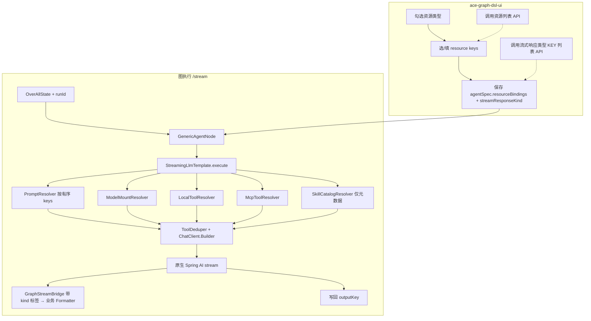
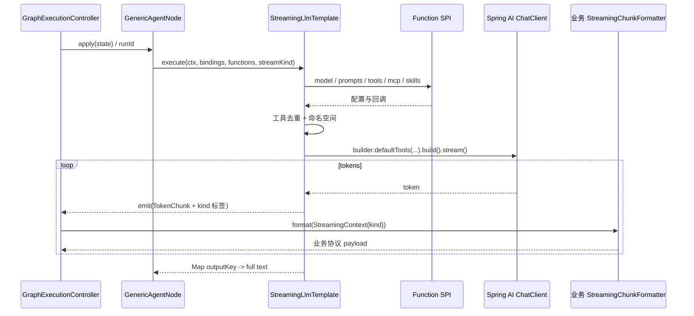
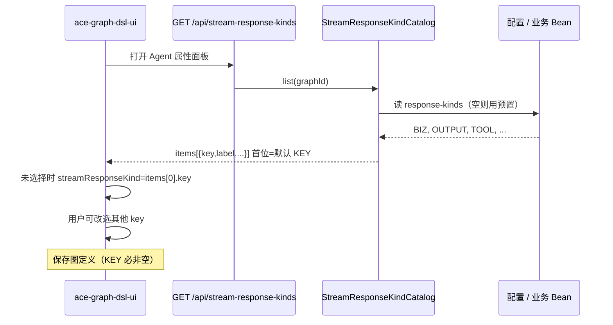
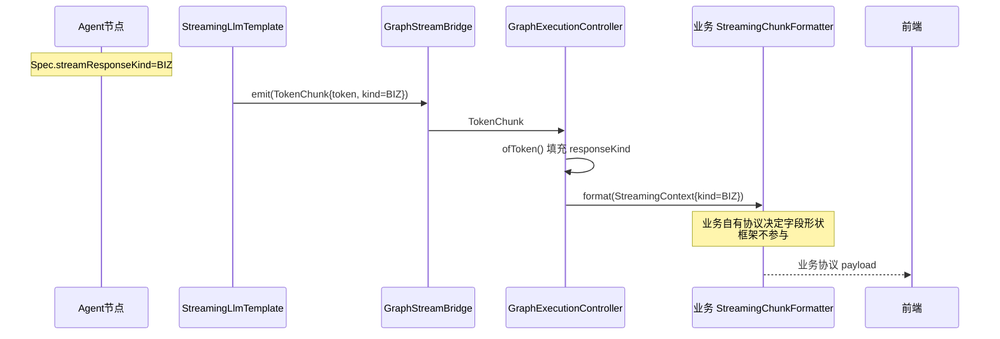

# 流式 LLM 节点模板服务设计方案

> 文档状态：设计稿  
> 适用范围：`ace-graph-dsl-backend` + `ace-graph-dsl-ui`（GENERIC_AGENT / Agent 节点）  
> 关联现状：`GenericAgentNode`、`GenericAgentSpec`、`GraphStreamBridge`、`StreamingChunkFormatter`、`TokenChunk`

### 写给读者：怎么读、怎么写这份方案

这份方案既要给人读，也要给**以后再 review 的人（或模型）**读。写糊了会出现两种成本：读者看不懂；过几轮对话后连作者自己也要靠翻代码、翻聊天记录才能「推断当初定了什么」——那不叫方案，叫谜语。

#### 三条硬规矩

1. **先讲人话，再给类名。** 每一节定案先回答：谁在用、发生什么事、允许怎样、禁止怎样、配在哪里。类名 / 接口名放在「对应代码」里，不能用行话顶替说明。  
2. **禁止「看起来很短、其实要猜」。** 例如不要只写「与图编辑权限对齐」——必须写清：哪些 HTTP 接口、要检查哪把权限钥匙、谁来配置、没配时会怎样。  
3. **缩写首次出现带一句解释**（例如：SPI = 业务可替换的扩展点；宿主 = 接入本框架的业务 Spring Boot 工程）。读者不应被迫翻源码才能懂方案在说什么。

#### 每条「定案」必须自带的五句话（缺一则未写完）

写完一节后，不看聊天记录、不看源码，只读本节，应能直接回答：

| # | 必须写清 | 反面例子（禁止） |
|---|---|---|
| 1 | **一句话结论**（允许 / 禁止 / 默认谁） | 「建议对齐现有能力」 |
| 2 | **作用对象**（哪个角色、哪个界面、哪条接口） | 「相关接口」 |
| 3 | **怎么做**（步骤或表：若 A 则 B） | 「按优先级处理」却不写优先级 |
| 4 | **明确不做什么** | 省略「不做什么」，后人以为范围很大 |
| 5 | **以后怎么验收**（日志长什么样、403、UI 提示等可观察结果） | 「实现时注意」 |

缺口表（§13）里标「已定案」的项，必须能链到满足上表的一节；链过去仍要靠推断的，视为**未闭环**，应改文案而不是改状态。

#### 给以后 review 的提醒

- 优先相信**本节白纸黑字**；聊天摘要、代码现状只能用来找「文案与实现是否一致」，不能用来补「方案没写清的结论」。  
- 若发现某节读完仍要猜：先改方案文案，再继续讨论或编码。

---

## 1. 背景与目标

### 1.1 问题

业务节点（如 Demo 中的 `TranslateJaNode`）往往把「翻译/问答等真实业务」委托给 Service（如 `TranslationService.translate`），而大模型调用本身存在大量共性：

- 提示词从哪里来（Nacos AI / K8s Config / Langfuse / 本地文件等）因项目而异
- 模型配置（base-url、api-key、model-id）常为请求级挂载
- 本地 Tools、MCP 远程工具需要按配置挂载，且需去重
- Skill 只需先暴露元数据，真正用到时再加载全文
- 多模态在节点间传递时，`UserMessage.media` 在序列化边界易丢失
- 不同节点流式 SSE 协议可能不同，需要可插拔的响应类型

### 1.2 目标

在 `ace-graph-dsl-backend` 提供 **流式 LLM 节点模板服务**（建议名 `StreamingLlmTemplate`）：

1. 用原生 Spring AI（`ChatClient` / `ChatClient.Builder` / `stream`）实现骨架
2. 用 `java.util.function` / SPI Function 把「取配置、取资源」交给业务实现
3. 仅面向 **Agent / GENERIC_AGENT** 节点；脚本等其他节点保持原样
4. UI 可勾选节点需要加载的资源类型与 key
5. 支持节点流式响应类型（默认 `BIZ` / `OUTPUT`，可扩展）
6. UI 定义 Agent 节点时必须能选择流式响应方式；后端提供「已实现流式响应类型 KEY」加载接口，供下拉配置（含业务扩展类型）

### 1.3 非目标

- Backend 不绑定具体注册中心（Nacos / K8s / Langfuse 等）实现
- 不改造脚本节点、纯 Java `NodeAction` 的既有语义（可自愿调用 Template）
- 不保证上游 Graph checkpoint 对 `UserMessage.media` 原样恢复（见第 8 节）
- **不定义 SSE 流式输出协议**：框架不规定 `thinking` / `isEnd` / `phase` 等字段，只提供挂载入口让业务已有协议接入（见 §9.0）
- **本期不做 AgentCard**：不设计绑定字段消费、不设计 `AgentCardResolver`、Template 不解析 Card（skill/工具/安全等信息若需要，先走独立 Skill/Tools/MCP 勾选）

---

## 2. 架构简述

| 层 | 职责 | 不负责 |
|---|---|---|
| `StreamingLlmTemplate` | 请求级装配、工具去重、流式桥接、结果写 State | 读 Nacos/K8s/Langfuse |
| Function / SPI Resolver | 按 key 取 Prompt / Model / Tools / MCP / Skill | 节点编排语义 |
| `StreamingChunkFormatter`（业务实现） | **决定 SSE 每帧形状** | — |
| 框架流式层 | 把 `streamResponseKind` 标签无损透传给业务 Formatter | **不定义任何 SSE 字段协议** |
| Agent 节点 | 读 UI 的 ResourceBinding + streamKind，调用 Template | 脚本节点逻辑 |
| UI | 勾选资源类型、填/选 key；经 kinds 接口选择流式响应方式 | 运行时拉真实内容 |
| 流式类型 Catalog API | 暴露可选 kind KEY 列表（配置驱动） | 业务协议内部细节 |

演进关系：现有 `GenericAgentNode` + SPI Bean → 升级为「请求级 Function 注入 + 资源勾选矩阵 + 流式类型标签透传」。

> **协议归属**：SSE 格式由业务项目掌控，框架只提供挂载入口（`StreamingChunkFormatter`，现网已有）。详见 §9.0。

```text
UI(ResourceBinding + streamKind)
        │
        ▼
GenericAgentNode / Agent
        │
        ▼
StreamingLlmTemplate  ── Function 填充 ──► Prompt / Model / Tools / MCP / Skill
        │
        ├── ChatClient.stream()（原生 Spring AI）
        ├── GraphStreamBridge.emit(TokenChunk + StreamResponseKind 标签)
        └── 业务 StreamingChunkFormatter（读 kind，自定协议）──► SSE
```

---

## 3. 总体数据流

### 3.1 资源装配与执行



### 3.2 请求级挂载时序



---

## 4. Function / SPI：把业务选型踢出骨架

### 4.1 设计原则（对应需求 1–4、11）

- 提示词、模型、本地 Tools、MCP：一律通过函数接口 / Resolver 形参获取
- Backend 只提供标准接口；业务用 Nacos、K8s Config、Langfuse 等自行实现
- 模型为 **请求级挂载**：每次请求再解析当前节点需要的模型信息
- Tools / MCP 支持热刷新或每次请求加载（由业务 Resolver 决定缓存策略）
- 模板内部优先使用原生 Spring AI SDK

### 4.2 请求上下文

```java
public record LlmRequestContext(
    String graphId,
    String nodeId,
    String runId,
    OverAllState state,
    ResourceBinding binding
) {}
```

### 4.3 Resolver 接口

```java
/** 按有序 keys 合并提示词（顺序有意义，例如两套 prompt 拼接） */
@FunctionalInterface
public interface PromptContentResolver {
    String resolve(LlmRequestContext ctx, List<String> promptKeys);
}

/** 请求级模型挂载 */
@FunctionalInterface
public interface ModelMountResolver {
    ModelEndpoint resolve(LlmRequestContext ctx, String modelConfigKey);
}

public record ModelEndpoint(
    String baseUrl,
    String apiKey,
    String modelId,
    Map<String, Object> extras
) {}

@FunctionalInterface
public interface LocalToolResolver {
    List<NamedToolCallback> resolve(LlmRequestContext ctx, List<String> toolKeys);
}

@FunctionalInterface
public interface McpToolResolver {
    List<NamedToolCallback> resolve(LlmRequestContext ctx, List<String> mcpKeys);
}

/** Skill：仅目录元数据 */
@FunctionalInterface
public interface SkillCatalogResolver {
    List<SkillDescriptor> resolve(LlmRequestContext ctx, List<String> skillKeys);
}

public record SkillDescriptor(
    String key,
    String name,
    String shortDescription,
    String triggerHint
) {}

/** 真正用到 skill 时再加载 SKILL.md 等正文 */
@FunctionalInterface
public interface SkillContentLoader {
    Optional<String> loadBody(LlmRequestContext ctx, String skillKey);
}
```

业务侧示例（Nacos，示意）：

```java
@Bean
PromptContentResolver nacosPrompts(ConfigService cs) {
    return (ctx, keys) -> keys.stream()
        .map(k -> cs.getConfig(k, "DEFAULT_GROUP", 3000))
        .filter(Objects::nonNull)
        .collect(Collectors.joining("\n\n"));
}
```

未实现时：默认空串 / 空列表 / stub 模型，保证开箱可跑。

### 4.4 与现有 SPI 的关系

现有 `PromptRepository`、`SkillRegistry`、`McpServerRegistry`、`McpToolProvider`、`ChatClientFactory`、`SecretResolver` **接口保留**（不改方法签名语义），Template 内可适配为 Function；新代码优先走 Resolver。

但**模块归属与工具类型有调整**（§12.1 定案）：

| 组件 | 变化 |
|---|---|
| `McpServerRegistry` / `McpToolProvider` / `ChatClientFactory` / `AgentChatClient` | 从 core **迁入 `ace-graph-dsl-ai`**（涉及模型层） |
| `AgentTool` | **删除**。原 `name()` / `call(Map)` 语义由 spring-ai `ToolCallback` + `ToolDefinition` 承担；`McpToolProvider` 返回类型随之改为 `ToolCallback` |
| `PromptRepository` / `SkillRegistry` / `SecretResolver` | 留在 core（返回 String / 纯数据） |

请求级 `ModelOverrideSpec` 与 binding.modelKey **并存**：Override 优先于 binding。

### 4.4.1 模型来源优先级（A5 定案）

#### 优先级链

```text
请求级 ModelOverrideSpec  >  modelConfigKey（需 enableModel=true）  >  节点内联 modelBaseUrl/apiKey/modelId
```

`ModelOverrideSpec` 内部已有自己的两级（现网 `effectiveFor`）：**nodeId 精确覆盖 > global 覆盖**，本方案不改。

**这个顺序的意图**：让注册中心成为模型配置的**权威来源**——改一处 key 指向即可全局切换模型，无需逐个节点改图。节点内联字段退化为**兜底与本地调试**用途（没接注册中心、或临时试某个私有端点时仍可用）。

#### `enableModel` 是什么

它是 `ResourceBinding` 的字段（§7.1），对应 UI 上「`[x] Model`」这个类型总开关，与 `modelConfigKey` 成对出现——与 Prompt / Skill / MCP 是同一套勾选机制：

| 值 | 含义 |
|---|---|
| `true` | 启用「按 key 取模型配置」这一路（第二优先级） |
| `false` | **跳过该路**，不调用 `ModelMountResolver`，连带省掉一次注册中心远程调用；此时静态来源只剩内联字段 |

**它不是「禁用节点」**。`enableModel=false` 时节点照常执行。

#### `modelConfigKey` 解析失败时，是否回落到内联（定案）

因为 key 排在内联**之前**，「解析不出来」就有了歧义，必须区分两种情况：

| 情况 | 行为 | 理由 |
|---|---|---|
| `ModelMountResolver` **抛异常**（key 不存在、注册中心不可达、鉴权失败） | **fail fast，不回落** | 这是配置或环境故障。静默降级到内联会让线上悄悄用错模型——比直接失败危险得多 |
| Resolver **正常返回，但某字段为空**（含返回 `null`） | 该字段**继续取内联** | 空值是「这一路没配这个字段」的正常表达，逐字段回落即可 |

一句话：**异常 = 出错了，要炸；空值 = 没配，往下找。**

#### 逐字段合并，不是整体替换（重要）

三路**不是**「谁赢谁全拿」，而是对 `baseUrl` / `apiKey` / `modelId` **各自独立**取第一个非空值。

原因：请求级覆盖最常见的用法是「只换 `modelId` 做 A/B 对比」，若整体替换，`baseUrl` 与 `apiKey` 就丢了，直接调用失败。现网 `GenericAgentSpec.withOverride` 已是逐字段语义（`ov.modelBaseUrl() != null ? ov.modelBaseUrl() : modelBaseUrl`），此处延续。

举例：Override 只给 `modelId=qwen-max`，`modelConfigKey` 取回完整三项 → 最终 `modelId` 取 Override，`baseUrl`/`apiKey` 取注册中心。

#### 分层职责

| 组件 | 职责 |
|---|---|
| `ModelMountResolver`（业务实现） | **只负责 key 这一路**：按 `modelConfigKey` 从注册中心取配置 |
| `ModelEndpointResolver`（框架内部） | 负责三路合并；按需调用上者 |

这样业务 SPI 保持单一职责，不必关心优先级。

```java
/**
 * 模型端点三路合并解析器（框架内部，非业务 SPI）。
 *
 * <p>优先级：请求级 Override &gt; modelConfigKey（需 enableModel）&gt; 节点内联字段。
 * 逐字段独立取首个非空值，而非整体替换。</p>
 */
public final class ModelEndpointResolver {

    private static final Logger log = LoggerFactory.getLogger(ModelEndpointResolver.class);

    private final ModelMountResolver mountResolver;
    private final SecretResolver secretResolver;

    /** 字段取值来源，仅用于日志与 api-key 还原判定 */
    private enum Source { OVERRIDE, INLINE, CONFIG_KEY, NONE }

    /**
     * 解析本次调用最终生效的模型端点。
     *
     * @param ctx      请求上下文（含 binding）
     * @param inline   节点内联模型字段（可空）
     * @param override 本节点生效的请求级覆盖（可空，已由 ModelOverrideSpec.effectiveFor 解析）
     * @return 非空端点；三路均无有效值时抛出可操作异常
     */
    public ModelEndpoint resolve(LlmRequestContext ctx, InlineModel inline, ModelOverride override) {
        ResourceBinding b = ctx.binding();

        // 第二路惰性解析：enableModel=false 或 key 为空时完全不调远程
        ModelEndpoint fromKey = null;
        if (b.enableModel() && isNotBlank(b.modelConfigKey())) {
            fromKey = resolveByKeyOrFail(ctx, b.modelConfigKey());
        }

        String baseUrl = firstNonBlank(
                override == null ? null : override.modelBaseUrl(),
                fromKey == null ? null : fromKey.baseUrl(),
                inline == null ? null : inline.baseUrl());
        String modelId = firstNonBlank(
                override == null ? null : override.modelId(),
                fromKey == null ? null : fromKey.modelId(),
                inline == null ? null : inline.modelId());

        // api-key 需连带记录来源：只有「内联且已掩码」才走 SecretResolver 还原
        String rawApiKey;
        Source keySource;
        if (override != null && isNotBlank(override.modelApiKey())) {
            rawApiKey = override.modelApiKey();
            keySource = Source.OVERRIDE;          // 请求级传入，视为明文（延续现网语义）
        } else if (fromKey != null && isNotBlank(fromKey.apiKey())) {
            rawApiKey = fromKey.apiKey();
            keySource = Source.CONFIG_KEY;        // 注册中心取回，视为明文
        } else if (inline != null && isNotBlank(inline.apiKey())) {
            rawApiKey = inline.apiKey();
            keySource = Source.INLINE;            // 唯一可能是掩码的来源
        } else {
            rawApiKey = null;
            keySource = Source.NONE;
        }
        String apiKey = (keySource == Source.INLINE && inline.apiKeyMasked())
                ? secretResolver.resolve(ctx.graphId(), ctx.nodeId(), rawApiKey)
                : rawApiKey;

        assertResolved(ctx, baseUrl, modelId, b);
        // 关键节点日志：打印各字段来源，便于排查「覆盖为何没生效」；api-key 只打来源不打值
        log.info("节点 {} 模型解析完成: modelId={}({}), baseUrl={}({}), apiKey来源={}",
                ctx.nodeId(), modelId, sourceOf(override, inline, fromKey, ModelField.MODEL_ID),
                baseUrl, sourceOf(override, inline, fromKey, ModelField.BASE_URL), keySource);
        return new ModelEndpoint(baseUrl, apiKey, modelId, extrasOf(fromKey));
    }

    /**
     * 按 key 解析，异常一律上抛不降级。
     *
     * <p>「Resolver 抛异常」与「返回值字段为空」语义不同：前者是配置/环境故障，
     * 静默回落内联会导致线上悄悄用错模型；后者是「这一路没配该字段」，由调用方逐字段继续回落。</p>
     */
    private ModelEndpoint resolveByKeyOrFail(LlmRequestContext ctx, String modelConfigKey) {
        try {
            return mountResolver.resolve(ctx, modelConfigKey);
        } catch (RuntimeException e) {
            // 不 catch 后静默返回 null：宁可失败，也不静默用错模型
            log.error("节点 {} 按 modelConfigKey={} 解析模型配置失败，不回落内联字段",
                    ctx.nodeId(), modelConfigKey, e);
            throw new IllegalStateException(String.format(
                    "节点 %s 的 modelConfigKey=%s 解析失败：%s。"
                            + "请检查该 key 是否存在于模型配置中心及其连通性；"
                            + "如需临时改用节点内联模型，请取消勾选 Model",
                    ctx.nodeId(), modelConfigKey, e.getMessage()), e);
        }
    }

    /** 三路皆空时给出可操作错误，而非等到调用模型才失败 */
    private static void assertResolved(LlmRequestContext ctx, String baseUrl,
                                       String modelId, ResourceBinding b) {
        if (isNotBlank(baseUrl) && isNotBlank(modelId)) {
            return;
        }
        throw new IllegalStateException(String.format(
                "节点 %s 无法确定模型（baseUrl=%s, modelId=%s）。请任选其一："
                        + "①勾选 Model 并配置 modelConfigKey（当前 enableModel=%s, modelConfigKey=%s）；"
                        + "②在节点上填写内联模型字段；③请求体传 modelOverrides",
                ctx.nodeId(), baseUrl, modelId, b.enableModel(), b.modelConfigKey()));
    }
}
```

`InlineModel` 为内联三字段的载体，由节点从 `GenericAgentSpec` 提取，避免 Template 依赖 Spec 类型：

```java
/** 节点内联模型字段（apiKeyMasked 决定是否需要 SecretResolver 还原） */
public record InlineModel(String baseUrl, String apiKey, boolean apiKeyMasked, String modelId) {}
```

#### 该优先级的已知副作用

`modelConfigKey` 优先于内联，意味着**一旦勾选 Model 并填了 key，节点上原有的内联模型字段就静默失效**。典型场景：某节点长期用内联字段指向一个专用端点跑得很好，后来有人为了统一管理给它勾上了 Model + key，该节点就悄悄换成了注册中心的模型，而界面上两处配置都还在。

相比反向顺序（内联优先），这个副作用**可预期性更好**：勾选 + 填 key 是一次明确的人工操作，而「残留的旧内联字段」是无人记得的历史包袱。但仍需提示。

缓解措施（**必须实现**）：编译期检测「`enableModel=true` 且 `modelConfigKey` 非空，同时内联字段也非空」时打印 warn，明确告知内联字段不会生效及涉及的 `nodeId`。

```java
log.warn("节点 {} 同时存在 modelConfigKey={} 与内联模型字段，按优先级 key 生效、内联字段不会被使用；"
        + "若希望改用内联模型，请取消勾选 Model", nodeId, modelConfigKey);
```

### 4.4.2 Prompt 变量渲染（A4 定案）

#### 先澄清现网实情

`GenericAgentSpec.prompt` 的 javadoc 写着「支持 `{{state.key}}` 占位」，但**该渲染从未实现**：

- `GenericAgentNode#toAction` 把 `spec.inputKeySet()` 对应的 state 值收集成 `variables` Map；
- 连同未渲染的 `promptTemplate` 一起交给 `AgentChatClient.call(promptTemplate, variables, spec)`；
- core 内**没有任何字符串替换**，`StubChatClientFactory` 只是把两者原样回显。

即渲染责任被隐式推给了各 `AgentChatClient` 实现方，且无人实现。因此本节不是「补齐规则」，而是**首次定义**，同时把渲染收归框架层。

#### 五条定案

**① 渲染在框架层完成，交给 Spring AI 的一律是已渲染纯文本**

不使用 Spring AI 的 `PromptTemplate` / `.param()`。原因是 Spring AI 模板用**单花括号** `{key}`，而 prompt 里极常见 JSON 示例（`{"role":"user"}`）与 JSON Schema 片段，交给它会直接解析报错。我们用双花括号 `{{}}` 自渲染，从根上规避。

**② 语法只有一个命名空间，`state.` 前缀可选**

```text
{{state.order_no}}   等价于   {{order_no}}
```

保留 `state.` 是为了兼容已写下的 javadoc 约定；允许省略是因为现网 `variables` Map 的键本就是裸 key。不引入其他命名空间（`env.` / `ctx.` 等），需要时再加。

**③ 单遍扫描，替换值不再参与渲染（安全红线）**

若递归渲染，用户输入 `{{state.internal_api_key}}` 存进 state 后，下一轮就会被展开——**模板注入**。因此严格单遍：一次 `Matcher` 遍历，替换进去的内容不再被扫描。

实现上必须用 `Matcher.quoteReplacement` 包裹替换值，否则值里的 `$` 和 `\` 会被 `appendReplacement` 当作组引用，轻则乱码重则抛异常。

**④ system 与 user 共用同一份变量快照**

「谁先渲染」的实质不是先后，而是**是否看到同一份 state**。定案：进入 Template 时取一次快照，system / user 都用它。二者互不引用，故顺序无语义差别。

多个 `promptKeys` 采用**先按序合并、后统一渲染一次**（而非各自渲染再拼接）。二者结果等价，前者只扫一遍，更省。

**⑤ skill L1 目录与工具目录在渲染之后拼接**

这两段是框架生成的，不该被当成用户模板。若先拼后渲染，skill 描述里恰好出现 `{{...}}` 就会被误替换。

#### 完整装配顺序

```text
1. 取变量快照（依据 inputKeySet，一次读完）
2. 按 promptKeys 顺序合并成 systemTemplate（分隔符 "\n\n"）
3. 单遍渲染 systemTemplate  ← 用户模板到此为止
4. 追加 skill L1 目录 + 工具目录（不渲染）
5. 单遍渲染 userMessage（同一快照）
```

#### 变量取值与类型转换

| state 值类型 | 转换方式 |
|---|---|
| `String` | 原样 |
| 数字 / 布尔 | `toString()` |
| `Map` / `List` / POJO | **JSON 序列化** |
| `null` 或 key 不存在 | 空串 + warn |

`Map`/`List` 必须走 JSON：Java 默认 `toString()` 产出 `{a=1, b=2}`，既非合法 JSON 也不利于模型解析。

#### 缺失变量策略

**默认空串 + warn，可配置切严格模式**（`ace.graph.dsl.prompt.strict-variables=true` 时抛异常）。

不选「保留原样」：把 `{{state.foo}}` 原封不动送进模型是最糟的——模型会把它当字面量学走，且难排查。不默认严格：图执行早期某些可选输入确实可能为空，直接炸太脆弱。

#### 编译期校验（顺带解决 `inputKeys` 手填痛点）

编译期扫描模板中全部占位符，与 `spec.inputKeySet()` 比对：

```java
// 模板里用了但 inputKeys 未声明 → 可达性校验覆盖不到，运行期必空
log.warn("节点 {} 的 prompt 引用了未声明的变量 {}，运行期将渲染为空串；"
        + "请将其补入 inputKeys 以纳入边可达性校验", nodeId, undeclared);
// inputKeys 声明了但模板没用 → 多余的可达性约束，可能挡住本可通过的图
log.warn("节点 {} 的 inputKeys 声明了 {} 但 prompt 未引用，建议移除", nodeId, unused);
```

同一份扫描结果可回吐给 UI 做 `inputKeys` 自动补全，免去手填（P1）。

#### 长度护栏

上游节点输出动辄数十 KB，直接拼进 prompt 会击穿上下文窗口且费用失控。约定**单变量截断上限**与**渲染后总长上限**（默认值走配置），超限截断并 warn，日志给出 `nodeId` 与变量名。

```java
/**
 * Prompt 变量渲染器（框架内部）。
 *
 * <p>严格单遍替换：替换入的内容不再参与后续扫描，避免 state 值携带
 * {@code {{...}}} 造成模板注入。</p>
 */
public final class PromptRenderer {

    private static final Logger log = LoggerFactory.getLogger(PromptRenderer.class);

    /** {{ state.key }} / {{ key }}，允许内部空白 */
    private static final Pattern PLACEHOLDER =
            Pattern.compile("\\{\\{\\s*(?:state\\.)?([A-Za-z0-9_.\\-]+)\\s*}}");

    private final ObjectMapper objectMapper;
    private final PromptRenderProperties props;   // strictVariables / maxValueLength / maxTotalLength

    /**
     * 单遍渲染。
     *
     * @param template  已合并的模板（多 promptKeys 按序拼接后传入）
     * @param snapshot  变量快照，system/user 共用同一份
     */
    public String render(String template, Map<String, Object> snapshot, String nodeId) {
        if (template == null || template.isEmpty()) {
            return "";
        }
        Matcher m = PLACEHOLDER.matcher(template);
        StringBuilder sb = new StringBuilder(template.length());
        while (m.find()) {
            String name = m.group(1);
            String value = stringify(snapshot, name, nodeId);
            // quoteReplacement 必须加：值中的 $ / \ 否则会被当作组引用
            m.appendReplacement(sb, Matcher.quoteReplacement(value));
        }
        m.appendTail(sb);
        return truncateTotal(sb.toString(), nodeId);
    }

    /** 类型归一：集合类走 JSON，避免 Java toString 产出非法 JSON */
    private String stringify(Map<String, Object> snapshot, String name, String nodeId) {
        Object v = snapshot.get(name);
        if (v == null) {
            if (props.strictVariables()) {
                throw new IllegalStateException(String.format(
                        "节点 %s 的 prompt 变量 %s 无值（严格模式）。请检查上游是否写入该 state key，"
                                + "或关闭 ace.graph.dsl.prompt.strict-variables", nodeId, name));
            }
            log.warn("节点 {} 的 prompt 变量 {} 无值，渲染为空串", nodeId, name);
            return "";
        }
        String text = (v instanceof String s) ? s
                : (v instanceof Number || v instanceof Boolean) ? String.valueOf(v)
                : toJson(v, nodeId, name);
        return truncateValue(text, nodeId, name);
    }
}
```

### 4.5 `LlmResolvers` / `LlmCallRequest` / `ChatModelFactory` 完整定义（A6 定案）

#### 4.5.1 先纠正一处概念错位

早期骨架把 `modelResolver()`、`localTools()`、`skillCatalog()` 等**全部当作请求级字段**放进 `LlmCallRequest`，导致该 record 需要 18 个构造参数。

但这些 Resolver 是**单例依赖**（Spring Bean，请求间复用），不是请求数据。二者混在一个 record 里既臃肿又误导——每次调用都要重新传一遍不会变的东西。

**定案：拆成两个对象。**

| 对象 | 生命周期 | 内容 |
|---|---|---|
| `LlmResolvers` | **单例**，构造 Template 时注入一次 | 全部 Resolver / Factory |
| `LlmCallRequest` | **请求级**，每次调用构造 | 本次调用真正变化的参数（8 个字段） |

#### 4.5.2 `LlmResolvers`（单例依赖集合）

```java
/**
 * Resolver 依赖集合（单例）。
 *
 * <p>由 Spring 装配一次后随 {@link StreamingLlmTemplate} 复用；业务未提供某项时
 * 由自动配置回落到默认实现（空串 / 空列表 / stub），保证开箱可跑。</p>
 */
public record LlmResolvers(
    PromptContentResolver prompts,
    PromptRenderer promptRenderer,          // 框架内部：单遍变量渲染（§4.4.2）
    ModelEndpointResolver modelEndpoints,   // 框架内部：三路合并（§4.4.1），内部持有 ModelMountResolver
    ChatModelFactory chatModels,
    LocalToolResolver localTools,
    McpToolResolver mcpTools,
    SkillCatalogResolver skillCatalog,
    SkillContentLoader skillContent,
    SkillResourceLoader skillResources,
    MediaRefResolver media,
    StreamResponseKindResolver kinds
) {
    /** 全部依赖非空校验：缺失项应由自动配置补默认实现，不允许 null 进入运行期 */
    public LlmResolvers {
        Objects.requireNonNull(prompts, "PromptContentResolver 不能为空");
        Objects.requireNonNull(promptRenderer, "PromptRenderer 不能为空");
        Objects.requireNonNull(modelEndpoints, "ModelEndpointResolver 不能为空");
        Objects.requireNonNull(chatModels, "ChatModelFactory 不能为空");
        Objects.requireNonNull(localTools, "LocalToolResolver 不能为空");
        Objects.requireNonNull(mcpTools, "McpToolResolver 不能为空");
        Objects.requireNonNull(skillCatalog, "SkillCatalogResolver 不能为空");
        Objects.requireNonNull(skillContent, "SkillContentLoader 不能为空");
        Objects.requireNonNull(skillResources, "SkillResourceLoader 不能为空");
        Objects.requireNonNull(media, "MediaRefResolver 不能为空");
        Objects.requireNonNull(kinds, "StreamResponseKindResolver 不能为空");
    }
}
```

#### 4.5.3 `LlmCallRequest`（请求级参数）

```java
/**
 * 一次 LLM 调用的请求级参数。
 *
 * <p>{@code binding} 不单独存放，统一从 {@link LlmRequestContext#binding()} 取，
 * 避免同一份配置在两处出现导致不一致。</p>
 */
public record LlmCallRequest(
    LlmRequestContext context,      // 含 graphId/nodeId/runId/state/binding
    String userMessage,             // 本次用户输入（已由节点从 state 取好）
    String outputKey,               // 结果写回 state 的 key
    String streamResponseKind,      // 节点配置的 kind KEY，可空（按 §9.7.4 回落）
    String mediaInputKey,           // 多模态引用所在的 state key，可空表示纯文本
    boolean streaming,              // 是否流式
    ToolConflictPolicy conflictPolicy,
    GraphStreamBridge bridge,       // 非流式时传 GraphStreamBridge.NOOP
    InlineModel inlineModel,        // 节点内联模型字段，可空（§4.4.1 兜底来源）
    ModelOverride modelOverride,    // 本节点生效的请求级覆盖，可空（§4.4.1 最高优先级）
    Set<String> inputKeys           // 变量快照读取范围，来自 spec.inputKeySet()（§4.4.2）
) {

    public LlmCallRequest {
        Objects.requireNonNull(context, "LlmRequestContext 不能为空");
        if (outputKey == null || outputKey.isBlank()) {
            throw new IllegalArgumentException("outputKey 不能为空");
        }
        // userMessage 允许为空串（纯 system + 多模态的场景），但不允许 null
        userMessage = userMessage == null ? "" : userMessage;
        conflictPolicy = conflictPolicy == null ? ToolConflictPolicy.FIRST_WIN : conflictPolicy;
        bridge = bridge == null ? GraphStreamBridge.NOOP : bridge;
    }

    /** 便捷访问：资源勾选配置（唯一来源为 context） */
    public ResourceBinding binding() {
        return context.binding();
    }

    public static Builder builder() {
        return new Builder();
    }

    /** 建造者：字段较多且多为可空，避免长构造器误传 */
    public static final class Builder { /* ... */ }
}
```

#### 4.5.4 `ChatModelFactory`

```java
/**
 * 由模型端点信息创建 spring-ai {@code ChatModel}（位于 ace-graph-dsl-ai，§12.1.3）。
 *
 * <p>与现网 {@code ChatClientFactory} 的区别：本接口返回**原生 ChatModel**，
 * 由 Template 自行 {@code ChatClient.builder(model)} 装配工具与提示词；
 * 而 {@code ChatClientFactory} 返回的是自定义隔离层 {@code AgentChatClient}。</p>
 */
@FunctionalInterface
public interface ChatModelFactory {

    /** 按端点创建（或复用）ChatModel */
    ChatModel create(ModelEndpoint endpoint);
}
```

**默认实现必须缓存**：`ChatModel` 内含 HTTP 客户端与连接池，每请求重建会造成连接风暴与显著延迟。

```java
/**
 * 默认实现：按 {@link ModelEndpoint} 缓存 ChatModel（OpenAI 兼容协议，含 DashScope 兼容模式）。
 *
 * <p>缓存必须有界：请求级模型覆盖可能带入动态 api-key，无界缓存会持续增长直至 OOM。
 * 超过上限时按 LRU 淘汰并打印 warn，便于发现「key 每次都变」的误用。</p>
 */
public class CachingChatModelFactory implements ChatModelFactory {

    private static final Logger log = LoggerFactory.getLogger(CachingChatModelFactory.class);

    /** 缓存上限：正常用法下端点数量有限，超限即说明存在动态 key 误用 */
    private static final int MAX_CACHED_MODELS = 64;

    private final Map<ModelEndpoint, ChatModel> cache =
            Collections.synchronizedMap(new LinkedHashMap<>(16, 0.75f, true) {
                @Override
                protected boolean removeEldestEntry(Map.Entry<ModelEndpoint, ChatModel> eldest) {
                    boolean evict = size() > MAX_CACHED_MODELS;
                    if (evict) {
                        log.warn("ChatModel 缓存超过上限 {}，触发 LRU 淘汰；"
                                + "请检查是否存在请求级动态 api-key 导致端点无限增长", MAX_CACHED_MODELS);
                    }
                    return evict;
                }
            });

    @Override
    public ChatModel create(ModelEndpoint endpoint) {
        validate(endpoint);
        return cache.computeIfAbsent(endpoint, ep -> {
            log.info("创建 ChatModel: baseUrl={}, modelId={}（api-key 已省略）",
                    ep.baseUrl(), ep.modelId());
            return buildOpenAiCompatible(ep);
        });
    }

    /** 端点必要字段校验：缺失时给出可操作错误，而非等到调用模型才失败 */
    private static void validate(ModelEndpoint ep) {
        Objects.requireNonNull(ep, "ModelEndpoint 不能为空");
        if (ep.baseUrl() == null || ep.baseUrl().isBlank()) {
            throw new IllegalArgumentException("模型 baseUrl 不能为空");
        }
        if (ep.modelId() == null || ep.modelId().isBlank()) {
            throw new IllegalArgumentException("模型 modelId 不能为空");
        }
    }
}
```

> **安全**：`ModelEndpoint` 含 api-key，作为缓存 key 仅存于内存；**日志一律不打印 api-key**（上例已省略），异常信息中亦不得回显。

#### 4.5.5 与现网 `ChatClientFactory` / `AgentChatClient` 的关系

| 组件 | 处置 |
|---|---|
| `ChatModelFactory`（新） | 新路径唯一模型入口，返回原生 `ChatModel` |
| `ChatClientFactory` / `AgentChatClient`（现网） | **保留并标 `@Deprecated`**，仅供未迁移的旧路径；随 `GenericAgentNode` 改为调用 Template 后一并下线 |
| 是否提供互相桥接 | **不提供**。`AgentChatClient` 返回 `String`（已完成的调用结果），`ChatModelFactory` 返回 `ChatModel`（可被继续装配的模型），语义不可逆，强行桥接会丢失工具与多模态能力 |

业务若已自定义 `ChatClientFactory`，迁移为 `ChatModelFactory` 通常更简单：直接返回构造好的 spring-ai `ChatModel` 即可，无需再实现 `call`/`stream` 两套方法。

#### 4.5.6 Template 签名调整

```java
public final class StreamingLlmTemplate {

    private final LlmResolvers resolvers;   // 单例注入

    public StreamingLlmTemplate(LlmResolvers resolvers) {
        this.resolvers = Objects.requireNonNull(resolvers, "LlmResolvers 不能为空");
    }

    /** 执行一次 LLM 调用并把结果写回 state */
    public Map<String, Object> execute(LlmCallRequest req) { /* 见 §10 */ }
}
```

---

## 5. 工具去重与同名 MCP（需求 5）

### 5.1 统一包装

```java
public record NamedToolCallback(
    String logicalKey,      // 内部配置 key，如 mcp:weather-svc（不下发给模型，可含冒号）
    String originalName,    // MCP / 本地原始 tool name
    String uniqueName,      // 模型可见名，必须合法：^[a-zA-Z0-9_-]{1,64}$（§5.3）
    ToolSource source,       // LOCAL | MCP | BUILTIN（枚举，非字符串）
    ToolCallback callback    // spring-ai 类型；本 record 位于 ace-graph-dsl-ai（§12.1.3）
) {}
```

#### 5.1.1 uniqueName 必须落到 `ToolDefinition.name`（D1 定案）

**关键**：Spring AI 注册给模型的工具名取自 `ToolCallback.getToolDefinition().name()`，**不是** record 里的字段。只在 `NamedToolCallback.uniqueName` 上改名，模型侧看到的仍是原始重名，`ChatClient` 会因重复工具名直接报错。

因此必须包装出一个改名后的 `ToolCallback`：

```java
/**
 * 生成对模型可见的 ToolCallback：强制令 name == uniqueName。
 *
 * <p>inputSchema 原样保留；description 仅在**存在同名冲突**时前置来源标识——
 * 名字唯一只解决路由，不解决模型在同名工具间的选择（§5.3 第二层）。</p>
 *
 * <p>具体 builder API 以实际 spring-ai 版本（当前 1.1.2）为准。</p>
 *
 * @param conflicted 该工具的 originalName 是否落在冲突组内，由 ToolDeduper 分组时产出
 */
public ToolCallback toModelCallback(boolean conflicted) {
    ToolDefinition origin = callback.getToolDefinition();
    if (uniqueName.equals(origin.name()) && !conflicted) {
        return callback;                      // 无需改名也无需消歧，避免多包一层
    }
    ToolDefinition renamed = ToolDefinition.builder()
            .name(uniqueName)
            .description(disambiguate(origin.description(), serverKey(), conflicted))
            .inputSchema(origin.inputSchema())
            .build();
    return new ToolCallback() {
        @Override
        public ToolDefinition getToolDefinition() {
            return renamed;
        }

        @Override
        public String call(String toolInput) {
            return callback.call(toolInput);   // 调用委派给原始回调，语义不变
        }

        @Override
        public String call(String toolInput, ToolContext toolContext) {
            return callback.call(toolInput, toolContext);
        }
    };
}
```

挂载时统一走该方法，并在日志中打印映射关系，便于排查模型「叫不到工具」：

```java
// conflicted：originalName 是否落在冲突组，决定是否改写 description（§5.3）
Set<String> conflicted = ToolDeduper.conflictedOriginalNames(unique);
List<ToolCallback> callbacks = unique.stream()
        .map(t -> t.toModelCallback(conflicted.contains(t.originalName())))
        .toList();
builder.defaultTools(callbacks.toArray(new ToolCallback[0]));
log.info("节点 {} 挂载工具 {} 个: {}", ctx.nodeId(), unique.size(),
        unique.stream().map(t -> t.originalName() + "->" + t.uniqueName()).toList());
```

**自检约束**：挂载前对 `callbacks` 的 `getToolDefinition().name()` 断言**两条**——全局唯一、且匹配 `^[a-zA-Z0-9_-]{1,64}$`。前者避免 `ChatClient` 抛出难以定位的底层异常，后者早于端点返回 400（§5.3）。

### 5.2 策略

1. **唯一名**：`{source}__{serverOrLocalKey}__{originalName}`  
   例：`mcp__weather__get_forecast`、`local__crm__get_order`（**分隔符为双下划线，不可用冒号**，原因见 §5.3）
2. **同 uniqueName**：建议 **先到保留 + warn**（避免热刷新抖动）；也可配置为后覆盖
3. **给模型的可见名**：**一律用 uniqueName，不设短名**（D2 定案，见 §5.3）
4. **本地 vs MCP**：冲突策略枚举 `ToolConflictPolicy`（LOCAL_FIRST / MCP_FIRST / FAIL）

不同 MCP 同名 tool 必须靠 `serverKey` 进命名空间，禁止直接用原名挂载到同一 `ChatClient`。

### 5.3 模型可见名与 description 消歧（D2 定案）

先回答关键问题：**uniqueName 能否保证模型调用到正确的工具？** 拆成两层，答案不同。

#### 第一层：技术路由——能保证，但有硬前提

链路是闭环的：`ToolDefinition.name()` → 请求体 `tools[].function.name` → 模型返回 `tool_calls[].function.name` → Spring AI `ToolCallingManager` 按同一字符串回查 callback → 执行。发出去和收回来是同一个 name，只要 `toModelCallback()` 改名后 `call()` 仍委派原实现，路由**不会错**。

**但现有格式会让请求直接失败**。OpenAI 及兼容端点对 function name 的约束是：

```text
^[a-zA-Z0-9_-]{1,64}$
```

`mcp:weather:get_forecast` 含**冒号**，违反字符集；`ace:skill:load_skill`（§6.4.1）同样违规。这类请求会被端点以 400 拒绝——不是「模型选错工具」，是**整个请求都发不出去**。故分隔符统一改为 `__`，并强制 sanitize：

```java
/** OpenAI 兼容端点的 function name 约束 */
private static final Pattern LEGAL_NAME = Pattern.compile("^[a-zA-Z0-9_-]{1,64}$");
private static final int MAX_NAME_LENGTH = 64;
private static final String NS_SEPARATOR = "__";

/**
 * 生成模型可见名：命名空间拼接 + 非法字符归一 + 超长哈希压缩。
 *
 * <p>超长时保留 originalName 尾部而非头部：工具语义主要落在原始名上，
 * 前缀（source/serverKey）对模型无价值，压成哈希即可，且哈希基于完整
 * uniqueName 计算，保证压缩后仍全局唯一。</p>
 */
public static String toModelName(String source, String serverKey, String originalName) {
    String joined = sanitize(source) + NS_SEPARATOR + sanitize(serverKey)
            + NS_SEPARATOR + sanitize(originalName);
    if (joined.length() <= MAX_NAME_LENGTH) {
        return joined;
    }
    String hash = sha256Hex(joined).substring(0, 8);
    int keep = MAX_NAME_LENGTH - hash.length() - NS_SEPARATOR.length();
    String tail = sanitize(originalName);
    if (tail.length() > keep) {
        tail = tail.substring(tail.length() - keep);
    }
    String compressed = tail + NS_SEPARATOR + hash;
    log.warn("工具名超长已压缩: {} -> {}（原名 {} 字符，上限 {}）",
            joined, compressed, joined.length(), MAX_NAME_LENGTH);
    return compressed;
}

/** 非法字符统一替换为下划线，避免端点 400 */
private static String sanitize(String raw) {
    return raw == null ? "" : raw.replaceAll("[^a-zA-Z0-9_-]", "_");
}
```

挂载前的断言随之升级为**两条**：既校验全局唯一，也校验合法性。

```java
ToolNames.assertUnique(callbacks);   // 重名 fail fast
ToolNames.assertLegal(callbacks);    // 不匹配 LEGAL_NAME 则 fail fast，早于端点 400
```

#### 第二层：语义选择——改名解决不了，必须补 description

这一层才是「模型调不到正确工具」的真正来源。

设想两个 MCP 都有 `query_order`，description 都是「查询订单」。改名后成了 `mcp__crm__query_order` 与 `mcp__erp__query_order`，名字确实唯一了，**但两条 description 一模一样**。模型选工具主要依据 description，面对两个无从区分的候选只能靠猜——**名字唯一了，调用照样是错的**，且错得隐蔽（不报错，只是查了错误的系统）。

因此 §5.1.1 中「description 原样保留」这条**仅适用于无冲突场景**。定案：

| 场景 | description 处理 |
|---|---|
| 无同名冲突 | **原样保留**，不加任何前缀（避免无谓噪声与 token） |
| 存在同名冲突 | **前置来源标识**：`[来源: {serverKey}] ` + 原描述 |

```java
/** 仅冲突组内改写 description：让模型有依据在同名工具间做选择 */
private static String disambiguate(String origin, String serverKey, boolean conflicted) {
    return conflicted ? "[来源: " + serverKey + "] " + origin : origin;
}
```

判定「是否冲突」由 `ToolDeduper` 在分组时一并产出——它本就按 `originalName` 分了组，冲突组信息是现成的，无需二次扫描。

> 仅靠 serverKey 未必够：若两个 MCP 的 key 是 `svc-a` / `svc-b` 这类无语义名，模型仍难判断。故 `McpToolResolver` 的配置项应允许为每个 MCP 填一段**人类可读的来源说明**（如「CRM 客户系统」），有则优先用于消歧文案。这属配置质量问题，框架给出位置即可。

#### 为什么不需要在 system 里写工具目录

D2 原提的「固定一段自动生成的工具目录文案」**不做**。理由：

1. 工具清单是经请求体的 `tools` 参数以结构化 JSON 下发的，**不走 system prompt**。模型本就从 `tools[].function.description` 读取工具信息。
2. 在 system 里重复一遍纯属冗余，且**每一轮对话都要重发**，持续烧 token。
3. 更糟的是存在**不一致风险**：system 里的目录与实际 `tools` 参数一旦不同步（如某工具解析失败被跳过），模型会更困惑。

既然 description 已承担消歧职责，system 侧不需要任何工具相关文案。§10 骨架的 `buildSystem` 相应**只拼 prompt 与 skill L1 目录**。

#### 顺带简化：短名保留规则可以取消

统一加命名空间前缀后，内置 skill 工具为 `ace__skill__load_skill`，业务侧同名工具为 `local__xx__load_skill`，**天然不撞**。§6.4.1 中「短名 `load_skill` 为保留名、业务让位」的规则不再需要（`BUILTIN` 优先级仍保留，用于去重排序）。

#### 为什么不做「无冲突用短名」

短名看着更简洁，但会让工具名**不稳定**：今天只有一个 `query_order` 于是用短名，明天接入第二个 MCP 触发冲突，它就突然变成 `mcp__crm__query_order`。若 prompt 里提到过工具名，或业务侧对工具调用做了埋点统计，都会在毫无征兆的情况下失效。统一前缀换来的是**行为可预测**，代价仅是名字长一些——而模型选工具主要看 description，不看 name。

---

## 6. Skill 渐进披露（需求 6）

> 业界最佳实践：**Progressive Disclosure**。禁止把成百上千份 `SKILL.md` + 脚本一次性挂进 `ChatClient`。

### 6.1 三层加载

| 层 | 加载什么 | 何时 | 说明 |
|---|---|---|---|
| L1 Catalog | `code` / `name` + 短 `description` | 节点执行启动时 | 仅本节点白名单内的 skill |
| L2 Instructions | 完整 `SKILL.md` 正文 | 激活该 skill 时 | 建议单份 &lt; 5k tokens |
| L3 Resources | `scripts/`、`references/`、附件 | 正文引用到时再读 | 激活时只返回资源**索引**，不预读内容 |

### 6.2 UI 勾选 = 节点白名单（L1 可见范围）

定义 Agent 节点时，Skill 为 **两级勾选**：

1. **类型总开关** `[x] Skill` → `enableSkill=true`（启用本节点 Skill 挂载）
2. **条目多选** → 只有勾选中的 key 写入 `skillKeys`，构成白名单

示例：`[x] Skill` + `[[x] skill.refund]` + `[ skill.invoice]`（invoice 未勾选）表示：

- 启用 Skill 挂载  
- 白名单仅 `skill.refund`  
- `skill.invoice` 不在白名单：不进 L1、不可 `load_skill`

其它约定：

- 全库可有成百上千 skill；catalog 可列出候选，**只有条目勾选的进入白名单**
- **条目勾选 ≠ 预加载正文**：不把对应 `SKILL.md`/脚本装进 system 或 ChatClient
- `enableSkill=false`：忽略 `skillKeys`，不注入目录、不注册 skill 相关 Tool
- `enableSkill=true` 但 `skillKeys` 为空：启用了类型却无白名单，等价本节点无可用 skill（可 UI 提示补选）

```text
全库 Skills（上千）
        │
        ▼
UI 勾选 skillKeys ──► 本节点白名单（例如 5～30 个）
        │
        ▼
L1：仅白名单元数据进 system / load_skill 工具描述
        │
   模型或业务激活某一 code
        │
        ▼
L2：SkillContentLoader 读 SKILL.md → 作为 Tool 结果回灌 messages
        │
        ▼
L3：read_skill_resource(code, path) 按需读脚本/附件
```

**上千 skill 时**：优先靠节点白名单控制 L1 体积；若单节点白名单仍过大，再增补 `search_skills(query)`（P2），先检索 Top-K 元数据再 `load_skill`。

### 6.3 触发与正文回灌（闭环）

推荐主路径：**框架内置 Tool**（优于解析 `SKILL:xxx` 文本标记）：

| 工具 | 作用 |
|---|---|
| `load_skill(code)` | 校验 `code ∈ 本节点 skillKeys`；调用 `SkillContentLoader` 返回 L2；附带 L3 资源索引 |
| `read_skill_resource(code, path)` | 按需读 L3；同样校验白名单 |

回灌规则：

1. L2/L3 内容作为 **Tool 结果 append 进 messages**，不修改已固定的 system 前缀  
2. 同一 `code` 重复加载：**去重**（已激活可返回短提示）  
3. **强制激活**（用户/上游已指定 skill）：节点入参或前置逻辑可直接调 `load_skill`，再进入模型轮次  
4. **模型自选**：依赖 L1 description（写清「做什么 + 何时用」；勿在 description 里写完整流程）

### 6.4 Resolver 职责划分

```java
/** L1：按白名单 keys 只解析元数据 */
@FunctionalInterface
public interface SkillCatalogResolver {
    List<SkillDescriptor> resolve(LlmRequestContext ctx, List<String> skillKeys);
}

public record SkillDescriptor(
    String key,              // code，与 UI skillKeys 一致
    String name,
    String shortDescription, // L1 展示 / 何时用
    String triggerHint
) {}

/** L2：真正用到时再加载 SKILL.md 正文 */
@FunctionalInterface
public interface SkillContentLoader {
    Optional<String> loadBody(LlmRequestContext ctx, String skillKey);
}

/** L3：按需加载脚本/附件（可与 ContentLoader 合并实现） */
@FunctionalInterface
public interface SkillResourceLoader {
    Optional<String> loadResource(LlmRequestContext ctx, String skillKey, String relativePath);
    List<String> listResourceIndex(LlmRequestContext ctx, String skillKey); // 激活时只返回路径列表
}
```

Template 侧：

1. `enableSkill` 时：用 `skillKeys` 调 `SkillCatalogResolver` → 拼 L1 目录 + 注册 `load_skill` / `read_skill_resource`  
2. 工具调用时：先校验白名单，再调 Loader  
3. Tool 结果写回后继续 ChatClient 多轮（与原生 tool-calling 一致）

### 6.4.1 内置 skill 工具的命名与去重（定案）

`load_skill` / `read_skill_resource` 是**框架内置工具**，与业务的本地 Tools / MCP 工具走同一个 `ChatClient` 工具列表，因此必须纳入 §5 的去重体系。

| 规则 | 说明 |
|---|---|
| 命名空间 | 内置工具 uniqueName 固定为 `ace__skill__load_skill` 与 `ace__skill__read_skill_resource`，`source=BUILTIN`（双下划线分隔，冒号不合法，见 §5.3） |
| ~~保留名~~ | **已取消**：统一命名空间前缀后，内置工具与业务同名工具（`local__xx__load_skill`）天然不撞，无需保留名规则 |
| 冲突优先级 | 在 `ToolConflictPolicy` 之上追加一条：`BUILTIN` 永远保留，不被 LOCAL / MCP 覆盖 |
| 注册条件 | 仅当 `enableSkill=true` 且 `skillKeys` 非空时注册；否则这两个工具完全不出现在工具列表里 |
| 参数校验 | `load_skill(code)` 必须校验 `code ∈ 本节点 skillKeys`；越权返回明确错误文本（不抛异常中断节点），并记录 warn |
| 路径校验 | `read_skill_resource(code, path)` 除白名单校验外，还须做**路径穿越防护**（拒绝 `..`、绝对路径、符号链接逃逸） |

### 6.4.2 多轮与流式的关系

L2 正文经 Tool 结果回灌后需要继续下一轮模型调用，这部分**由 Spring AI 的 tool-calling 机制自动完成**，Template 不自己写循环。需要注意：

- 流式场景下，工具调用轮次不产生对用户可见的 token；只有最终回答轮的 token 经 `GraphStreamBridge` 下发
- 若希望把「正在加载 skill」这类过程可见，可在工具执行前后额外 `emit` 一个 `BIZ` 类型片段（可选，默认不发）
- 单次请求的工具调用轮数应设上限（建议 ≤ 5），防止模型反复 `load_skill` 打转

### 6.5 与现网行为差异

现网 `GenericAgentNode` 对 `skillKey` 会 **直接 load 全文拼进 prompt**。  
新方案改为：勾选只定白名单 → L1 元数据；全文仅在激活后经 Tool 回灌。旧单 `skillKey` 兼容：映射为 `skillKeys=[skillKey]`，**默认仍只注入 L1**，除非显式配置「启动即激活」（可选高级开关，默认关闭）。

### 6.6 不做

- 一次性挂载全部 / 白名单内全部 `SKILL.md` + 脚本到 ChatClient  
- 无白名单时把全库 L1 塞进 system（必须由节点勾选限定；未勾选则本节点无 skill）  

---

## 7. 资源勾选与 Catalog API（需求 8–9）

### 7.1 ResourceBinding

不是每个节点都需要 prompt / skill / tools / MCP 全量加载。  
UI 勾选类型 + 填写/选择 key；未勾选类型 Template **跳过**对应 Resolver。

```java
public record ResourceBinding(
    boolean enablePrompt,
    List<String> promptKeys,      // 有序；可多套合并
    boolean enableModel,
    String modelConfigKey,        // 通常单套
    boolean enableLocalTools,
    List<String> localToolKeys,
    boolean enableMcp,
    List<String> mcpKeys,
    // serverKey → 该 server 内启用的工具名；缺省或空列表 = 该 server 全部工具（§7.1.1 / D3）
    Map<String, List<String>> mcpToolWhitelist,
    boolean enableSkill,
    List<String> skillKeys
) {}
```

> **本期不做 AgentCard**：不纳入 `ResourceBinding`、不设计 Resolver、Template 亦不消费。  
> 后续若要从 Card 汇总 skill/工具/安全信息，再单独立项（绑定 + 解析 + 与独立 skill/mcp keys 的优先级）。

### 7.1.1 旧字段清理与 MCP 工具级过滤（D3 定案）

**前提**：确认无存量图，出现也可重建，故**不做任何兼容映射**——原「`promptKey` → `promptKeys=[promptKey]`」之类的自动转换全部取消。

#### 先纠正一处对 `spec.tools` 的误判

D3 缺口原写「旧 `tools[]` → `localToolKeys` 或 mcp 工具过滤名」，前一半是错的。查证现网 `GenericAgentNode#resolveTools` 与 `InMemoryMcpToolProvider#effectiveToolNames`：

```java
// 节点声明的工具名与 server 白名单取交集；节点未声明时用 server 白名单全集
```

即 `spec.tools` **从来不是本地工具 key，而是 MCP 工具级过滤白名单**——先由 `mcp`/`mcpKey` 定位到某个 server，再用 `tools` 从该 server 暴露的工具里挑子集。

这意味着直接删掉它会**丢失一项能力**：新设计的 `mcpKeys` 只能整个 server 全选。这不是兼容问题，是**功能缺口**，且是生产刚需——一个 MCP server 动辄暴露几十个工具，全量挂载会带来三重代价：

| 代价 | 说明 |
|---|---|
| token | 每个工具的 name/description/inputSchema 都要随每轮请求下发 |
| 准确率 | 候选越多模型越容易选错（与 §5.3 第二层同源） |
| 安全 | 把不该暴露给模型的工具（如删除类）一并给了出去 |

#### 因此：删字段，但把能力搬到 `ResourceBinding`

新增 `mcpToolWhitelist`，语义与现网**完全一致**，只是从 `spec` 平移到 `binding`：**两级白名单取交集**——server 侧（`McpServerConfig.tools()`）划定可暴露范围，节点侧再挑子集，节点未声明则取 server 全集。

两级各由谁施加：

| 层级 | 施加者 | 说明 |
|---|---|---|
| server 级 | 业务的 `McpToolResolver` 实现 | 它读自己的 MCP 配置，天然知道该 server 暴露什么 |
| 节点级 | **框架**（`McpToolFilter`） | 见下 |

#### 过滤放在框架侧，不放进 SPI

`McpToolResolver` 签名**保持不变**（仍是 `resolve(ctx, mcpKeys)`），白名单过滤由 Template 侧的 `McpToolFilter` 统一施加。

职责划分是：**业务负责「取」，框架负责「筛」**。理由是白名单同时承担安全边界职责，若下放到 SPI，任一业务实现漏做过滤即形成绕过；而 MCP 的 `list_tools` 本就一次返回全部，框架侧过滤不产生额外远程开销。过滤逻辑亦因此只有一处实现。

```java
/** 按节点白名单过滤 MCP 工具；serverKey 取自 NamedToolCallback.logicalKey 的后半段 */
public static List<NamedToolCallback> apply(List<NamedToolCallback> resolved,
                                            ResourceBinding b, String nodeId) {
    Map<String, List<String>> wl = b.mcpToolWhitelist();
    if (wl == null || wl.isEmpty()) {
        return resolved;                      // 未声明任何白名单 = 全放行
    }
    List<NamedToolCallback> kept = resolved.stream()
            .filter(t -> {
                List<String> allow = wl.getOrDefault(t.serverKey(), List.of());
                return allow.isEmpty() || allow.contains(t.originalName());
            })
            .toList();
    if (kept.size() != resolved.size()) {
        log.info("节点 {} MCP 工具白名单过滤: {} → {} 个", nodeId, resolved.size(), kept.size());
    }
    // 白名单点了但 server 侧没暴露 → 配置错；静默忽略会让人误以为工具已挂载
    Set<String> available = resolved.stream()
            .map(NamedToolCallback::originalName).collect(Collectors.toSet());
    wl.forEach((server, names) -> {
        List<String> missing = names.stream().filter(n -> !available.contains(n)).toList();
        if (!missing.isEmpty()) {
            log.warn("节点 {} 的 MCP {} 白名单含未暴露的工具 {}，已忽略；"
                    + "请确认工具名拼写与该 server 的实际暴露范围", nodeId, server, missing);
        }
    });
    return kept;
}
```

> `NamedToolCallback` 需提供派生访问器 `serverKey()`——从 `logicalKey`（如 `mcp:weather-svc`）截出 `weather-svc`。`logicalKey` 是内部标识，不下发模型，故仍可含冒号（§5.1）。

UI 上 MCP 相应从两级勾选变**三级树**（类型开关 → server → 工具），不勾具体工具即代表该 server 全选：

```text
[x] MCP
  [x] crm-svc                    → mcpKeys=["crm-svc"]
      [x] query_order            → mcpToolWhitelist={"crm-svc":["query_order"]}
      [ ] delete_order
  [ ] erp-svc                    → 未勾选，不加载
```

#### 各旧字段处置

| 旧字段 | 处置 | 理由 |
|---|---|---|
| `tools` | **删**，能力由 `mcpToolWhitelist` 承接 | 见上 |
| `promptKey` / `skillKey` / `mcpKey` | **删** | 被 `promptKeys` / `skillKeys` / `mcpKeys` 取代，且新字段支持多选与排序 |
| `skill` / `mcp`（内联文本） | **删** | 二者都是**跨节点共享资源**，天然该注册后按 key 引用；保留内联等于鼓励复制粘贴 |
| `prompt`（内联模板） | **保留**，但语义改为「节点特化追加」 | 唯一有合理特化需求的字段，详见下 |

保留 `prompt` 的理由与新语义：prompt 常有一句两句的节点专属补充（如「本节点只输出 JSON」），为此注册一个资源过重。但**不再是「与 promptKey 二选一」**——那要定优先级、要处理两者都填的情况。改为**纯追加**：

```text
system = 渲染(promptKeys 按序合并) + "\n\n" + 渲染(prompt 内联)
```

位置固定在末尾，无优先级概念，也不影响 §4.4.2 的单遍渲染（两段合并后一次扫描）。

#### 废弃字段的检测：分层处理

`GenericAgentSpec` 带 `@JsonIgnoreProperties(ignoreUnknown = true)`，删字段后残留 JSON **不会反序列化失败**——但会被**静默吞掉**。若有人照旧文档填了 `tools`，他会以为工具已挂载，实际一个都没有。这种静默失效比报错难查得多。

故分两层：

| 层 | 策略 | 理由 |
|---|---|---|
| 反序列化 | **保留 `ignoreUnknown = true`** | 灰度期两版本后端需能互读图定义，收紧会导致回滚失败 |
| 保存 / 编译入口 | **检出废弃字段即 fail fast** | 明确告知字段已删及替代项，不给静默机会 |

```java
/** 已删除字段 → 替代项，用于给出可操作报错（保存与编译期共用） */
private static final Map<String, String> REMOVED_FIELDS = Map.of(
        "tools",      "已删除，请改用 ResourceBinding.mcpToolWhitelist（MCP 工具级白名单）",
        "promptKey",  "已删除，请改用 ResourceBinding.promptKeys（支持多选与排序）",
        "skillKey",   "已删除，请改用 ResourceBinding.skillKeys",
        "mcpKey",     "已删除，请改用 ResourceBinding.mcpKeys",
        "skill",      "已删除，请注册为 skill 资源后用 skillKeys 引用",
        "mcp",        "已删除，请注册为 MCP 资源后用 mcpKeys 引用");
```

检测点放在 `GenericAgentNodeService`（保存）与 `DynamicGraphBuilder#resolveGenericAgent`（编译）——后者已是内联与注册式的唯一汇聚点（§9.7.3 / §12.1），不新增遍历。

#### 连带删除的类

| 类 | 处理 |
|---|---|
| `McpToolProvider` / `InMemoryMcpToolProvider` | 删除，职责由 `McpToolResolver` 承接（返回 `NamedToolCallback`） |
| `AgentTool` | 删除（A8 已定，统一到 `ToolCallback`） |
| `McpServerConfig` | **保留**，`tools()` 仍是 server 级白名单来源 |

### 7.2 Catalog 列表 API

开发者实现则返回可选 key；未实现默认空列表。UI 始终支持手动添加 key。

```text
GET /api/agent-resources/prompts?graphId=&agentId=
GET /api/agent-resources/models?...
GET /api/agent-resources/tools?...
GET /api/agent-resources/mcp?...
GET /api/agent-resources/skills?...
```

> 不含 `agent-cards`（本期不做）。
响应示例：

```json
{
  "items": [
    { "key": "cs.reply.ja", "label": "日译提示词", "description": "..." }
  ]
}
```

```java
public interface AgentResourceCatalog {
    ResourceType type();
    List<ResourceItem> list(String graphId, String agentId);
    // 默认：return List.of();
}

public enum ResourceType {
    PROMPT, MODEL, LOCAL_TOOL, MCP, SKILL
    // AGENT_CARD 本期不做
}

public record ResourceItem(String key, String label, String description) {}
```

**约束（软）**：Catalog 返回的 key **宜**与运行时 Resolver 使用同一 key 空间。框架**不在保存期强制对齐**（见 §7.4）；不一致时以运行期加载结果为准，并通过错误日志与调试 UI 暴露。

### 7.3 前端交互

1. 选中 Agent 节点 → 属性面板「资源装配」+「流式响应方式」
2. 每类资源均为 **两级勾选**（Prompt / Skill / MCP / LocalTools 语义相同）：
   - 左侧类型总开关 → `enableXxx`
   - 右侧候选条目多选 → 只有勾选中的 key 写入对应 `*Keys`（本节点实际应用列表 / 白名单）
   - prompt / tools / mcp / skill：多 key；model：单 key（单选）
3. 打开面板时并行请求：各类资源 catalog + **流式响应类型 KEY 列表**（见第 9.4 节）
4. catalog 候选默认 **条目未勾选**；用户勾选后才写入 Binding
5. **流式响应方式：节点必选 KEY**（见第 9.4.3 节）
   - 打开面板拉取 kinds 列表后，**默认选中列表第一项**（`items[0].key`）
   - 用户可改选其他已实现类型
   - 若用户未操作/忘记选择：保存与运行一律使用前端已写入的默认 KEY（首位），**不得**提交空值
6. 支持拖拽调整 **已勾选** `promptKeys` 的顺序（合并顺序有意义）
7. 保存图 → `agentSpec` 落库；运行只加载「类型已启用且条目已勾选」的资源；所选 kind 随 SSE 片段透传给业务 Formatter
8. 试跑与图内执行共用同一 `execute` 链路

### 7.3.1 两级勾选通例

| UI | 含义 |
|---|---|
| 左侧 `[x] Prompt`（或 Skill / MCP / …） | **启用**该类型挂载（`enableXxx=true`） |
| 右侧 `[[x] some.key]` | 该 key **应用到本节点**（写入对应 keys） |
| 右侧 `[[ ] other.key]` | 仅在候选列表中，**不应用**到本节点 |

**Prompt 跨节点示例**（同一 catalog，各节点应用列表不同）：

```text
NODE-A：[x] Prompt  [[x] cs.sys] [[x] cs.ja] [[ ] cs.output]
         → enablePrompt=true, promptKeys=["cs.sys","cs.ja"]
         （cs.output 未应用到 A）

NODE-B：[x] Prompt  [[ ] cs.sys] [[x] cs.ja] [[x] cs.output]
         → enablePrompt=true, promptKeys=["cs.ja","cs.output"]
         （cs.sys 未应用到 B）

NODE-C：[x] Prompt  [[x] cs.sys] [[ ] cs.ja] [[ ] cs.output]
         → enablePrompt=true, promptKeys=["cs.sys"]
         （仅 cs.sys 应用到 C）
```

Template：只按该节点 `promptKeys` **有序**合并拉取并注入；未写入 keys 的 key 绝不加载。

**Skill** 同理（条目勾选 = 白名单，仅 L1；见 §6.2）：

```text
enableSkill=true, skillKeys=["skill.refund"]  // [[x] skill.refund] [[ ] skill.invoice]
```

交互示意（NODE-A）：

```text
[x] Prompt     ← 启用提示词挂载
               [[x] cs.sys ]     ← 应用到本节点
               [[x] cs.ja ]      ← 应用到本节点（顺序可调）
               [[ ] cs.output ]  ← 未应用
[x] Model      (o) model.qwen-plus
[ ] LocalTools
[x] MCP        [[x] mcp.weather ] [[ ] mcp.crm ]
[x] Skill      ← 启用 Skill 挂载
               [[x] skill.refund ]
               [[ ] skill.invoice ]

多模态入参 key  [ multimodal_refs ]  ← 可留空；填了就从该 state key 读引用（§8.2.1）
流式响应方式 *  [ 下拉：BIZ ← 默认首位 | OUTPUT | TOOL | ... ]
```

> UI 本期不展示 AgentCard 勾选项。

---

### 7.4 资源 key 校验策略（C1 / C2 定案）

#### 定案一句话

**prompt / model / localTool / mcp / skill 等资源 key：默认允许先保存，不在保存期做「key 是否存在」校验；运行时加载失败则打错误日志，调试 UI 尽可能把失败的 key 列出来。仅当业务提供了校验 SPI 时，保存期才可选启用校验。**

流式响应类型 `streamResponseKind` **不在此列**——它仍按 §9.4 / §9.7：必选、目录内、空值归一；那是框架自有配置目录，与外部资源注册中心无关。

#### 为什么默认不做保存期存在性校验

| 原因 | 说明 |
|---|---|
| 资源常在外部系统 | Prompt / MCP / Skill 可能在 Nacos、配置中心、MCP Server；保存瞬间未必可达，硬拦会误伤「先画图后上资源」的工作流 |
| Catalog ≠ Resolver | Catalog 只负责 UI 候选列表；真实能否加载以 Resolver 为准。框架无法在无业务实现时凭空「ping」远端 |
| 与 D3「零兼容 / 先跑起来」一致 | 无存量包袱时更应降低保存摩擦，把正确性验证放到可观测的运行/调试路径 |

#### 三层行为

| 层 | 做什么 | 不做 |
|---|---|---|
| **保存 / 发布（默认）** | 只做结构级与废弃字段检查（`REMOVED_FIELDS`、JSON 形状等）；**不**因 key 在远端不存在而拒绝保存 | 不强制 `enableXxx=true ⇒ keys 非空` 的存在性校验；不强制 Catalog ∩ Resolver |
| **运行期** | Resolver 按 key 加载；**加载不到则 error 日志**（含 `graphId` / `nodeId` / `resourceType` / `key` / 原因），节点按策略失败或降级（见下） | 不静默跳过并假装成功 |
| **调试 UI（`/debug/stream`）** | 汇总本 run 内「无法加载的资源 key」并输出到调试通道，便于属性面板对照 | 不依赖业务 Formatter（与 §9.6.7 一致） |

#### 运行期加载失败策略

按资源类型区分「硬失败」与「可跳过」：

| 资源 | 失败时 | 理由 |
|---|---|---|
| **Model**（最终三路仍无有效端点） | **节点 fail fast** | 没有模型无法调用（§4.4.1 已定） |
| **Prompt**（`enablePrompt` 且某个 `promptKey` 加载失败） | **节点 fail fast** | system 残缺比静默少一段指令更危险 |
| **MCP / LocalTool**（某个 key 加载失败） | **跳过该 key + error 日志**；其余工具继续挂载 | 单工具缺失常可降级；整节点炸掉过重 |
| **Skill**（某个 `skillKey` 元数据加载失败） | **从本节点白名单剔除 + error 日志**；其余 skill 继续 | L1 目录缺一项可降级；`load_skill` 越权规则仍生效 |
| **MCP 工具白名单点名但 server 未暴露** | warn（§7.1.1 已定） | 配置拼写问题，非「资源中心挂了」 |

关键节点日志示例（必须带齐定位字段）：

```java
log.error("节点 {} 资源加载失败: type={}, key={}, graphId={}, cause={}",
        ctx.nodeId(), ResourceType.PROMPT, key, ctx.graphId(), e.toString());
```

#### 调试 UI 如何看到失败的 key

在 `/debug/stream` 的框架标准格式中增加诊断事件（**仅调试端点**，不进入生产 `/stream`）：

```json
{
  "type": "resource_miss",
  "nodeId": "agent_cs",
  "resourceType": "PROMPT",
  "key": "cs.output",
  "message": "PromptContentResolver 未找到该 key",
  "fatal": true,
  "ts": 1757300000456
}
```

| 字段 | 说明 |
|---|---|
| `type=resource_miss` | 与 `chunk` / `node` 并列的调试诊断事件 |
| `resourceType` / `key` | 无法加载的具体资源 |
| `fatal` | `true` 表示将导致节点失败（如 Prompt）；`false` 表示已降级跳过（如单个 MCP） |

`StreamingLlmTemplate` 在 Resolver 失败时把条目写入本 run 的 `ResourceLoadDiagnostics`（线程/run 作用域），由调试端点在流结束前或失败时刷出；生产 `/stream` **不发射**该类事件（避免框架私自定生产协议）。

UI 调试台：在节点卡片或「资源装配」旁展示红色失败列表（key + 类型 + 原因），与属性面板勾选对照。

#### 可选：业务提供保存期校验（C1 收束到此）

框架提供**可选** SPI；**未实现则保存路径完全跳过存在性校验**（默认）：

```java
/**
 * 资源 key 存在性校验（可选 Bean）。
 *
 * <p>业务能同步/廉价判断 key 是否可被对应 Resolver 加载时实现本接口；
 * 未提供时框架不做保存期存在性校验，仅依赖运行期日志 + 调试 UI。</p>
 */
@FunctionalInterface
public interface ResourceKeyValidator {

    /**
     * @return 校验结果；unknown/不可达时应返回 {@code skipped} 而非伪造失败，
     *         以免远端抖动误拦保存
     */
    ValidationResult validate(ResourceType type, String key, String graphId, String agentId);
}

public record ValidationResult(
        Status status,   // OK | MISSING | SKIPPED | ERROR
        String message
) {
    public enum Status { OK, MISSING, SKIPPED, ERROR }
}
```

保存入口行为：

```text
若容器中无 ResourceKeyValidator Bean
  → 不做 key 存在性校验，直接保存
若有 Bean
  → 对 Binding 中已启用类型的每个 key 调用 validate
  → MISSING / ERROR：拒绝保存并返回可操作错误（类型 + key + message）
  → SKIPPED / OK：放行（SKIPPED 打 debug，表示业务也无法确认）
```

**不提供**框架内置「对着 Catalog.list 做差集」冒充校验：Catalog 可能不全（UI 仍允许手动填 key）、且与 Resolver 不是同一实现时差集会误报。存在性必须以业务 Validator（或运行期 Resolver）为准。

> C1「Catalog ↔ Resolver 同一 key 空间」因此收束为：**约定 + 可选 Validator + 运行期真相**；不再单独做强制联合试探 API。若业务需要「试跑单个 key」，可自行基于同一 Validator 暴露内部工具，框架不强制。

### 7.5 设计器相关接口要不要登录权限（C4 定案）

#### 用大白话说清问题

画流程图、勾选提示词、点「试跑 / 调试」的人，是**内部编排人员**。  
真正跟机器人聊天的人，是**业务终端用户**。

这两种人权限不一样。  
本方案新加的几个接口（拉提示词列表、拉流式类型下拉、设计器调试流）如果**不设门槛**，任何人知道 URL 就能调——等于把设计器后门敞开。

所以定案是：

> **给「设计器里用的接口」加上和「保存图 / 试运行」同一套菜单权限检查；  
> 「线上给用户跑图」的接口不走这套菜单，由业务自己的登录体系管。**

「与图编辑权限对齐」这句话，翻译过来就是上面这句，不要再单独猜。

#### 权限配在哪里（不用猜）

业务项目（接入 ace-graph-dsl 的那个 Spring Boot 工程）里实现一个 Bean，告诉框架「当前登录用户有哪些菜单权限」。  
实现哪个接口、菜单 key 有哪些、前端怎么藏按钮，**现成文档已经写好了**：

| 想知道什么 | 去哪看 |
|---|---|
| 后端怎么接权限、菜单 key 列表 | `ace-graph-dsl-backend/docs/MENU_PERMISSION_INTEGRATION.md` |
| 和 Spring Security 怎么配合 | `ace-graph-dsl-backend/docs/SECURITY_INTEGRATION.md` |
| 前端按钮显隐 | `ace-graph-dsl-ui/src/stores/permissions.js` |
| 后端拦没登录/没权限的请求 | 各 Controller 里调用 `MenuPermissionGuard.require(...)`（保存图、试运行已经在用） |

**没接权限时：全部放行。** 本地开发不受影响；上线由业务项目接上自己的权限中心。

注意：前端把按钮藏起来**不够**。必须后端也拦一遍，否则别人直接调 HTTP 仍能过。

#### 哪些接口要拦、要哪把钥匙

把「钥匙」理解成菜单权限码（字符串），业务把自家权限映射到这些码即可。

| 谁在用 | 接口（干什么） | 要哪把钥匙 | 现在有没有拦 |
|---|---|---|---|
| 编排人员打开属性面板 | 拉可选提示词 / 模型 / 工具 / MCP / Skill 列表 | 能看图：`graph:view`（若人在 Agent 节点库里配，有 `agent-node:view` 也行） | **还没有，要实现** |
| 编排人员打开属性面板 | 拉「流式响应方式」下拉列表 | 同上 `graph:view` | **还没有，要实现** |
| 编排人员点试运行 | 用草稿图跑一遍（dry-run） | `graph:validate` | **已有** |
| 编排人员在 Agent 库里试跑节点 | Agent 试跑 / 校验接口 | `agent-node:test` | **已有** |
| 编排人员在设计器里看流式调试 | **新接口** `/execution/{图id}/debug/stream` | `graph:validate`（和试运行同级） | **还没有，要实现** |
| 终端用户 / 业务前端正式跑图 | `/execution/{图id}/stream`（以及 resume、invoke） | **不走上面这些菜单钥匙** | 见下一节 |
| 设计器启动时问「我有哪些按钮」 | 查菜单权限列表接口 | 一般不拦（否则连自己有没有权限都查不到） | 现网如此 |

没有权限时：后端返回 **403**，前端提示「没有权限」。

#### 正式跑图为什么不跟「改图权限」绑在一起

| | 设计器调试流 `/debug/stream` | 正式跑图 `/stream` |
|---|---|---|
| 谁用 | 改流程图的人 | 聊天的用户，或业务自己的后端 |
| 问的是 | 「你能不能在设计器里调试这张图？」 | 「你能不能调用已经上线的能力？」 |
| 谁管权限 | 用菜单钥匙 `graph:validate` | 业务自己的登录 / 网关 / Spring Security |
| 框架还管什么 | 开了就要检查菜单 | 另有开关 `ace.graph.dsl.web.execution.enabled`（默认关）；**不会自动套菜单钥匙** |

千万别把「能聊天的普通用户」也授成 `graph:validate`，否则等于给所有用户开了设计器调试后门。  
也别把正式流量打到 `/debug/stream`：那条线返回的是框架调试格式，不是业务线上协议。

#### 「提示词 / MCP 这些资源」还要不要再鉴权一层？

分两件事：

1. **能不能打开设计器、拉列表、点调试** → 上面菜单权限管（本节省定）。  
2. **某个具体的提示词 key、模型配置，这个租户能不能用** → **菜单不管。**  
   由业务在「列资源列表」和「按 key 加载」的实现里自己按登录用户过滤；api-key、MCP 令牌仍按现有密钥方案保管。

不必为每一个 prompt key 再发明一把菜单钥匙。

#### 对应代码（实现时照着挂）

```java
// 新接口里与「保存图 / 试运行」同一写法；没有权限就抛错 → 403
MenuPermissionGuard.require(menuPermissions, GraphMenuPermissions.GRAPH_VIEW,
        "无权查看 Agent 资源目录");
MenuPermissionGuard.require(menuPermissions, GraphMenuPermissions.GRAPH_VALIDATE,
        "无权使用图调试流");
```

- 不新发明菜单权限码（除非产品明确要求单独拆「只能调试」）。  
- 前端：调试按钮和「试运行」用同一权限判断；列表接口若 403，属性面板直接提示无权限。

---

## 8. 多模态在节点间传递（需求 7）

### 8.1 结论

| 传递方式 | 同一 run、内存、无 interrupt | checkpoint / HITL resume |
|---|---|---|
| State 存 URL / MediaRef 字符串 | 一般不丢 | 一般不丢 |
| State 存完整 `UserMessage`（含 media） | 多数能传到下一节点 | **易丢 media** |
| 收成 `Map(role, content)` | 往往只剩文本 | 无 media |

**不要指望** checkpoint 原样恢复 `UserMessage.media`。  
上游参考：[spring-ai-alibaba#3913](https://github.com/alibaba/spring-ai-alibaba/issues/3913)、[#4562](https://github.com/alibaba/spring-ai-alibaba/issues/4562)。

### 8.2 MediaRef 协议（定案）

节点间只传 **引用**，不传 `Media` 对象/二进制。

```java
/**
 * 多模态引用。
 *
 * @param url   资源地址；引用存在时必须有值（无 url 的条目视为非法，跳过 + warn）
 * @param mime  MIME 类型；**可选**，允许为 null，由 Resolver 补全
 * @param mediaId 可选：外置存储 id（上传场景优先用它，少依赖 url 猜类型）
 * @param type  可选：业务分类（image / file / audio…），仅用于展示与路由
 */
public record MediaRef(String url, String mime, String mediaId, String type) {}
```

#### 8.2.1 Agent 节点入参约定（定案：UI 填 mediaInputKey）

**配置方式**：Agent 节点新增一个字段 `mediaInputKey`，由用户在 UI 填写「本节点从哪个 state key 读多模态引用」。与现网 `inputKeys` 同层，**不做成带 enable 开关的资源类型**。

```java
// GenericAgentSpec 新增（与 inputKeys 同层，不放 ResourceBinding —— 它是 state key，不是资源 key）
String mediaInputKey;   // 例：multimodal_refs；留空表示本节点不处理多模态
```

放在 `GenericAgentSpec` 而非 `ResourceBinding` 的理由：它指向的是 **图内 state key**（数据来源），而 `ResourceBinding` 里的 keys 指向的是 **外部资源中心的资源 key**，两者语义不同。

**取值规则**：

- `mediaInputKey` 留空 → 本节点完全不处理多模态，纯文本调用
- 有值但 state 中该 key 不存在 / 为 null / 为空列表 → 同样纯文本调用，**不报错**  
  （与现网口径一致：`state.value(key).orElse(null)`，不因 null 拦节点）
- 单个引用内：**`url` 必须有**；**`mime` 能提供就提供，提供不了传 null**

| 情况 | Template 行为 |
|---|---|
| `mediaInputKey` 留空 | 纯文本调用，不挂任何 media |
| key 有值但 state 无该 key / null / 空列表 | 纯文本调用，debug 级日志 |
| 引用有 url、有 mime | 直接用该 mime 挂载 |
| 引用有 url、mime 为 null | 走 §8.2.2 回退补全 |
| 引用无 url | 跳过该条 + warn（不中断节点） |

**UI 与校验**：

- 属性面板（内联节点）/ 节点面板编辑器（注册式节点）新增输入框「多模态入参 key」，可留空
- 该 key 应一并计入 `inputKeys`，让连线可达性校验能发现「上游没人产出这个 key」
- 保存时给出**提示级**告警（不阻断）：填了 key 但全图无节点声明产出该 key
- 填错 key 时运行期只会静默走纯文本，因此上述校验提示是必要的

#### 8.2.1.1 State 中的存储形态（重要）

多模态引用在 state 中**必须以 Map / List&lt;Map&gt; 形态存放**，不要直接存 `MediaRef` 对象。

原因：`OverAllState` 经序列化 / checkpoint / 深拷贝后，自定义 record 很可能被还原成 `LinkedHashMap`，下游强转会抛 `ClassCastException`（同类问题见 [#1978](https://github.com/alibaba/spring-ai-alibaba/issues/1978)）。

约定：

```java
// 前置节点写入
state.put("multimodal_refs", List.of(
    Map.of("url", "https://.../a.png", "mime", "image/png"),
    Map.of("url", "https://.../b", "mediaId", "oss-123")   // mime 缺失，交后端补全
));
```

- Template 侧解析必须**容错**：同时接受 `List<Map>` 与 `List<MediaRef>`，也接受单个对象（自动包成单元素列表）和单个 url 字符串
- 该 key 的 `KeyStrategy` 统一注册为 **`REPLACE`**（每个节点整体替换，不做累积追加），避免多节点写入时引用越滚越多
- 若业务确实需要累积多轮附件，由业务节点自己合并后整体 `REPLACE` 写回，框架不提供 `APPEND` 语义

#### 8.2.2 mime 缺失时的补全顺序

前端常只有 url，且 url 可能没有文件后缀。补全由后端 `MediaRefResolver` 负责：

1. 引用里显式携带的 `mime`（有则优先）
2. `mediaId` 对应的存储元数据（上传时已落库的 contentType）
3. URL 路径扩展名映射（`.png → image/png`）
4. HTTP `HEAD`（或 GET 首包）的 `Content-Type`（剥离 `;charset=…`）
5. 下载后读文件头魔数（`FF D8` → jpeg、`%PDF` → pdf …）

**仍无法识别时（定案：保守跳过）**：不挂该 media，仅把 url 以文本形式附在 prompt 里（例如「附件：https://…（类型未识别）」），并打印 warn（含 graphId / nodeId / url / 失败原因）。  
理由：宁可模型看不到附件，也不要因错误 MIME 让视觉模型直接报错、带倒整次调用。  
可选开关：改为按 `application/octet-stream` 强挂，**默认关闭**。

#### 8.2.3 Resolver 接口

```java
/** 把 MediaRef 解析为可直接交给 Spring AI 的 Media（含 mime 补全） */
@FunctionalInterface
public interface MediaRefResolver {
    /**
     * @return 解析成功的 Media 列表；无法识别的条目按策略跳过（不抛异常中断节点）
     */
    List<Media> resolve(LlmRequestContext ctx, List<MediaRef> refs);
}
```

缺省实现：仅做第 1、3 级（显式 mime、URL 扩展名），HEAD / 魔数由业务实现按需接入（涉及网络与超时策略）。

#### 8.2.3.1 安全约束（必须实现，url 为外部输入）

`url` 来自前端，后端对其发起 `HEAD` / 下载相当于开放了一个 **SSRF** 入口，必须限制：

| 约束 | 要求 |
|---|---|
| 协议白名单 | 仅允许 `http` / `https`；拒绝 `file:` `ftp:` `gopher:` 等 |
| 地址黑名单 | 拒绝回环、私网、链路本地与云元数据地址（`127.0.0.0/8`、`10/8`、`172.16/12`、`192.168/16`、`169.254/16`、`::1` 等） |
| DNS 解析后复检 | 解析出的真实 IP 再校验一次，防 DNS rebinding |
| 重定向 | 限制跟随次数（建议 ≤ 3），**每跳都要重新做上述校验** |
| 域名白名单 | 可选但推荐：仅允许业务自有 CDN / OSS 域名，开关可配 |

失败一律按 §8.2.2 的保守策略处理（跳过 + warn），并记录被拒原因，便于排查是配置问题还是攻击探测。

#### 8.2.3.2 性能约束

| 约束 | 建议默认 |
|---|---|
| 连接 / 读取超时 | 各 2s，可配 |
| 单文件大小上限 | 10MB，超限跳过 + warn |
| 单次请求 media 条数上限 | 10 条，超出截断 + warn |
| 解析结果缓存 | 按 `url` 或 `mediaId` 缓存已识别的 mime，短 TTL（如 5 分钟），避免同一 url 在多节点重复 HEAD / 下载 |
| 下载时机 | 能只传 URL 给模型的适配器，就不要下载字节；只有必须读魔数时才下载首若干字节 |

#### 8.2.4 Template 接线（骨架内的固定步骤）

多模态在 Template 主流程里是一个**可跳过的前置步骤**，与 §10 骨架合并如下：

```java
// 1. 读 state：mediaInputKey 留空则整段跳过
List<MediaRef> refs = MediaRefs.readFrom(ctx.state(), spec.mediaInputKey());
// readFrom 内部容错：List<Map> / List<MediaRef> / 单对象 / 单 url 字符串 / null

// 2. 解析 + mime 补全（含安全与条数限制）；失败条目已按保守策略剔除
//    mediaResolver 为单例依赖，取自 LlmResolvers（§4.5.2）
List<Media> medias = refs.isEmpty()
        ? List.of()
        : resolvers.media().resolve(ctx, refs);

// 3. 组装 user 消息：medias 为空时行为与纯文本调用完全一致
ChatClient.ChatClientRequestSpec prompt = client.prompt().system(system)
        .user(u -> {
            u.text(req.userMessage());
            for (Media m : medias) {
                u.media(m.getMimeType(), m.getData());
            }
        });

// 4. 后续 stream / call 与无多模态时同一条链路
```

要点：

- **每次调模型都重新组装** media，绝不复用上游传来的 `UserMessage`（其 `media` 可能已在序列化边界丢失，见 §8.1）
- `medias` 为空是正常路径，不是异常，不打 warn（只打 debug）
- 被跳过的条目由 Resolver 返回附带说明，Template 把它们以文本形式追加到 user 文本末尾（「附件：url（类型未识别）」）

`LlmCallRequest` 相应新增两项：

```java
MediaRefResolver mediaResolver;   // 缺省实现只做显式 mime + 扩展名
String mediaInputKey;             // 来自 GenericAgentSpec，可空
```

#### 8.2.5 其它约定

- 上传场景：外置对象存储，state 只存 `mediaId` / `url`，**上传时即记录 mime**，从源头避免后续猜类型
- 对 `messages` 与多模态 refs 注册明确的 `KeyStrategy`（refs 用 `REPLACE`，见 §8.2.1.1），避免 resume 丢 key

### 8.3 ChatClient 入参位置（重要）

多模态 **不挂在** `ChatClient.Builder` 上，而挂在 **某次请求的 `UserMessage.media`**：

```text
ChatClient.Builder  →  模型 / tools / defaultSystem 等客户端配置
ChatClient.prompt().user(...).media(...)  →  本次多模态输入
```

官方约定：media 仅对 User 消息有意义。  
Excel 等非视觉文件多数模型不能直接当 media 理解，宜前置解析为文本再入 prompt。

到第三个节点时：若依赖上游传来的 `UserMessage.media`，**有可能已经没有 Media**；应持有 URL/引用并在本节点重新 `.media(...)`。

---

## 9. 流式响应类型（BIZ / OUTPUT / 扩展）

### 9.0 首要原则：协议归业务，框架只给入口（定案）

**ace-graph-dsl 不定义、不强制、不内置任何 SSE 字段协议。** 业务项目往往已有一套成熟且被前端/网关/APP 依赖的流式输出格式，框架无权也无必要替它决定 `thinking` / `isEnd` / `phase` 这类字段。

据此划分职责：

| 职责 | 归属 |
|---|---|
| 决定 SSE 每帧长什么样（字段名、层级、编码） | **业务项目** |
| 提供挂载入口，让业务已有协议实现能接进来 | 框架 |
| 保证「当前片段属于哪个节点、哪个流式响应类型、是否末帧」这些**事实**准确送达业务（仅 Java 侧，不写入 SSE） | 框架 |
| 提供 kind KEY 目录给 UI 下拉，保证设计期与运行期同一套 KEY | 框架 |

框架**唯一的新增职责**是把 `streamResponseKind` 这个标签从节点配置无损透传到业务的格式化实现手里。**怎么用这个标签，是业务的事。**

> 这一条同时消解了早期方案「框架内置 BIZ/OUTPUT Codec 带 `thinking:true`」的设计——那实质上是框架在定协议。已废弃，见 §9.6.5。

### 9.1 动机

每个节点的流式输出格式可能有细微差异（过程流 vs 终稿流 vs 工具调用流）。需要：

- 节点在设计期声明**流式响应类型 KEY**
- 运行期该 KEY 能被业务的格式化实现读到，从而按类型输出不同形状
- 框架预置两个**语义占位** KEY：`BIZ`（业务处理）、`OUTPUT`（结果输出）
- 业务可扩展任意自定义 KEY

**注意**：`BIZ` / `OUTPUT` 只是**两个字符串 KEY 与它们的中文标签**，框架不附带任何字段实现。选了 `BIZ` 不会自动获得 `thinking:true`——除非业务在自己的 Formatter 里这么写。

| Kind | 语义（仅约定俗成） | 框架内置的字段行为 |
|---|---|---|
| `BIZ` | 业务处理过程流 | **无**。由业务 Formatter 决定 |
| `OUTPUT` | 结果输出流 | **无**。由业务 Formatter 决定 |
| 自定义（如 `TOOL`、`AUDIT`） | 业务自定 | **无**。由业务 Formatter 决定 |

### 9.2 与现有组件正交关系

| 概念 | 含义 | 谁定义值 |
|---|---|---|
| `OutputType`（框架已有） | 帧生命周期：STREAMING / FINISHED | 框架 |
| `StreamResponseKind`（本方案新增） | 业务语义通道标签：BIZ / OUTPUT / 自定义 | 设计期由 UI 选，运行期由框架透传 |
| `StreamingChunkFormatter`（框架已有） | **SSE 协议唯一挂载入口**，语义与现网完全一致 | 业务实现 |

### 9.3 SPI 与核心类型

框架侧只新增「标签类型」与「上下文字段」，**不新增任何协议编码接口**。

#### 9.3.1 标签类型

```java
/**
 * 流式响应类型标签。仅承载 KEY 字符串，不含任何格式语义。
 *
 * <p>BIZ / OUTPUT 为框架预置的两个语义占位 KEY，不附带字段实现；
 * 业务可通过配置扩展任意 KEY。</p>
 */
public record StreamResponseKind(String code) {

    public static final String BIZ_CODE = "BIZ";
    public static final String OUTPUT_CODE = "OUTPUT";

    public static final StreamResponseKind BIZ = new StreamResponseKind(BIZ_CODE);
    public static final StreamResponseKind OUTPUT = new StreamResponseKind(OUTPUT_CODE);

    public StreamResponseKind {
        if (code == null || code.isBlank()) {
            throw new IllegalArgumentException("streamResponseKind code 不能为空");
        }
    }

    /** 归一化：去空白 + 转大写。空值由调用方按 §9.6.4 回落，不在此处写死默认值。 */
    public static StreamResponseKind of(String code) {
        return new StreamResponseKind(code.trim().toUpperCase(Locale.ROOT));
    }
}
```

#### 9.3.2 `TokenChunk` 增加标签

```java
public record TokenChunk(
    String nodeId,
    String token,
    OutputType outputType,
    StreamResponseKind responseKind,   // 新增：可空，空则按 §9.6.4 回落
    boolean last
) {
    /** 向后兼容：不带 kind 的旧构造 */
    public TokenChunk(String nodeId, String token, OutputType outputType, boolean last) {
        this(nodeId, token, outputType, null, last);
    }
}
```

#### 9.3.3 `StreamingContext` 暴露标签（框架的唯一新增职责）

```java
public class StreamingContext {

    // ... 现有字段不变 ...
    private final StreamResponseKind responseKind;

    /**
     * 当前片段的流式响应类型。
     *
     * <p>取值顺序见 §9.6.4：token 自带 → 节点 Spec 配置 → 空。
     * 框架不对该值做任何格式化解释，业务 {@link StreamingChunkFormatter} 自行决定如何使用。</p>
     *
     * @return 可能为 {@code null}（非 Agent 节点片段、框架内置片段）
     */
    public StreamResponseKind getResponseKind() {
        return responseKind;
    }

    /** 便捷判定，避免业务写 null 检查 */
    public boolean isKind(String code) {
        return responseKind != null && responseKind.code().equals(code);
    }
}
```

**到此为止，框架的流式类型能力就结束了。** 没有 Codec、没有 Registry、没有内置字段。

#### 9.3.4 业务挂载已有协议：直接实现现网入口

业务项目已有的格式协议实现，只要包一层 `StreamingChunkFormatter` 即可接入，**不需要迁移到框架的任何新接口**：

```java
/**
 * 业务项目已有协议的挂载示例。
 * MyStreamProtocol 是业务侧已存在的成熟协议组件，框架完全不感知其内部结构。
 */
@Bean
StreamingChunkFormatter myFormatter(MyStreamProtocol protocol) {
    return ctx -> {
        String kind = ctx.getResponseKind() != null
                ? ctx.getResponseKind().code()
                : MyStreamProtocol.KIND_UNKNOWN;
        // 复用业务已有协议构造器，字段形状完全由业务决定
        return protocol.buildChunk(kind, ctx.getNodeId(), textOf(ctx), ctx.isLast());
    };
}
```

`resolveFormatter()` 的现网优先级**保持不变**，业务 Bean 一如既往地整颗生效（§9.6）。

#### 9.3.5 可选便利基类（不用也完全可以）

若业务希望按 kind 分派到不同方法，框架提供一个**纯语法糖**抽象类。它只做 `switch`，不产出任何字段：

```java
/**
 * 按 kind 分派的便利基类（可选）。
 *
 * <p>框架不提供任何分支的默认实现，全部为抽象方法 / 由业务覆盖，
 * 因此本类不构成协议约束。业务不想用时，直接实现 {@link StreamingChunkFormatter} 即可。</p>
 */
public abstract class KindDispatchingChunkFormatter implements StreamingChunkFormatter {

    @Override
    public final Object format(StreamingContext ctx) {
        StreamResponseKind kind = ctx.getResponseKind();
        // 无 kind 的片段（框架内置流式节点、HITL 中断等）走 onOther
        return kind == null ? onOther(ctx, null) : dispatch(ctx, kind);
    }

    private Object dispatch(StreamingContext ctx, StreamResponseKind kind) {
        return switch (kind.code()) {
            case StreamResponseKind.BIZ_CODE -> onBiz(ctx);
            case StreamResponseKind.OUTPUT_CODE -> onOutput(ctx);
            default -> onOther(ctx, kind);
        };
    }

    protected abstract Object onBiz(StreamingContext ctx);

    protected abstract Object onOutput(StreamingContext ctx);

    /** 自定义 kind 与无 kind 片段；kind 可为 null */
    protected abstract Object onOther(StreamingContext ctx, StreamResponseKind kind);
}
```

#### 9.3.6 节点 Spec

```java
String streamResponseKind; // 必填语义：kind 目录（§9.4）中的 KEY，如 "BIZ" | "OUTPUT" | "TOOL"
```

设计器侧每个节点绑定**一个主 kind**。运行期中途切换（先 BIZ 过程、再 OUTPUT 终稿）见 §13.1 B3，首期不做。

### 9.4 已实现流式响应类型 KEY 加载接口（UI 必用）

定义 Agent 节点时，UI **必须**能选择当前节点的流式响应方式。选项不能写死在前端，否则业务扩展的 KEY 无法出现在下拉框、且前后端 KEY 容易漂移。

由于框架不再持有 Codec，kind 目录的**来源改为「配置文件 + 可选 Bean 覆盖」**——这也更贴合「协议归业务」：业务有哪些 kind，业务自己声明。

#### 9.4.1 HTTP API

```text
GET /api/stream-response-kinds
```

可选查询参数（便于多图/多环境过滤，首期可忽略）：

```text
GET /api/stream-response-kinds?graphId={graphId}
```

响应示例：

```json
{
  "items": [
    {
      "key": "BIZ",
      "label": "业务处理",
      "description": "过程/中间推理类流式输出",
      "builtin": true,
      "order": 10
    },
    {
      "key": "OUTPUT",
      "label": "结果输出",
      "description": "对用户可见的终稿流式输出",
      "builtin": true,
      "order": 20
    },
    {
      "key": "TOOL",
      "label": "工具调用过程",
      "description": "业务扩展：工具调用片段",
      "builtin": false,
      "order": 30
    }
  ]
}
```

约定：

| 字段 | 说明 |
|---|---|
| `key` | 与 `agentSpec.streamResponseKind` 及业务 Formatter 内的判定值 **完全一致** |
| `label` | UI 展示名 |
| `description` | 悬停/副文案，帮助选型 |
| `builtin` | 是否框架预置 KEY（BIZ/OUTPUT） |
| `order` | 排序权重；**服务端已按此排好序返回**，前端直接用数组顺序即可，无需二次排序 |

> **已移除 `defaultSelected`**（原 B8）：默认值语义只有一个来源——**列表首位**。同时存在 `defaultSelected` 会让前后端各解读一套（若两者冲突听谁的？），且它与服务端空值回落（§9.7.4 取 `items[0]`）无法保持一致。删除后「默认 = 首位」是全链路唯一规则。

**兜底**：业务未做任何配置时，接口至少返回预置 `BIZ`、`OUTPUT`，保证 UI 可配置。  
**排序**：`order` 升序、同 order 按 key 字典序；期望的默认类型排在 `items[0]`，与前端「默认 KEY = 首位」及服务端空值回落（§13.1 B1）用**同一比较器**。

#### 9.4.2 后端实现要点

```java
/** 供 UI / OpenAPI 使用的流式类型目录项 */
public record StreamResponseKindItem(
    String key,
    String label,
    String description,
    boolean builtin,
    int order          // 排序权重；无 defaultSelected，默认值语义唯一来源是「列表首位」
) {}

/**
 * 流式类型目录 SPI。
 *
 * <p>默认实现读配置 {@code ace.graph.dsl.streaming.response-kinds}；
 * 业务需要动态目录（如按租户 / 从注册中心取）时，提供自己的 @Bean 覆盖即可。</p>
 */
public interface StreamResponseKindCatalog {
    List<StreamResponseKindItem> list(String graphId); // graphId 可空
}
```

**默认实现：配置驱动**

```yaml
ace:
  graph:
    dsl:
      streaming:
        # 不配置时等价于下面这两项（仅 KEY 与标签，无任何字段协议）
        response-kinds:
          - key: BIZ
            label: 业务处理
            description: 过程/中间推理类流式输出
            order: 10
          - key: OUTPUT
            label: 结果输出
            description: 对用户可见的终稿流式输出
            order: 20
          # 业务扩展：加一项即出现在 UI 下拉，无需改代码
          - key: TOOL
            label: 工具调用过程
            order: 30
```

```java
/** 配置驱动的默认目录实现；业务 @Bean 可整体覆盖 */
public class ConfigStreamResponseKindCatalog implements StreamResponseKindCatalog {

    private static final Logger log =
            LoggerFactory.getLogger(ConfigStreamResponseKindCatalog.class);

    /** order 升序 + key 字典序：UI 首位与服务端空值回落共用此序 */
    private static final Comparator<StreamResponseKindItem> ORDER =
            Comparator.comparingInt(StreamResponseKindItem::order)
                      .thenComparing(StreamResponseKindItem::key);

    private final List<StreamResponseKindItem> items;

    public ConfigStreamResponseKindCatalog(StreamingProperties props) {
        // 空配置回落到预置 BIZ/OUTPUT，保证 UI 永不出现空下拉
        List<StreamResponseKindItem> resolved =
                (props.getResponseKinds() == null || props.getResponseKinds().isEmpty())
                        ? builtinDefaults()
                        : normalize(props.getResponseKinds());
        this.items = List.copyOf(resolved);
        log.info("流式响应类型目录初始化完成: size={}, keys={}, 默认首位={}",
                items.size(), items.stream().map(StreamResponseKindItem::key).toList(),
                items.get(0).key());
    }

    @Override
    public List<StreamResponseKindItem> list(String graphId) {
        return items; // graphId 首期忽略，见 §13.1 C3
    }

    /** 去重（按 key 大写归一，后者覆盖前者）+ 排序 */
    private static List<StreamResponseKindItem> normalize(List<...> raw) { /* ... */ }
}
```

Controller 示意：

```java
@GetMapping("/api/stream-response-kinds")
public Map<String, Object> listKinds(@RequestParam(required = false) String graphId) {
    return Map.of("items", streamResponseKindCatalog.list(graphId));
}
```

**校验要点**：`key` 必须非空、去空白转大写后唯一；重复 key 记 warn 并保留最后一项，避免 UI 出现重复选项。

#### 9.4.3 UI 配置逻辑（必选 KEY + 默认首位）

**硬性规则**：

1. Agent 节点 **必须**带有非空的 `streamResponseKind`（节点流式响应类型 KEY）
2. 前端默认 KEY = kinds 接口返回列表的 **第一项** `items[0].key`
3. 用户忘记选择 / 未改下拉：仍使用该默认 KEY 写入 Spec 并随图保存，**禁止空字符串 / null**

**交互步骤**：

1. 打开 Agent 节点属性面板 → 请求 `GET /api/stream-response-kinds`
2. 渲染「流式响应方式」下拉（单选）；选项 = `items[].key`，展示 `label`
3. **初始化赋值**（满足其一即执行）：
   - 新建节点，或
   - 已有节点 `streamResponseKind` 为空 / 不在当前列表中  
   → 立即设置 `agentSpec.streamResponseKind = items[0].key`（前端默认 KEY）
4. 用户改选其他项 → 更新为对应 `key`
5. 接口失败：本地兜底列表仍保证有序，例如 `[{key:BIZ},{key:OUTPUT}]`，默认仍取首位 `BIZ`
6. **不允许**提交空 KEY；保存前若发现空值，自动回填 `items[0].key`（或兜底首位）后再保存
7. 不鼓励自由文本乱填未注册 key；若保留高级输入，保存前校验 ∈ 列表，否则回退默认首位并提示

伪代码：

```javascript
const items = await fetchStreamResponseKinds() // 失败则用 [{ key: 'BIZ' }, { key: 'OUTPUT' }]
const defaultKey = items[0].key

if (!agentSpec.streamResponseKind || !items.some(i => i.key === agentSpec.streamResponseKind)) {
  agentSpec.streamResponseKind = defaultKey
}

// 保存前再次兜底
function ensureStreamKind() {
  if (!agentSpec.streamResponseKind) {
    agentSpec.streamResponseKind = defaultKey
  }
}
```

#### 9.4.4 配置期数据流



### 9.5 运行期流式类型数据流



框架在这条链路上只做一件事：**保证 `StreamingContext.getResponseKind()` 拿到的是该节点设计期配的那个 KEY**。payload 长什么样，从头到尾没有框架代码参与。

### 9.6 挂载入口定案：`StreamingChunkFormatter` 唯一且不变

#### 9.6.1 定案

| 决策 | 内容 |
|---|---|
| 唯一挂载入口 | **`StreamingChunkFormatter`**（现网已有接口，语义、优先级、注释导向全部不变） |
| 是否 deprecated | **否**。它是本方案推荐的正式扩展点 |
| 框架内置协议实现 | **无**。不提供带 `thinking` / `isEnd` 等字段的 kind 实现 |
| 默认输出是否带 kind 字段 | **不带，且无开关**。框架代码零处产出 kind 相关 SSE 字段（§9.6.3） |
| `GraphExecutionController` | **现有端点零改动**（`/stream`、`/resume`），`resolveFormatter()` 逻辑不变；另新增 `/debug/stream` 调试端点（§9.6.7） |
| 框架新增 | 仅 `StreamingContext.getResponseKind()` 与 `TokenChunk.responseKind`（Java 侧透传标签） |

#### 9.6.2 控制器保持原样

```java
/**
 * 解析流式格式化器（优先级，与现网完全一致）：
 *   1. 自定义 StreamingChunkFormatter Bean → 业务定制格式
 *   2. 自定义旧版 GraphExecutionEventAdapter → 委派（向后兼容）
 *   3. DefaultStreamingChunkFormatter（原生默认格式）
 */
private StreamingChunkFormatter resolveFormatter() {
    StreamingChunkFormatter custom = formatterProvider.getIfAvailable();
    if (custom != null) {
        return custom;      // ← 业务协议整颗生效，框架不再插手
    }
    if (!(eventAdapter instanceof DefaultGraphExecutionEventAdapter)) {
        return new AdapterDelegatingStreamingChunkFormatter(eventAdapter);
    }
    return new DefaultStreamingChunkFormatter();
}
```

建议**仅补一条启动日志**（不改逻辑），便于排查「哪个格式化器在生效」：

```java
// 此处 list(null) 是有意为之：启动期无图上下文，打印全量目录即可；
// 运行/编译期的归一化必须传真实 graphId（§9.7.6）
log.info("流式格式化器生效: {}（kind 目录={}）",
        formatter.getClass().getName(), kindCatalog.list(null).stream()
                .map(StreamResponseKindItem::key).toList());
```

#### 9.6.3 兜底行为（业务未提供 Formatter 时）

沿用现网 `DefaultStreamingChunkFormatter`，输出形状**逐字节保持不变**（`type:chunk|node|interrupt`）。

**定案：默认输出不附带 `streamKind`，也不提供任何开关。** 框架代码路径上零处产出 kind 相关字段。

理由：只要框架在默认 payload 里写了 `streamKind`，它就成了一个事实上的协议字段——前端会开始依赖它，之后就改不掉了，等于框架又悄悄定了半个协议。加开关也不解决问题，反而多一个需要解释的配置项。

由此得到一条干净的边界：

| | 默认（无业务 Formatter） | 业务提供 Formatter |
|---|---|---|
| SSE 字段来源 | 现网 `DefaultStreamingChunkFormatter`，与升级前完全一致 | 100% 业务决定 |
| kind 是否出现在 payload | **不出现** | 业务自己决定是否输出、叫什么名字 |
| kind 是否可被读到 | 可以，但只在 Java 侧：`ctx.getResponseKind()` | 同 |

也就是说，**kind 是一个只对 Java 扩展点可见的标签，不是一个线上协议字段**。业务想让它出现在 SSE 里，就实现自己的 Formatter——这本来就是唯一正确的入口。

> 副作用（可接受）：未实现 Formatter 的项目在浏览器里看不到 kind，调试时需要看服务端日志或临时挂一个 Formatter。相比「框架私自定义协议字段」，这个代价明显更小。

#### 9.6.4 kind 解析回落（闭环 B6）

`StreamingContext` 构造时按顺序取值，业务侧因此拿到尽可能准确的 kind：

| 顺序 | 来源 | 适用片段 |
|---|---|---|
| 1 | `TokenChunk.responseKind()` | 桥接 token（最精确，Agent 节点） |
| 2 | 该 `nodeId` 的节点 Spec `streamResponseKind`（编译期收集 `nodeId → kind` 映射） | `ofNode()` 路径的 Agent 节点片段 |
| 3 | `null` | 框架内置流式节点、普通节点输出、HITL 中断等非 Agent 片段 |

第 3 档**保持 `null` 而不是造一个 `FRAMEWORK` 常量**——因为一旦框架定义了 `FRAMEWORK` 的输出形状，就又回到「框架定协议」。业务在自己的 Formatter 里判 `null` 即可（`KindDispatchingChunkFormatter` 会把 `null` 路由到 `onOther`）。

#### 9.6.5 与早期 Codec 方案的关系（已废弃）

早期方案引入 `StreamChunkCodec` + `StreamChunkCodecRegistry` + `KindAwareStreamingChunkFormatter`，并内置 BIZ/OUTPUT Codec。**本次定案将其整体废弃**，原因：

1. **越界**：内置 Codec 写死 `thinking:true` / `isEnd:true`，等于框架替业务定协议
2. **迁移成本**：要求存量项目把已成熟的 Formatter 拆成多个 Codec，收益为零
3. **自相矛盾**：「不动控制器」与「Codec 优先」严格执行时互斥——不改 `resolveFormatter()` 则业务 Formatter 永远短路 Codec，改了则破坏「不动控制器」

废弃后这组矛盾**自动消失**：只有一个入口、一条优先级链、控制器零改动，不存在两套实现争夺格式化权。

| 早期概念 | 现方案对应物 |
|---|---|
| `StreamChunkCodec` | 删除。业务实现 `StreamingChunkFormatter` |
| `StreamChunkCodecRegistry` / `hasBusinessCodec()` | 删除。无需冲突判定 |
| `KindAwareStreamingChunkFormatter` | 降级为**可选**便利基类 `KindDispatchingChunkFormatter`（§9.3.5） |
| 内置 `FRAMEWORK` kind | 删除。第 3 档回落为 `null`（§9.6.4） |
| Codec 枚举驱动 kinds API | 改为配置驱动 `StreamResponseKindCatalog`（§9.4.2） |

#### 9.6.6 业务接入清单

| 业务现状 | 需要做什么 |
|---|---|
| 已有 `@Bean StreamingChunkFormatter` | **什么都不用改**，继续生效。想用 kind 就在实现里读 `ctx.getResponseKind()` |
| 已有自己的协议组件，但未接入框架 | 写一个 3 行的 `@Bean StreamingChunkFormatter` 委派给它（§9.3.4） |
| 无自定义协议 | 不用管，走默认格式 |
| 需要按 kind 分派 | 可选继承 `KindDispatchingChunkFormatter`，或自己 `switch` |

**升级零破坏**：不新增必填 Bean、不改控制器、不改默认输出形状、`TokenChunk` 旧构造器保留。

### 9.6.7 调试端点：ace-graph-dsl-ui 使用框架标准格式（B7 定案）

#### 定案

`ace-graph-dsl-ui` 的调试界面**不消费业务协议**，改用框架自有的标准 SSE 格式。理由：ui 是通用产品，若跟随业务协议，则每接一个业务方都要在前端做一次协议适配，不可持续。

实现方式为**新增独立调试端点**，而非在 `/stream` 内按「是否调试」分支——避免调试逻辑侵入生产链路：

| 端点 | 使用者 | 格式 |
|---|---|---|
| `POST /execution/{graphId}/stream` | 业务生产 | 业务 `StreamingChunkFormatter`（**行为完全不变**） |
| `POST /execution/{graphId}/debug/stream` | ace-graph-dsl-ui 调试台 | **框架内置 `DebugStreamingChunkFormatter`，强制忽略业务 Bean** |

```java
/** 调试流式执行：固定使用框架标准格式，不受业务 Formatter 影响 */
@PostMapping(value = "/{graphId}/debug/stream", produces = MediaType.TEXT_EVENT_STREAM_VALUE)
public SseEmitter debugStream(@PathVariable String graphId,
                              @RequestBody(required = false) ExecutionRequest req) {
    String threadId = resolveThreadId(req);
    CompiledGraph graph = runtime.get(graphId);
    log.info("调试流式执行: graphId={}, threadId={}, 使用框架标准格式", graphId, threadId);
    // 注意：此处刻意不调用 resolveFormatter()，避免业务 Bean 介入
    return toSse(graph.stream(inputs(req, threadId), buildConfig(threadId)),
            graphId, threadId, new DebugStreamingChunkFormatter());
}
```

#### 调试格式可以携带 kind（与 §9.6.3 不矛盾）

§9.6.3 定的是「**默认** Formatter 不附带 `streamKind`」，因为那条链路可能正被业务生产使用，加字段等于框架私自定协议。

调试端点不同：它是**框架自有端点、服务框架自有 UI**，其格式就是框架的内部协议，可以自由定义。因此 `DebugStreamingChunkFormatter` **应当**输出调试所需的完整信息：

```json
{
  "type": "chunk",
  "nodeId": "agent_translate",
  "streamKind": "BIZ",
  "chunk": "正在查询订单",
  "isEnd": false,
  "seq": 12,
  "ts": 1757300000123
}
```

| 字段 | 用途 |
|---|---|
| `type` | `chunk` / `node` / `interrupt` / **`resource_miss`**（仅调试；§7.4） |
| `nodeId` | 调试台按节点分栏 |
| `streamKind` | 调试台标注该片段的响应类型（**调试台能显示 kind 的关键**） |
| `seq` / `ts` | 序号与时间戳，便于排查乱序、卡顿、丢帧 |
| `resourceType` / `key` / `message` / `fatal` | 仅 `resource_miss`：无法加载的资源类型、key、原因、是否导致节点失败 |

该格式属于**框架契约**，需版本化并写入接口文档，`ace-graph-dsl-ui` 可稳定依赖。

#### 已知风险与应对

**调试所见 ≠ 生产所下发**。业务协议只在 `/stream` 生效，调试台看不到，因此调试端点无法验证业务 Formatter 自身的 bug。

应对：

1. UI 调试面板需**明示提示**：「当前为框架调试格式；生产实际下发格式由业务 `StreamingChunkFormatter` 决定」
2. 业务验证自有协议时，直接压 `/stream` 抓包（原有方式不变）
3. 调试端点鉴权与图编辑权限对齐（并入 C4），**禁止对生产终端用户开放**

#### 对「控制器零改动」结论的修正

§9.6.1 原表述为 `GraphExecutionController` **零改动**。现修正为：**现有端点（`/stream`、`/resume`）零改动**，另新增 `/debug/stream` 端点。存量行为不受影响，`resolveFormatter()` 逻辑仍不变。

### 9.7 空 KEY / 无效 KEY 归一化（定案：编译期 normalize + 运行期兜底）

#### 9.7.1 问题：同一个「未指定」有两套默认值

原设计中，设计期默认值来自 **Catalog 返回顺序的首位**（UI 取 `items[0].key`），运行期默认值却是**代码写死的 `BIZ`**（`StreamResponseKind.of(null)`）。两者无任何关联。

空值一定会出现，因此这不是纸面问题：

| 空值来源 | 说明 |
|---|---|
| **存量图** | `streamResponseKind` 是新增字段，所有已发布图的 Agent 节点都没有 |
| 非 UI 写入 | OpenAPI / 脚本 / DSL 导入 / 直接改库 |
| 前端兜底失效 | kinds 接口失败时前端用本地兜底列表，可能与服务端目录不一致 |
| 目录变更 | 业务下线了某个 key，老图里存的还是旧 key（**无效值**，与空值同等处理） |

危害示例：某业务目录只有 `OUTPUT` / `TOOL`（无 `BIZ` 概念），旧图节点字段为空 → 运行期解析成 `BIZ` → 业务 Formatter 无 `BIZ` 分支 → 落 `default`。**输出格式与界面配置不符，且全程不报错**，排查时界面显示一切正常。

#### 9.7.2 为什么不能像 `outputKey` 那样在 record 构造器里兜底

现网 `GenericAgentSpec` 对 `outputKey` 的兜底放在紧凑构造器：

```java
public GenericAgentSpec {
    if (outputKey == null || outputKey.isBlank()) {
        outputKey = DEFAULT_OUTPUT_KEY;   // 静态常量，构造期即可确定
    }
}
```

`streamResponseKind` **不能**照搬：它的默认值是 Catalog 排序首位，**取决于运行时配置**，record 构造器里既拿不到 Bean，也不应该依赖 Spring 上下文（该 record 还用于反序列化与落库脱敏）。

这正是必须把归一化外移到编译期的原因。

#### 9.7.3 第一层：编译期 normalize（一次性修好存量图）

落点选在 `DynamicGraphBuilder#resolveGenericAgent(GraphDefinition, NodeRef)`——它是**内联通道与注册式通道的唯一汇聚点**，两条通道都会经过，无需改两处：

```java
private GenericAgentNode resolveGenericAgent(GraphDefinition def, NodeRef ref) throws GraphStateException {
    if (ref.agentSpec() != null) {
        // 通道一 · 内联：归一化后再装配
        GenericAgentSpec spec = normalizeStreamKind(def.graphId(), ref.nodeId(), ref.agentSpec());
        return new GenericAgentNode(ref.nodeId(), def.graphId(), spec, applicationContext);
    }
    // ... 通道二 · 注册式：取出 registeredAgent 后同样归一化 ...
}

/**
 * 归一化节点流式响应类型：空 KEY / 不在目录内的 KEY 一律回落到 Catalog 排序首位。
 *
 * <p>与 UI 默认值同源（同一比较器、同一目录），杜绝「设计期看到 A、运行期跑成 B」。
 * 编译期只做一次，避免每帧查目录。</p>
 */
private GenericAgentSpec normalizeStreamKind(String graphId, String nodeId, GenericAgentSpec spec) {
    String raw = spec.streamResponseKind();
    // 必须传 graphId：目录可按图/租户过滤，缺省会与 UI 首位不一致（§9.7.6）
    String resolved = kindResolver.resolveOrDefault(graphId, raw).code();
    if (resolved.equals(raw)) {
        return spec;
    }
    log.info("节点 {} 的 streamResponseKind 归一化: {} -> {}",
            nodeId, raw == null ? "<空>" : raw, resolved);
    return spec.withStreamResponseKind(resolved);
}
```

`GenericAgentSpec` 增加 wither，沿用现网 `withResolvedApiKey` / `withOverride` 的惯例：

```java
/** 新增：用归一化后的流式响应类型生成新副本 */
public GenericAgentSpec withStreamResponseKind(String kind) { /* ... */ }
```

**顺带闭环 B6**：同一处循环里收集 `nodeId → streamResponseKind` 映射并交给流式层，供 `StreamingContext.ofNode()` 路径回落（§9.6.4 第 2 档）。一次遍历同时解决两个缺口。

#### 9.7.4 第二层：运行期兜底（最后防线）

归一化集中在一个方法里，编译期与运行期**共用同一份实现**：

```java
/**
 * 空值 / 不在目录内的 KEY 一律回落到目录首位，与 UI 默认同源。
 *
 * <p>必须携带 graphId：目录允许按图/租户过滤，若此处写死 null，业务覆盖
 * Catalog 后运行期取到的首位会与 UI 看到的首位不一致（§9.7.6 / C3）。</p>
 */
public StreamResponseKind resolveOrDefault(String graphId, String raw) {
    List<StreamResponseKindItem> items = catalog.list(graphId);   // 已按 ORDER 排序
    String fallback = items.get(0).key();
    if (raw == null || raw.isBlank()) {
        log.warn("图 {} 节点未配置 streamResponseKind，回落到目录首位: {}", graphId, fallback);
        return StreamResponseKind.of(fallback);
    }
    String normalized = raw.trim().toUpperCase(Locale.ROOT);
    boolean known = items.stream().anyMatch(i -> i.key().equals(normalized));
    if (!known) {
        log.warn("图 {} 的 streamResponseKind={} 不在目录内，回落到首位: {}（目录={}）",
                graphId, normalized, fallback,
                items.stream().map(StreamResponseKindItem::key).toList());
        return StreamResponseKind.of(fallback);
    }
    return StreamResponseKind.of(normalized);
}
```

配套：`StreamResponseKind.of()` 对空值 **fail fast**（§9.3.1），杜绝「随手一调就悄悄拿到 BIZ」。空值处理只有 `resolveOrDefault` 这一个入口。

#### 9.7.6 `graphId` 的语义与约束（C3 定案）

**默认实现忽略 `graphId`，直接返回全量**——首期不做按图/租户过滤，需要时由业务覆盖 `StreamResponseKindCatalog` Bean。这部分沿用原建议。

但**签名必须带 `graphId`，不可写死 `null`**。原骨架里 `resolveOrDefault` 内部调 `catalog.list(null)`，而 UI 调 kinds API 时是传 `graphId` 的。一旦业务覆盖 Catalog 做了过滤，这个不对称会让 B1 好不容易闭环的「设计期看到 A、运行期跑成 B」**重新裂开**：

| 环节 | 传入 | 得到列表 | 首位 |
|---|---|---|---|
| UI 属性面板 | `list("graph-A")` | 过滤后 `[K5, K6]` | **K5**（UI 显示的默认） |
| 编译期 / 运行期 | `list(null)` | 全量 `[K1 … K6]` | **K1**（实际生效） |

在按租户过滤的场景下这还不只是不一致，而是**越权**：租户 T2 只被允许用 `K2`，但其图的空值回落会拿到全量首位 `K1`。

`graphId` 在三个调用点都是现成的（`LlmRequestContext.graphId()`、`DynamicGraphBuilder` 的图上下文、kinds API 的请求参数），传递成本为零。

覆盖 Catalog 时须满足两条约束：

| 约束 | 原因 |
|---|---|
| **同一 `graphId` 必须返回同一列表**（幂等、无随机、排序稳定） | UI、编译期归一、运行期兜底三处独立调用，返回不一致即等于配置漂移 |
| **实现须为廉价内存操作**；需查远程（注册中心 / DB）时**自行缓存** | 运行期每次 `execute` 都会调用（§9.7.5），远程调用会被放大到每节点每次执行 |

> 已保存的 KEY 因目录调整而落到过滤范围之外时，沿用既有行为：**warn + 回落该图目录首位**，不 fail fast——线上图不应因目录规则变更而无法执行。

#### 9.7.5 为什么要两层（职责边界）

| 层 | 触发时机 | 解决什么 | 单独用它的不足 |
|---|---|---|---|
| 编译期 normalize | 图加载 / 发布 | 存量图**无需迁移即可正确运行**；`ofNode` 路径拿到确定的 kind；每次编译只查目录一次 | 绕过 builder 的路径（直接构造 Spec 的单测、未来新增入口）仍可能漏 |
| 运行期兜底 | 每次 `execute` | 兜住一切绕过编译期的路径 | 每次调用都查目录；且库里脏数据永不清理，问题被长期掩盖 |

双保险的取舍：**编译期负责「修好并留痕」，运行期负责「绝不崩、绝不静默用错默认值」**。两层都记日志，且日志级别不同（编译期 info 表示例行归一，运行期 warn 表示有路径绕过了归一，值得排查）。

> 明确**不做**图保存时 normalize：存量图不会被触碰，必须等下次人工编辑才修，对「一次性消化存量」没有帮助。

#### 9.7.6 归一化不回写数据库（重要，避免误解）

`withStreamResponseKind()` 返回**新副本**用于装配本次 `GenericAgentNode`，**不回写图定义**。三者状态如下：

| 对象 | 状态 | 说明 |
|---|---|---|
| 运行行为 | **已正确** | 每次编译归一化，幂等无副作用；节点跑的是目录首位，绝不会是写死的 BIZ |
| 库中数据 | 仍为空值 | 每次编译重新归一；归一化是纯函数，成本为一次目录查询，可接受 |
| UI 打开旧图 | 显示目录首位 | 前端读到空值后按 `items[0]` 填充，与服务端归一化结果**同值**（同目录、同比较器），用户保存后才真正落库 |

结论：**界面显示与运行行为在任何时刻一致，无需数据迁移**。若业务另有「SQL 直查统计 `streamResponseKind` 分布」等需求，可另写一次性迁移脚本，本方案不包含。

---

## 10. StreamingLlmTemplate 骨架（需求 11）

```java
public final class StreamingLlmTemplate {

    private static final Logger log = LoggerFactory.getLogger(StreamingLlmTemplate.class);

    /** Resolver 为单例依赖，构造时注入一次（§4.5.1） */
    private final LlmResolvers resolvers;

    public StreamingLlmTemplate(LlmResolvers resolvers) {
        this.resolvers = Objects.requireNonNull(resolvers, "LlmResolvers 不能为空");
    }

    public Map<String, Object> execute(LlmCallRequest req) {
        var ctx = req.context();
        var b = req.binding();                 // 委派 context.binding()，单一来源
        long startNanos = System.nanoTime();

        // 模型三路合并（§4.4.1）：Override > modelConfigKey > 内联，逐字段取首个非空
        ModelEndpoint endpoint = resolvers.modelEndpoints()
            .resolve(ctx, req.inlineModel(), req.modelOverride());
        ChatClient.Builder builder = ChatClient.builder(
            resolvers.chatModels().create(endpoint)
        );

        List<NamedToolCallback> tools = new ArrayList<>();
        // 内置 skill 工具（§6.4.1）：仅在启用且白名单非空时注册，BUILTIN 优先级最高
        List<SkillDescriptor> skills = (b.enableSkill() && !b.skillKeys().isEmpty())
            ? resolvers.skillCatalog().resolve(ctx, b.skillKeys())
            : List.of();
        if (!skills.isEmpty()) {
            tools.addAll(SkillTools.builtin(ctx, b.skillKeys(),
                resolvers.skillContent(), resolvers.skillResources()));
        }
        if (b.enableLocalTools()) {
            tools.addAll(resolvers.localTools().resolve(ctx, b.localToolKeys()));
        }
        if (b.enableMcp()) {
            // Resolver 只负责按 server 取回；白名单过滤由框架统一施加——
            // 它是安全边界，交给业务 Resolver 实现容易漏（§7.1.1 / D3）
            tools.addAll(McpToolFilter.apply(
                resolvers.mcpTools().resolve(ctx, b.mcpKeys()), b, ctx.nodeId()));
        }
        var unique = ToolDeduper.dedupe(tools, req.conflictPolicy());
        if (!unique.isEmpty()) {
            // 必须用 toModelCallback()：模型可见名取自 ToolDefinition.name，
            // 直接用 ::callback 会让不同 MCP 的同名 tool 撞名（§5.1.1 / D1）
            // conflicted 决定是否给 description 加来源标识——名字唯一不解决模型选择（§5.3）
            Set<String> conflicted = ToolDeduper.conflictedOriginalNames(unique);
            List<ToolCallback> callbacks = unique.stream()
                .map(t -> t.toModelCallback(conflicted.contains(t.originalName())))
                .toList();
            ToolNames.assertUnique(callbacks);          // fail fast，早于 ChatClient 底层异常
            ToolNames.assertLegal(callbacks);           // 名字合法性，早于端点 400（§5.3）
            builder.defaultTools(callbacks.toArray(new ToolCallback[0]));
            log.info("节点 {} 挂载工具 {} 个: {}", ctx.nodeId(), unique.size(),
                unique.stream().map(t -> t.originalName() + "->" + t.uniqueName()).toList());
        }

        // 变量快照取一次，system/user 共用，保证二者看到同一份 state（§4.4.2 定案④）
        Map<String, Object> vars = PromptVars.snapshot(ctx.state(), req.inputKeys());
        // system = 有序 promptKeys 合并 → 单遍渲染 → 再追加 skill L1 目录（不渲染）
        // 注意：不拼工具目录——工具经请求体 tools 参数下发，system 重复一遍纯属冗余（§5.3）
        String system = buildSystem(ctx, b, skills, vars);
        ChatClient client = builder.build();
        // 空 KEY 回落到 kind 目录排序首位（与 UI 默认首位同一比较器，§13.1 B1），不写死 BIZ
        // 传 graphId：目录可按图/租户过滤，写死 null 会让运行期首位偏离 UI 首位（§9.7.6）
        StreamResponseKind kind = resolvers.kinds()
            .resolveOrDefault(ctx.graphId(), req.streamResponseKind());

        // 多模态（§8.2.4）：mediaInputKey 留空 / 无引用时 medias 为空，等价纯文本调用
        List<MediaRef> refs = MediaRefs.readFrom(ctx.state(), req.mediaInputKey());
        List<Media> medias = refs.isEmpty()
            ? List.of()
            : resolvers.media().resolve(ctx, refs);

        // user 同样只在框架层渲染一次，传给 Spring AI 的是纯文本（不走 PromptTemplate，§4.4.2 定案①）
        String userText = resolvers.promptRenderer()
            .render(req.userMessage(), vars, ctx.nodeId());

        // 每次调模型都重新组装 media，勿复用上游 UserMessage（其 media 可能已丢失）
        Consumer<ChatClient.PromptUserSpec> userSpec = u -> {
            u.text(userText);
            for (Media m : medias) {
                u.media(m.getMimeType(), m.getData());
            }
        };

        if (req.streaming() && req.bridge() != GraphStreamBridge.NOOP) {
            StringBuilder full = new StringBuilder();
            client.prompt().system(system).user(userSpec)
                .stream().content()
                .doOnNext(tok -> {
                    full.append(tok);
                    req.bridge().emit(ctx.runId(),
                        new TokenChunk(ctx.nodeId(), tok,
                            OutputType.AGENT_MODEL_STREAMING, kind, false));
                })
                .blockLast();
            req.bridge().emit(ctx.runId(),
                new TokenChunk(ctx.nodeId(), "",
                    OutputType.AGENT_MODEL_FINISHED, kind, true));
            log.info("节点 {} 流式调用完成: kind={}, 字符数={}, 耗时={}ms",
                ctx.nodeId(), kind.code(), full.length(), elapsedMs(startNanos));
            return Map.of(req.outputKey(), full.toString());
        }

        String text = client.prompt().system(system).user(userSpec)
            .call().content();
        log.info("节点 {} 同步调用完成: 字符数={}, 耗时={}ms",
            ctx.nodeId(), text == null ? 0 : text.length(), elapsedMs(startNanos));
        return Map.of(req.outputKey(), text);
    }
}
```

业务薄节点示意（`binding` 随 `context` 传入，不再单独设置）：

```java
public Map<String, Object> apply(OverAllState state) {
    LlmRequestContext ctx = new LlmRequestContext(
        graphId, nodeId, StateValues.getString(state, ModelOverrideSpec.ACE_RUN_ID_KEY, ""),
        state, ResourceBindings.fromSpec(spec));

    // 请求级覆盖：从 state 保留键读取并解析出本节点生效项（§4.4.1 最高优先级）
    ModelOverrideSpec overrides = StateValues.get(state, ModelOverrideSpec.ACE_MODEL_OVERRIDES_KEY);
    return streamingLlmTemplate.execute(LlmCallRequest.builder()
        .context(ctx)
        .streamResponseKind(spec.streamResponseKind())
        .mediaInputKey(spec.mediaInputKey())   // 可空 → 纯文本
        .userMessage(StateValues.getString(state, "reply_draft", ""))
        .outputKey(spec.effectiveOutputKey())
        .streaming(true)
        .bridge(streamBridge)
        .inlineModel(InlineModels.fromSpec(spec))                    // 内联三字段
        .modelOverride(overrides == null ? null : overrides.effectiveFor(nodeId))
        .build());
}
```

---

## 11. 作用范围（需求 10）

**仅 Agent / GENERIC_AGENT 节点**接入本能力。

| 节点类型 | 是否接入 |
|---|---|
| GENERIC_AGENT / Agent | 是 |
| 脚本节点 | 否（保持原样） |
| 普通 Java `NodeAction` | 默认否；可自愿注入 Template |

避免脚本节点被 LLM 资源模型污染。

---

## 11.1 注册式 Agent 的配置落点（定案：1A + 2B + 3B）

现网 Agent 有两条通道：**内联**（图节点 `properties.agentSpec`）与**注册式**（节点定义库 `GenericAgentDefinition.spec`，多图按 `nodeId` 复用）。新增字段落点定案如下。

| 字段 | 落库位置 | 图内可否覆写 | 编辑入口 |
|---|---|---|---|
| `resourceBindings`（enable + keys） | **节点定义库 `GenericAgentSpec`** | **不可** | 节点面板「通用 Agent」编辑器 |
| `streamResponseKind` | **节点定义库 `GenericAgentSpec`** | **不可** | 节点面板「通用 Agent」编辑器 |

### 11.1.1 规则

1. **单一配置源**：注册式 Agent 的资源勾选与流式响应类型，只在节点定义库存一份；所有引用图行为一致
2. **不引入覆写层**：图节点上不存这两个字段的覆写片段，编译期无需 merge，运行时不存在「哪一层生效」的歧义
3. **属性面板对注册式节点只读**：显示摘要 + 跳转链接（沿用现网 `isGenericAgentRegistered` / `gotoNodePanelAgent` 行为），不提供编辑
4. **内联 Agent 不受影响**：内联节点的这两个字段仍存在图节点 `agentSpec` 上，就地编辑
5. **差异化诉求走多定义**：同一 Agent 在不同图需要不同资源或不同流式类型时，**新建独立定义**（例如 `agent:translator-biz` / `agent:translator-output`），不做图内覆写

### 11.1.2 取值与校验

- 编译期：注册式节点从 `GenericAgentDefinition.spec` 读取 `resourceBindings` 与 `streamResponseKind`，忽略图节点上可能残留的同名字段（若存在则打 warn，便于发现误配）
- `streamResponseKind` 为空时：由后端按 §9.4 的 Registry 排序首位 normalize，与 UI 默认一致
- 保存节点定义时：`streamResponseKind` 仍按 §9.4 校验（必选、目录内）；**prompt/mcp 等资源 key 默认不做存在性校验**（§7.4），除非业务提供了 `ResourceKeyValidator`

### 11.1.3 该决策的已知代价

- 小差异（例如 B 图想少挂一个 MCP、或想改成 `OUTPUT`）必须新建定义，定义数量会增长
- 拆出的多个定义需人工保持同步，存在「改了一个忘了另一个」的风险；可由节点面板提供「复制定义」降低成本

---

## 12. 与现有代码衔接

| 现有 | 演进 |
|---|---|
| `GenericAgentSpec` 单 promptKey/mcpKey | → `ResourceBinding` 多 key + enable；兼容旧字段 |
| `GenericAgentSpec` 紧凑构造器（`outputKey` 静态兜底） | 保持不变；`streamResponseKind` 因默认值依赖运行时 Catalog **不在此兜底**，改由编译期归一（§9.7.2）；新增 `withStreamResponseKind` wither |
| `DynamicGraphBuilder#resolveGenericAgent` | ①改为注入 `GenericAgentNodeFactory` 而非直接 `new GenericAgentNode`，返回类型改 `GraphBoundAgentNode`（§12.1.5）；②新增编译期 normalize + 收集 `nodeId → kind` 映射（内联/注册式唯一汇聚点，§9.7.3） |
| 新模块 `ace-graph-dsl-ai` | 承载模型层：Template / Resolver / `NamedToolCallback` / 迁入的 6 个类（§12.1） |
| `GenericAgentDefinition.spec` | 承载注册式 Agent 的 `resourceBindings` + `streamResponseKind`（§11.1） |
| PromptRepository 等 SPI | 保留；适配为 Resolver |
| `AgentChatClient` 隔离层 | 可选保留；新路径优先原生 `ChatClient` |
| `GraphStreamBridge` | 继续作为流式带外通道；`TokenChunk` 携带 kind 标签 |
| `StreamingChunkFormatter` | **保持不变**，仍为协议唯一挂载入口（不 deprecated、不改优先级） |
| `GraphExecutionController#resolveFormatter` | **零改动**；仅建议补一条「生效格式化器」启动日志 |
| `StreamingContext` | 新增 `getResponseKind()` / `isKind(code)` |
| `TokenChunk` | 增加 `StreamResponseKind`（可空，保留旧构造器） |
| UI `PropertyPanel` agentSpec 区 | **内联节点**：开关 + 资源 catalog 多选 + 流式类型下拉；**注册式节点**：只读摘要 + 跳转节点面板 |
| UI `AgentNodeEditor`（节点面板） | 注册式 Agent 的唯一编辑入口：资源勾选 + 流式类型下拉（kinds API） |

---

## 12.1 模块划分与迁移（A8 定案：新建 `ace-graph-dsl-ai` + 彻底迁移）

### 12.1.1 背景

现状核查结论：**整个 backend 无任何模块直接依赖 spring-ai**。`core/pom.xml` 仅有 `spring-ai-alibaba-graph-core`（图引擎）；根 pom 引入了 `spring-ai-bom` 但无模块声明 `spring-ai-client-chat`；`AgentTool` 的类注释明确写着「隔离 spring-ai ToolCallback，避免 core 依赖具体模型实现」。

而需求 11 要求 Template 用原生 Spring AI（`ChatClient.builder()` / `ToolCallback` / `Media`），必须有模块真实依赖 spring-ai。

**定案**：新建 `ace-graph-dsl-ai` 模块承载全部模型相关能力；`AgentTool` 弃用删除，统一到 spring-ai `ToolCallback`；core 保持不依赖 spring-ai。

### 12.1.2 模块依赖

```text
ace-graph-dsl-core            （编排内核，不依赖 spring-ai）
        ▲
        │ depends
ace-graph-dsl-ai              （模型层，依赖 spring-ai-client-chat）
        ▲
        │ depends
ace-graph-dsl-spring-boot-starter
```

### 12.1.3 归属判定原则

**返回/参数类型中出现 spring-ai 类型的，放 `ai` 模块；纯数据、纯 String、仅依赖 graph-core 的，留 `core`。**

| 组件 | 归属 | 依据 |
|---|---|---|
| `StreamResponseKind` / `StreamResponseKindItem` / `StreamResponseKindCatalog` | **core** | 纯数据；且 `GenericAgentSpec` 需引用 |
| `TokenChunk` / `GraphStreamBridge` / `StreamingContext` / `StreamingChunkFormatter` | **core** | 仅依赖 graph-core 的 `OutputType` / `NodeOutput` |
| `PromptContentResolver` / `SkillCatalogResolver` / `SkillContentLoader` | **core** | 返回 String / 纯描述对象 |
| `MediaRef` | **core** | 纯数据（url + mime） |
| `MediaRefResolver` | **ai** | 返回 `List<Media>` |
| `LocalToolResolver` / `McpToolResolver` / `NamedToolCallback` / `ToolDeduper` | **ai** | 涉及 `ToolCallback` |
| `StreamingLlmTemplate` / `ChatModelFactory` | **ai** | 使用 `ChatClient` |

### 12.1.4 从 core 迁往 ai 的类

| 类 | 处理 |
|---|---|
| `GenericAgentNode` | 迁入 ai，改为实现新抽象 `GraphBoundAgentNode` |
| `AgentChatClient` / `ChatClientFactory` / `StubChatClientFactory` | 迁入 ai |
| `McpServerRegistry` / `McpServerConfig` | 迁入 ai（`McpServerConfig.tools()` 仍是 server 级白名单来源，§7.1.1） |
| `McpToolProvider` / `InMemoryMcpToolProvider` | **删除**，职责由 `McpToolResolver` 承接（返回 `NamedToolCallback`，D3） |
| `AgentTool` | **删除**，其 `name()` / `call(Map)` 语义由 `ToolCallback` + `ToolDefinition` 承担 |
| 对应单测（`GenericAgentNode*Test` 等） | 随类迁入 ai |

### 12.1.5 core 新增两个抽象（依赖倒置）

`DynamicGraphBuilder` 当前直接 `new GenericAgentNode(...)`，节点迁走后无法编译。改为依赖抽象：

```java
/** 可绑定图归属的 agent 节点（core 侧抽象，避免 core 引用 ai 模块的具体类型） */
public interface GraphBoundAgentNode extends RegisteredGraphNode {

    /**
     * 克隆出绑定指定 graphId 的副本。
     *
     * <p>注册中心实例为「无图归属」共享定义，直接复用会让 SecretResolver 取到
     * 错误的图命名空间，故编译期须按当前图克隆。</p>
     */
    GraphBoundAgentNode withGraphId(String graphId);
}

/** GENERIC_AGENT 节点工厂（core 定义，ai 模块实现） */
public interface GenericAgentNodeFactory {

    /** 按元数据构造 agent 节点；graphId 用于 secret 命名空间隔离 */
    GraphBoundAgentNode create(String nodeId, String graphId, GenericAgentSpec spec);
}
```

`resolveGenericAgent` 改造后（两条通道均不再引用具体类型）：

```java
private GraphBoundAgentNode resolveGenericAgent(GraphDefinition def, NodeRef ref) throws GraphStateException {
    GenericAgentNodeFactory factory = agentNodeFactory.getIfAvailable();
    if (factory == null) {
        // 未引入 ai 模块时给出可操作错误，而非 NPE
        throw new GraphStateException("图 " + def.graphId() + " 含 GENERIC_AGENT 节点 " + ref.nodeId()
                + "，但未找到 GenericAgentNodeFactory；请引入 ace-graph-dsl-ai 依赖");
    }
    if (ref.agentSpec() != null) {
        // 通道一 · 内联（含 §9.7.3 编译期 kind 归一化）
        return factory.create(ref.nodeId(), def.graphId(),
                normalizeStreamKind(def.graphId(), ref.nodeId(), ref.agentSpec()));
    }
    if (!nodeRegistry.contains(ref.nodeId())) {
        throw new GraphStateException("通用 agent 节点既无内联 agentSpec，也未在注册中心找到已入库定义: "
                + ref.nodeId() + "（请先在设计器创建 agent 节点定义，或为该节点补内联元数据）");
    }
    RegisteredGraphNode registered = nodeRegistry.get(ref.nodeId());
    if (!(registered instanceof GraphBoundAgentNode agentNode)) {
        throw new GraphStateException("节点 " + ref.nodeId() + " 已注册但并非通用 agent 节点: "
                + registered.getClass().getName());
    }
    // 通道二 · 注册式：克隆绑定当前图
    return agentNode.withGraphId(def.graphId());
}
```

### 12.1.6 starter 的依赖方式

starter **compile 依赖** `ace-graph-dsl-ai`，保证全家桶开箱可用（starter 本已绑定 web/redis，定位为重量级集成包）。仅做纯编排、不需要 Agent 节点的项目直接依赖 `core` 即可，此时 GENERIC_AGENT 节点按 §12.1.5 抛出可操作错误。

---

## 13. 高级工程师审查报告

| 维度 | 结论 | 说明 |
|---|---|---|
| 边界 | 通过 | Function 入参把注册中心选型踢出 backend |
| 请求级模型 | 部分缺口 | Override / 内联字段 / modelConfigKey 三路优先级未写死 |
| 工具冲突 | **已闭环** | D1（§5.1.1）uniqueName 经 `toModelCallback` 落到 `ToolDefinition.name`；D2（§5.3）分隔符改 `__` 修正端点 400 缺陷、关闭短名、冲突组 description 补来源标识、system 不拼工具目录；BUILTIN 优先级保留，短名保留名规则取消 |
| Skill 懒加载 | **已闭环** | §6 渐进披露；UI 勾选 = 白名单；内置工具命名/去重/越权与路径校验已定；§10 骨架已接线 |
| 多模态 | **已闭环** | §8.2：`mediaInputKey` UI 可配 / state 存 Map + REPLACE / mime 五级补全 / SSRF 与超时约束 / Template 组装接线 |
| AgentCard | **本期不做** | 已移出 Binding / Resolver / Template；见 §1.3 |
| 流式协议归属 | **已定案** | §9.0：协议归业务，框架只给入口 + 透传 kind；不内置任何字段实现 |
| 流式类型设计期 | 基本闭环 | kinds API（配置驱动）+ 必选 + 首位默认 |
| 流式类型运行期 | **已闭环** | §9.7：编译期 normalize + 运行期兜底双保险，与 UI 默认同源；节点内切 kind 已定案不做，改由「一节点一 kind」编排承载（§13.2.1） |
| Formatter 共存 | **已闭环（矛盾消除）** | §9.6：单一入口、控制器零改动；废弃 Codec 体系后「不动控制器 vs Codec 优先」的互斥自动消失 |
| Catalog↔Runtime | **已定案** | §7.4：软约定 + 运行期真相 + 可选 Validator；不做强制联合试探 |
| 注册式 Agent | **已定案** | §11.1：1A+2B+3B，定义库单一源、无图内覆写、节点面板唯一入口 |
| 执行端 UI | **已定案** | §9.6.7：新增 `/debug/stream` 端点用框架标准格式（带 `streamKind`），ui 不适配业务协议；`/stream` 生产行为不变 |

主要风险（原）：

1. 多 MCP 同名 tool 用原名挂载会直接导致 ChatClient 报错  
2. UI catalog 与 Resolver key 不一致导致运行期失败  
3. BIZ/OUTPUT 字段若完全相同，前端无法分流  

详见下一节「闭环缺口清单」。

---

## 13.1 闭环缺口清单（Review）

下列项为方案中「有半截设计、未形成配置→运行→观测完整闭环」或「互相矛盾」之处，落地前需补齐。

### A. 配置 → 运行 未接通

| # | 缺口 | 现状 | 建议闭环 |
|---|---|---|---|
| A1 | **AgentCard** | ~~Binding 有字段无消费~~ | **本期明确不做**；不阻塞其余闭环。后续单独立项 |
| A2 | **多模态** | 已闭环（§8.2）：UI 填 `mediaInputKey`；state 存 `List<Map>` + `REPLACE`；`MediaRef{url 必有, mime 可空}`；mime 五级补全；失败跳过+warn；SSRF/超时/条数/缓存约束；Template 组装步骤与 `LlmCallRequest` 字段已定 | 仅剩编码实现 |
| A3 | **Skill 触发加载** | 已闭环（§6）：渐进披露三层 + `skillKeys` 白名单 + `load_skill`/`read_skill_resource` 内置工具（BUILTIN 优先、保留名、越权与路径穿越校验）+ 多轮由 Spring AI tool-calling 承担 + 骨架已接线 | 仅剩编码实现（P1） |
| A4 | **Prompt 变量渲染** | **已定案（§4.4.2）**。先纠正一处误解：现网 `{{state.key}}` **从未实现**——`GenericAgentNode` 只把 `inputKeySet()` 收集成 `variables` 原样下传，core 无任何替换，Stub 仅回显；渲染责任被隐式推给 `AgentChatClient` 实现方且无人实现。定案五条：①渲染收归框架层，交给 Spring AI 的是**已渲染纯文本**，不用其 `PromptTemplate`（其单花括号 `{}` 与 prompt 内 JSON 示例冲突）；②语法仅 `{{state.key}}`，`state.` 前缀可选；③**严格单遍替换**防模板注入，替换值不再被扫描，且必须 `Matcher.quoteReplacement`；④system/user **共用同一变量快照**（「谁先」的实质是同源而非先后），多 promptKeys **先按序合并再统一渲染一次**；⑤skill L1 目录与工具目录**在渲染之后**追加，不作为用户模板。缺失变量默认空串+warn，可配严格模式；`Map`/`List` 走 JSON 而非 `toString` | 实现项：`PromptRenderer` + `PromptVars.snapshot` + `PromptRenderProperties`（严格模式/单值上限/总长上限）+ **编译期占位符与 `inputKeys` 双向比对 warn**；`LlmResolvers` 加 `promptRenderer`、`LlmCallRequest` 加 `inputKeys` |
| A5 | **模型三路来源** | **已定案（§4.4.1）**：优先级 **Override > modelConfigKey（需 enableModel）> 节点内联**，即注册中心为权威来源、内联退化为兜底与本地调试；**逐字段独立取首个非空**而非整体替换（延续现网 `withOverride` 语义，避免只覆盖 modelId 时丢掉 baseUrl/apiKey）；`enableModel=false` 仅表示「跳过 key 这一路、不调远程」而**非禁用节点**；**key 解析抛异常则 fail fast 不回落内联**（避免静默用错模型），返回值字段为空才逐字段回落；三路皆空 fail fast 并给出三种补救方式；api-key 仅在「内联且 apiKeyMasked」时走 SecretResolver；日志打印各字段来源但不打 key 值 | 实现项：`ModelEndpointResolver` + `InlineModel` + `LlmCallRequest` 加 2 字段 + **编译期 warn**（key 与内联并存时提示内联不生效） |
| A6 | **`LlmCallRequest` / `ChatModelFactory`** | **已闭环（§4.5）**：纠正「Resolver 当请求级字段」的概念错位，拆为单例 `LlmResolvers`（10 项，含非空校验）+ 请求级 `LlmCallRequest`（8 字段 + Builder + 参数归一）；`binding` 唯一来源为 `context`；`ChatModelFactory` 返回原生 `ChatModel`，默认实现按端点 **LRU 有界缓存**（上限 64，超限 warn 提示动态 key 误用）、api-key 严禁入日志；`ChatClientFactory`/`AgentChatClient` 标 deprecated 且**不提供桥接**（语义不可逆） | 实现项：两 record + Builder + 缓存工厂 + 自动配置默认回落 |
| A8 | **Template 的模块归属与 spring-ai 依赖** | **已定案（§12.1）**：新建 `ace-graph-dsl-ai` 承载模型层；`AgentTool` 删除、统一到 `ToolCallback`；core 保持不依赖 spring-ai；core 新增 `GraphBoundAgentNode` + `GenericAgentNodeFactory` 两个抽象，`DynamicGraphBuilder` 改注入工厂；starter compile 依赖 ai | 实现项：建模块 + 6 类迁移（含单测）+ 工厂抽象 + 缺失时可操作报错 |
| A7 | **注册式 Agent** | 已定案（§11.1）：两字段只存 `GenericAgentDefinition.spec`，图内不可覆写，节点面板为唯一编辑入口 | 实现项：属性面板对注册式保持只读+跳转；编译期忽略图上残留字段并 warn |

### B. 流式类型闭环缺口

| # | 缺口 | 现状 | 建议闭环 |
|---|---|---|---|
| B1 | **服务端空 KEY 兜底 ≠ 前端首位** | **已闭环（§9.7）**：统一到 `resolveOrDefault` 单一入口，取 Catalog 排序首位（order 升序 + key 字典序，与 UI 同一比较器）；`StreamResponseKind.of` 对空值 fail fast，不再写死 BIZ | 实现项：`ORDER` 比较器 + `resolveOrDefault` |
| B2 | **旧图无 `streamResponseKind`** | **已闭环（§9.7）**：定案「编译期 normalize + 运行期兜底」双保险；落点 `DynamicGraphBuilder#resolveGenericAgent`（内联/注册式唯一汇聚点）；不做保存时 normalize | 实现项：`GenericAgentSpec.withStreamResponseKind` + 编译期归一并记 info |
| B3 | ~~节点内 BIZ→OUTPUT 切换~~ | **已定案（①首期不做）**：一个节点固定一个 kind。「节点A(BIZ 思考/处理) → 节点B(OUTPUT 总结输出)」的编排方式已完整支持（§13.2.1） | 无。将来如需单节点内分段，可平滑追加 `emitKind` 可选 API，不影响已落库图 |
| B4 | ~~Codec 的 label/description~~ | **已消解**：kind 元数据由配置项 `key/label/description/order` 承载，与协议实现解耦（§9.4.2） | 无 |
| B5 | **与现有 Formatter Bean 冲突** | **已闭环（矛盾消除）**：废弃 Codec 体系，`StreamingChunkFormatter` 为唯一入口，控制器零改动，不存在两套实现争格式化权（§9.6） | 实现项：仅补一条「生效格式化器」启动日志 |
| B6 | **`graph.stream()` 内置片段** | 已闭环（§9.6.4）：kind 三级回落 token → 节点 Spec → `null`；`null` 由业务 Formatter 自行处理，默认格式保持现网形状不变 | 实现项：`nodeId → kind` 映射与 §9.7.3 编译期归一**同一处遍历**完成 |
| B7 | ~~执行端前端~~ | **已定案（§9.6.7）**：新增独立端点 `/execution/{graphId}/debug/stream`，强制用框架内置 `DebugStreamingChunkFormatter`（带 `nodeId`/`streamKind`/`seq`/`ts`），忽略业务 Bean；ui 只依赖此框架契约，不做业务协议适配。`/stream` 行为完全不变 | 实现项：新端点 + Debug Formatter + UI 格式提示文案 + 端点鉴权（并入 C4） |
| B8 | ~~`defaultSelected` 字段~~ | **已闭环**：字段已从 JSON 契约与 `StreamResponseKindItem` 删除，改为 `order`（服务端已排序返回）；「默认 = 列表首位」成为全链路唯一规则（§9.4.1） | 无 |

### C. Catalog / 校验 / 安全

| # | 缺口 | 现状 | 建议闭环 |
|---|---|---|---|
| C1 | **资源 Catalog ↔ Resolver** | **已收束到 §7.4**：不再单独做强制联合试探 API。Catalog 与 Resolver「同一 key 空间」为**软约定**；真相以运行期 Resolver 为准。可选 `ResourceKeyValidator` 供业务在能廉价判断时做保存期校验 | 实现项：可选 SPI；无 Bean 则保存跳过存在性校验 |
| C2 | **资源 key 保存校验** | **已定案（§7.4）**：**默认不做** prompt/mcp/skill/model/localTool 的 key 存在性校验，允许先保存。运行期加载失败 → **error 日志**（含 graphId/nodeId/type/key）；调试 `/debug/stream` 另发 `resource_miss` 事件，UI 列出失败 key。失败策略：Model/Prompt 硬失败；MCP/LocalTool/Skill 单项跳过+日志。仅当业务提供 `ResourceKeyValidator` 时保存期才拦截 `MISSING/ERROR`。**不**用 Catalog.list 差集冒充校验。`streamResponseKind` 仍按 §9.4 必选校验，不在此列 | 实现项：`ResourceLoadDiagnostics` + debug `resource_miss` + 运行期分层失败策略 + 可选 Validator 挂钩保存入口 |
| C3 | **kinds 的 graphId 过滤** | **已定案（§9.7.6）**：默认实现忽略 `graphId` 直接返回全量，需要按图/租户过滤时由业务覆盖 `StreamResponseKindCatalog` Bean——**这部分沿用原建议**。但补一处必改项：原骨架 `resolveOrDefault` 内部写死 `catalog.list(null)`，而 UI 调 kinds API 是传 `graphId` 的；一旦业务覆盖 Catalog 做过滤，该不对称会让 **B1 已闭环的「设计期看到 A、运行期跑成 B」重新裂开**（UI 取过滤后首位 K5、运行期取全量首位 K1），按租户过滤时更构成**越权**（T2 的图回落到 T2 无权使用的 K1）。故 `resolveOrDefault(graphId, raw)` 与 `normalizeStreamKind(graphId, …)` 签名一律带 `graphId`（三个调用点均现成，成本为零）。覆盖 Catalog 的两条约束：同一 `graphId` 必须返回同一列表（幂等、排序稳定）；实现须廉价内存操作，查远程须自行缓存（运行期每次 `execute` 都会调用）。已存 KEY 落到过滤范围外时沿用 warn + 回落该图首位，不 fail fast | 实现项：`resolveOrDefault`/`normalizeStreamKind` 加 `graphId` 参数并贯通三个调用点；默认实现忽略该参数；文档写明覆盖约束 |
| C4 | **鉴权** | **已定案（§7.5，大白话）**。设计器里用的新接口（资源列表、流式类型下拉、调试流）要像「保存图 / 试运行」一样查菜单权限，没权限返回 403。正式给用户跑图的 `/stream` 不走这套，由业务自己的登录管。权限配在业务工程里（见 `MENU_PERMISSION_INTEGRATION.md`）；前端藏按钮不够，后端还要拦。不新造一套权限 | 实现：新接口挂现有权限检查；调试按钮与试运行同一权限 |

### D. 工具与模型调用

| # | 缺口 | 现状 | 建议闭环 |
|---|---|---|---|
| D1 | **uniqueName → 模型可见名** | **已闭环（§5.1.1）**：`NamedToolCallback.toModelCallback()` 包装出改名后的 `ToolCallback`，令 `ToolDefinition.name == uniqueName`（description/inputSchema 原样保留）；同名时直接返回原回调不多包一层；挂载前断言 name 全局唯一并 fail fast；日志打印 `原名->uniqueName` 映射 | 实现项：包装方法 + 唯一性断言 + 映射日志 |
| D2 | **短名映射进 system** | **已定案（§5.3）：关闭短名，一律用 uniqueName；system 不写任何工具目录文案**。查证中发现一处会导致请求直接失败的缺陷：原 uniqueName 格式 `mcp:weather:get_forecast` **含冒号，违反 OpenAI 兼容端点的 `^[a-zA-Z0-9_-]{1,64}$` 约束**，端点会以 400 拒绝整个请求（`ace:skill:load_skill` 同样违规），故分隔符改为 `__` 并强制 sanitize + 超长哈希压缩。更关键的是分清两层：**名字唯一只解决技术路由，不解决模型在同名工具间的语义选择**——两个 MCP 的 `query_order` 改名后 description 仍相同，模型只能猜。故定案冲突组内 **description 前置 `[来源: {serverKey}]`**（无冲突则原样保留，不加噪声）。system 不写目录的理由：工具经请求体 `tools` 参数结构化下发、不走 prompt，重写一遍既每轮烧 token 又有与实际 tools 不一致的风险 | 实现项：`ToolNames.toModelName`（sanitize + 64 上限哈希压缩）+ `assertLegal` 断言 + `ToolDeduper.conflictedOriginalNames` + `toModelCallback(boolean conflicted)`；§6.4.1 保留名规则取消；MCP 配置项增「人类可读来源说明」用于消歧文案 |
| D3 | **本地 tools 与现网 `spec.tools` 名列表** | **已定案（§7.1.1）**。前提：确认无存量图，故**零兼容映射**，原「`promptKey` → `promptKeys=[promptKey]`」等自动转换一并取消。查证纠正一处误判：`spec.tools` **从来不是本地工具 key，而是 MCP 工具级过滤白名单**（`InMemoryMcpToolProvider#effectiveToolNames` 将其与 `serverConfig.tools()` 取交集，节点未声明则取全集），故直接删它会**丢失能力**而非仅破兼容——而工具级过滤是刚需（几十个工具全挂会同时恶化 token、选择准确率与安全暴露面）。定案：删 `tools`，能力平移为 `ResourceBinding.mcpToolWhitelist`（`serverKey → 工具名`，缺省=全选）；过滤由**框架** `McpToolFilter` 施加而非下放 SPI（白名单兼安全边界，业务漏做即绕过；且 `list_tools` 本就全量返回，框架过滤无额外远程开销）。旧字段处置：`promptKey`/`skillKey`/`mcpKey`/`skill`/`mcp` 全删，**仅保留 `prompt`** 且语义由「与 key 二选一」改为**纯追加**（拼在 promptKeys 合并结果之后，无优先级概念）。废弃字段检测分层：反序列化保留 `ignoreUnknown=true`（灰度期两版本需互读图），保存与编译入口**检出即 fail fast**并给出替代项——因 `ignoreUnknown` 会静默吞掉残留 `tools`，使人误以为工具已挂载 | 实现项：`ResourceBinding` 加 `mcpToolWhitelist` + `McpToolFilter` + `NamedToolCallback.serverKey()` 派生访问器 + `REMOVED_FIELDS` 映射与两处 fail fast；删除 `McpToolProvider`/`InMemoryMcpToolProvider`；UI 的 MCP 勾选改三级树 |

### E. 文档/示意自相矛盾（小）

| # | 问题 | 处理 |
|---|---|---|
| E1 | ~~流程图节点 `K` 既表示 kinds API 又表示写回 outputKey~~ | **已修**：§3.1 中「写回 outputKey」节点已改名为 `W`，不再与 kinds API 的 `K` 冲突 |
| E2 | ~~BIZ/OUTPUT 默认 Codec 均 `thinking:true`~~ | **已消解**：框架不再内置任何 kind 的字段实现（§9.0） |
| E3 | ~~第 13 节原「流式类型通过」与真实缺口不符~~ | **已修**：§13 审查表已逐项改为「已闭环 / 已定案 / 待确认」并与 §13.1 对齐（含流式设计期、运行期、Formatter 共存、执行端 UI 四行） |

### F. 已基本闭环（对照）

- Function 抽象 Prompt/Model/LocalTool/MCP 的职责边界  
- 工具去重命名空间思路  
- 资源勾选 enable + keys（设计意图完整，差校验）  
- 流式 kinds 列表 API + UI 必选 + 默认首位 + 禁止空 KEY（**设计期闭环**）  
- 仅 Agent 节点接入范围  
- 多模态「勿信 UserMessage.media 过 checkpoint」结论  

---

## 13.2 待产品确认清单（流式类型）

流式类型 8 项缺口 **B1–B8 已全部闭环**（B3 定案①见 §13.2.1，B7 定案「独立调试端点」见 §13.2.2 与 §9.6.7）。本节保留各项候选与取舍记录，供后续回溯。

### 13.2.1 B3：节点内能否中途切换 kind（已定案：①首期不做）

**定案理由**：主流编排方式是「一个节点干一件事、各配一个 kind」，该方式已完整支持，无需节点内切换。典型链路：

```text
节点A（kind=BIZ）业务思考与处理，流式吐字 → 前端灰字折叠区
   │ 完整文本写入 outputKey
   ▼
节点B（kind=OUTPUT）总结 A 的结果，流式吐字 → 前端主气泡黑字
```

三点保障：

| 关注点 | 机制 |
|---|---|
| 前端实时收字，不等节点跑完 | `GraphStreamBridge` 为**带外通道**，模型每出一个 token 直接推 SSE；§10 骨架中 `blockLast()` 阻塞的是图引擎（B 需等 A 的完整结果），**不影响前端实时性** |
| A 的输出传给 B | A 用 `StringBuilder` 边推边攒，完整文本写 `outputKey`；B 经 `inputKeys` 读取（现有 `OverAllState` 机制，无需新增） |
| 前端区分渲染位置 | 每个片段携带 `nodeId` + 该节点的 kind；追加到哪个区域、折叠区样式等**全归前端**（§9.0） |

**动因（保留备查）**：一次模型调用内部有时也有两种性质不同的输出——过程性内容（推理、工具调用，前端通常折叠）与给用户看的终稿。二者渲染逻辑不同，故曾考虑节点内切换。

**当前无落点的原因**：`GenericAgentSpec.streamResponseKind` 只有一个字段；§10 骨架中 `kind` 是 `execute()` 内的循环外局部变量，全流复用同一值。「切换」既无触发者，也无第二个值的存放处。

> 早期 §9.5 时序图曾画「emit(BIZ) → 切换 → emit(OUTPUT)」，但未定义切换的触发者与判据，与数据结构自相矛盾。该图已在重写时统一为单 kind，**文档现已自洽**；B3 是「是否新增该能力」的产品决策，非文档缺陷。

| 候选 | 效果 | 好处 | 负面影响 |
|---|---|---|---|
| **①首期不做**（倾向） | 一个节点固定一个 kind，Spec 与运行期一一对应 | 无歧义；设计器上看到的就是实际输出的；实现成本为零。**「节点A(kind=BIZ) + 节点B(kind=OUTPUT)」的编排方式完全支持**，多数场景够用 | 仅一种情况受限：**单节点、单次调用内部**想分段标记。典型为节点内挂了工具（模型自行决定调几轮，全在一次 `stream()` 内）或用推理模型（自己先出思维链再出答案）。此时只能整段一个 kind；改拆两节点则变成两次模型调用，且后一次拿不到前一次的完整推理过程 |
| ②开放 `emitKind(kind, token)` | 业务可在节点内自由分段 | 灵活，单节点即可完成多阶段输出 | 设计器上配的 kind 退化为「主 kind」，与实际输出可能不符，排查变难；需额外校验 emit 的 kind ∈ 目录 |
| ③内置两段式（`processKind` + `outputKind`） | Template 自动在流末切换 | 覆盖最常见场景且行为可预期 | 框架又对「什么算过程、什么算终稿」做了假设，与 §9.0「协议归业务」相悖 |

> 选 ① 时的迁移路径：将来若确需中途切换，可平滑升级到 ②，不影响已落库的图（多出一个可选 API 而已）。

### 13.2.2 B7：`ace-graph-dsl-ui` 执行/调试面板如何渲染（已定案：独立调试端点 + 框架标准格式）

**定案理由**：`ace-graph-dsl-ui` 是通用产品，若跟随业务协议渲染，则每接一个业务方都要在前端做一次协议适配，不可持续。故调试台只认框架标准格式。

**落地**：新增 `POST /execution/{graphId}/debug/stream`，强制使用框架内置 `DebugStreamingChunkFormatter`，不调用 `resolveFormatter()`、业务 Bean 完全不介入；`/stream` 保持原样供生产使用。完整设计见 **§9.6.7**（含调试格式字段表、为何调试格式可带 `streamKind`、风险与鉴权要求）。

> 原「候选③强制 debug Formatter」的顾虑（调试所见≠生产所下发）依然存在，应对方式是 UI 明示格式提示 + 业务验证协议时直接压 `/stream` 抓包，见 §9.6.7。

张力所在（保留备查）：按 §9.0 协议归业务，但框架自己的调试面板也要显示流式输出，业务自定义 Formatter 后它就读不懂该协议了。

| 候选 | 效果 | 好处 | 负面影响 |
|---|---|---|---|
| **①默认格式正常渲染，检测到自定义 Formatter 则降级为原始 SSE 文本**（倾向） | 分两档体验 | 无自定义协议的项目开箱好用；有自定义的也不会渲染错乱 | 需要一个「是否存在自定义 Formatter」的探测端点；两档体验不一致 |
| ②一律只显示原始 SSE 文本 | 调试台对协议零假设 | 最干净，永不出错，无需探测 | 即使没自定义协议，调试体验也偏原始 |
| ③调试时强制使用框架 debug Formatter，绕过业务实现 | 调试台体验统一 | 渲染始终可用且结构化 | **调试看到的与生产实际下发的不是同一份报文**，容易掩盖协议 bug；违反「所见即所得」 |

---

## 14. 分阶段落地建议

| 阶段 | 内容 |
|---|---|
| **P0（最先做）** | **建 `ace-graph-dsl-ai` 模块 + 迁移**（§12.1）：6 类从 core 迁入、删除 `AgentTool`、core 新增 `GraphBoundAgentNode`/`GenericAgentNodeFactory`、`DynamicGraphBuilder` 改注入工厂、starter 加依赖、单测随迁。**此项完成后其余 P0 才能编译** |
| P0 | `StreamingLlmTemplate` + Resolver Function + ToolDeduper；Agent 切换骨架 |
| P0 | `NamedToolCallback.toModelCallback(conflicted)` 改名包装 + 挂载前 name 唯一性断言 + 映射日志（§5.1.1 / D1） |
| P0 | **工具名合法化**：分隔符改 `__`、`ToolNames.toModelName` sanitize + 64 上限哈希压缩、`assertLegal` 断言；冲突组 description 前置来源标识；system 不拼工具目录（§5.3 / D2） |
| P0 | `StreamResponseKind` 标签 + `TokenChunk.responseKind` + `StreamingContext.getResponseKind()`（框架流式侧全部改动） |
| P0 | **`GET /api/stream-response-kinds` + 配置驱动 Catalog**（含 `ORDER` 比较器）；UI 下拉；默认首位；保存禁止空 KEY |
| P0 | `resolveOrDefault(graphId, raw)` 单一归一化入口（**签名带 graphId**，三调用点贯通）；`StreamResponseKind.of` 空值 fail fast（§9.7.4 / §9.7.6） |
| P0 | `DynamicGraphBuilder#resolveGenericAgent` 编译期 normalize + `GenericAgentSpec.withStreamResponseKind`（§9.7.3） |
| P0 | 同一处遍历收集 `nodeId → streamResponseKind` 映射，供 `ofNode` 路径回落（§9.6.4 / §9.7.3） |
| P0 | `resolveFormatter()` 补一条生效日志（**不改逻辑**）；可选 `KindDispatchingChunkFormatter` 便利基类 |
| P0 | `ResourceBinding` + UI 开关/手动 key（**零兼容映射**） |
| P0 | **旧字段清理**：删 `tools`/`promptKey`/`skillKey`/`mcpKey`/`skill`/`mcp`，`prompt` 改纯追加语义；`mcpToolWhitelist` + `McpToolFilter` 承接 MCP 工具级过滤；`REMOVED_FIELDS` 检出 fail fast；UI MCP 改三级树（§7.1.1 / D3） |
| P0 | `PromptRenderer` 单遍渲染（防注入 + quoteReplacement）+ 统一变量快照 + 集合类 JSON 化 + 长度护栏 + 编译期占位符/`inputKeys` 比对 warn（§4.4.2） |
| P0 | `ModelEndpointResolver` 三路逐字段合并 + `InlineModel` + key 解析异常不回落 + 三路皆空 fail fast + 各字段来源日志 + 编译期「key 遮蔽内联」warn（§4.4.1） |
| P0 | `LlmResolvers` + `LlmCallRequest`（含 Builder 与校验）+ `CachingChatModelFactory`（LRU 有界）+ 自动配置默认回落；`ChatClientFactory`/`AgentChatClient` 标 deprecated（§4.5） |
| P0 | 注册式 Agent：两字段写入 `GenericAgentDefinition.spec`；节点面板编辑器补资源勾选 + 流式类型；属性面板保持只读+跳转（§11.1） |
| P1 | `AgentResourceCatalog` 列表 API（**不做**默认保存期 key 存在性校验）；Nacos/K8s 示例 |
| P0 | 运行期资源加载失败：**error 日志** + 分层策略（Prompt/Model 硬失败，MCP/Tool/Skill 单项跳过）；`ResourceLoadDiagnostics` |
| P0 | `/debug/stream` 增发 `resource_miss`；调试 UI 展示失败 key 列表（§7.4 / C2） |
| P1 | 可选 `ResourceKeyValidator` 挂钩保存入口（有 Bean 才校验；无则跳过）（§7.4 / C1） |
| P1 | Skill：L1 白名单目录 + `load_skill` / `read_skill_resource` + ContentLoader 回灌 messages（§6） |
| P0 | **调试端点** `/execution/{graphId}/debug/stream` + `DebugStreamingChunkFormatter`（带 `nodeId`/`streamKind`/`seq`/`ts`）+ 接口文档版本化；UI 加「调试格式」提示文案（§9.6.7） |
| P0 | 新设计器 API 挂菜单守卫：catalog/kinds→`graph:view`，`/debug/stream`→`graph:validate`（§7.5 / C4）；生产 `/stream` 不挂图编辑菜单 |
| P1 | 调试端点鉴权与图编辑权限对齐（并入 C4）；禁止对生产终端用户开放；UI 调试按钮绑 `MENU.GRAPH_VALIDATE` |
| P1 | 业务侧协议文档：`/stream` 按 `streamKind` 的前端消费契约（框架不提供字段示例） |
| P2 | （可选）AgentCard：绑定 + Resolver + Template 消费 skill/工具/安全，并与独立 keys 定优先级 |
| P2 | 多模态实现（§8.2）：`MediaRef` / `MediaRefs.readFrom` 容错解析 / `MediaRefResolver` 默认实现（含 SSRF 校验、超时、大小与条数上限、mime 缓存）/ Template 组装 / UI 「多模态入参 key」输入框与可达性提示 |
| P2 | MCP 缓存/热刷新；节点内中途切 kind（若需要） |
| P2 | （已取消强制）联合试探 API；需要时由业务基于 `ResourceKeyValidator` 自行暴露 |

---

## 15. 需求对照表

| # | 需求要点 | 方案落点 |
|---|---|---|
| 1 | Prompt 等用 Function 抽象 | `PromptContentResolver` |
| 2 | 请求级模型挂载 | `ModelMountResolver` + Override |
| 3 | 本地 Tools Function | `LocalToolResolver` |
| 4 | MCP Function | `McpToolResolver` |
| 5 | 工具去重与同名区分 | `NamedToolCallback` + `ToolDeduper` |
| 6 | Skill 渐进披露；UI 勾选=白名单 | 第 6 节 |
| 7 | 多模态不截断 | MediaRef/URL；第 8 节 |
| 8 | UI 勾选资源与 key | `ResourceBinding` + PropertyPanel；MCP 为三级树（§7.1.1） |
| 9 | Catalog 列表 API | `AgentResourceCatalog` |
| 10 | 仅 Agent 节点 | 第 11 节 |
| 11 | 原生 Spring AI 骨架 | `StreamingLlmTemplate` |
| + | 流式响应类型 BIZ/OUTPUT/扩展 | 第 9 节 |
| + | UI 选择流式方式 + kinds KEY 加载接口 | 第 9.4 节 `GET /api/stream-response-kinds` |

---

## 16. 附录：相关现状类

- `io.acelance.graph.dsl.agent.GenericAgentNode`
- `io.acelance.graph.dsl.definition.GenericAgentSpec`
- `io.acelance.graph.dsl.streaming.GraphStreamBridge`
- `io.acelance.graph.dsl.streaming.TokenChunk`
- `io.acelance.graph.dsl.execution.StreamingChunkFormatter`
- `io.acelance.graph.dsl.execution.StreamingContext`
- `io.acelance.graph.dsl.execution.DefaultStreamingChunkFormatter`
- Demo：`TranslationService` / `TranslateJaNode`（业务委托模式参考）

---

## 17. 修订记录

| 日期 | 说明 |
|---|---|
| 2026-09-07 | 初稿：模板服务、资源勾选、多模态、BIZ/OUTPUT 流式类型 |
| 2026-09-07 | 补充：UI 必选流式响应方式；`GET /api/stream-response-kinds` 已实现类型 KEY 加载接口 |
| 2026-09-07 | 明确：节点流式 KEY 必选；默认取列表首位；忘记选择则用前端默认 KEY |
| 2026-09-07 | Review：补充 §13.1 闭环缺口清单，并调整分期优先级 |
| 2026-09-07 | 确认：本期不做 AgentCard 绑定/解析/消费及函数接口 |
| 2026-09-07 | 定案：Skill 三层渐进披露；UI `skillKeys` 勾选即节点白名单；`load_skill` Tool 回灌 |
| 2026-09-07 | 明确 Skill 两级勾选：类型总开关 + 条目多选；未勾选条目不在白名单 |
| 2026-09-07 | Prompt（及 MCP/LocalTools）同两级勾选；补充 NODE-A/B/C promptKeys 示例 |
| 2026-09-08 | 定案多模态协议：Agent inputKey 非必填；`MediaRef.url` 必有、`mime` 可为 null 并由 Resolver 五级补全，失败跳过 + warn |
| 2026-09-08 | 定案注册式 Agent 落点（1A+2B+3B）：`resourceBindings` 与 `streamResponseKind` 只存节点定义库、图内不可覆写、节点面板为唯一编辑入口 |
| 2026-09-08 | 多模态补齐闭环：新增 `mediaInputKey`（UI 可填 state key）、state 存 Map + `REPLACE`、SSRF/超时/大小/条数约束、`LlmCallRequest` 与 §10 骨架接线 |
| 2026-09-08 | Skill 补齐闭环：新增 §6.4.1 内置工具命名/去重/越权与路径校验、§6.4.2 多轮与流式关系；§10 骨架注册 skill 工具 |
| 2026-09-08 | ~~定案 Formatter 共存（§9.6）：Codec 为唯一扩展点、全局 Formatter deprecated、Codec 优先 + 三态判定与启动日志；新增内置 `FRAMEWORK` kind 完成 B6 回落~~ **（已被下一条取代）** |
| 2026-09-08 | **重大定案（§9.0）：流式协议归业务，框架只提供挂载入口。** 废弃 `StreamChunkCodec` / Registry / `KindAware` / 内置 BIZ-OUTPUT-FRAMEWORK Codec 全套；`StreamingChunkFormatter` 恢复为唯一且不 deprecated 的入口，`GraphExecutionController` 零改动；框架流式侧仅保留 kind 标签透传（`TokenChunk.responseKind` + `StreamingContext.getResponseKind()`）；kind 目录改为配置驱动；`KindDispatchingChunkFormatter` 降级为可选便利基类。B4/B5/E2 随之消解 |
| 2026-09-08 | 补充定案（§9.6.3）：默认输出**不附带** `streamKind`、不提供 `expose-kind-in-default` 开关；kind 定位为「仅 Java 扩展点可见的标签」，非线上协议字段。框架产出的 SSE 与升级前逐字节一致 |
| 2026-09-08 | 闭环 B8：删除 `defaultSelected` 字段（JSON 契约 + `StreamResponseKindItem`），改为 `order`；「默认 = 列表首位」成为全链路唯一规则 |
| 2026-09-08 | 新增 §13.2 待产品确认清单：B3（节点内中途切 kind）、B7（执行/调试面板渲染）各 3 个候选及取舍；修正 B3 原误标「定案」为待确认。两项均不阻塞 P0 |
| 2026-09-08 | **定案 A4（§4.4.2）：Prompt 变量渲染**。查证发现现网 `{{state.key}}` **从未实现**（javadoc 有承诺、core 无替换代码、责任被推给 `AgentChatClient` 实现方），故本次为首次定义并将渲染收归框架层。五条：①不使用 Spring AI `PromptTemplate`（单花括号与 prompt 内 JSON 示例冲突），传入已渲染纯文本；②`{{state.key}}` 单命名空间、前缀可选；③**严格单遍替换**，替换值不再参与扫描（防模板注入），替换时用 `Matcher.quoteReplacement` 规避 `$`/`\` 组引用；④system/user 共用**同一变量快照**，多 promptKeys 先合并后渲染一次；⑤skill L1 目录与工具目录在渲染后追加。缺失变量默认空串+warn（可切严格模式），`Map`/`List` 走 JSON 序列化。新增编译期占位符与 `inputKeys` 双向比对 warn，可回吐 UI 做自动补全（P1）；新增单变量/总长护栏防上下文击穿 |
| 2026-09-08 | **定案 A5（§4.4.1）：模型来源优先级 = 请求级 Override > modelConfigKey（需 enableModel）> 节点内联字段**。意图是让注册中心成为权威来源（改一处 key 指向即全局切换模型），内联字段退化为兜底与本地调试。明确四点：①**逐字段独立取首个非空**而非整体替换，延续现网 `withOverride` 语义，使「只覆盖 modelId」不会丢掉 baseUrl/apiKey；②`enableModel=false` 含义为「跳过 key 这一路并省掉远程调用」，**不是禁用节点**；③**key 解析抛异常时 fail fast、不回落内联**（异常=故障，静默降级会让线上悄悄用错模型），仅「正常返回但字段为空」才逐字段回落；④三路皆空 fail fast 并提示三种补救方式。api-key 仅在「内联且 `apiKeyMasked`」时走 SecretResolver，Override/注册中心来源视为明文；日志打印各字段来源但**不打 key 值**。新增框架内部 `ModelEndpointResolver`（业务 SPI `ModelMountResolver` 仅负责 key 这一路，保持单一职责）与 `InlineModel`；`LlmCallRequest` 增 `inlineModel`/`modelOverride` 两字段。**副作用与缓解**：勾选 Model 并填 key 后内联字段静默失效，故要求编译期检测二者并存并 warn |
| 2026-09-08 | **闭环 A6（§4.5）**：纠正早期骨架把 Resolver 当请求级字段的概念错位（原致 `LlmCallRequest` 需 18 个构造参数），拆为**单例 `LlmResolvers`**（10 项 + 非空校验）与**请求级 `LlmCallRequest`**（8 字段 + Builder + 参数归一）；`binding` 唯一来源为 `context.binding()`；新增 `ChatModelFactory`（返回原生 `ChatModel`），默认 `CachingChatModelFactory` 按端点 LRU 有界缓存（上限 64，超限 warn 提示动态 api-key 误用），api-key 严禁进日志与异常；`ChatClientFactory`/`AgentChatClient` 标 deprecated 且不提供桥接（`String` vs `ChatModel` 语义不可逆）。§10 骨架调用点同步改为 `resolvers.xxx()` 并补充耗时日志 |
| 2026-09-08 | **定案 B7（§9.6.7）：ace-graph-dsl-ui 调试界面只用框架标准 SSE 格式**。理由：ui 为通用产品，跟随业务协议将导致每接一个业务方都要做一次前端协议适配。落地为新增独立端点 `/execution/{graphId}/debug/stream` + 内置 `DebugStreamingChunkFormatter`（含 `nodeId`/`streamKind`/`seq`/`ts`），刻意不调 `resolveFormatter()` 使业务 Bean 不介入；调试格式属框架自有契约故**可带 `streamKind`**，与 §9.6.3「默认输出不带」不矛盾。风险「调试所见≠生产所下发」由 UI 明示提示 + 业务压 `/stream` 抓包应对。§9.6.1「控制器零改动」修正为「**现有端点**零改动 + 新增调试端点」。流式类型 B1–B8 至此全部闭环 |
| 2026-09-08 | **定案 A8（§12.1）：新建 `ace-graph-dsl-ai` 模块 + 彻底迁移**。核查发现 backend 原先无任何模块直接依赖 spring-ai（`AgentTool` 刻意隔离），与需求 11 冲突。定案：模型层全部移入 ai 模块、删除 `AgentTool` 统一到 `ToolCallback`、core 保持干净并新增 `GraphBoundAgentNode`/`GenericAgentNodeFactory` 两个抽象（依赖倒置），`DynamicGraphBuilder` 改为注入工厂、缺失时给可操作报错；starter compile 依赖 ai。该项为 P0 最先做，否则其余 P0 无法编译 |
| 2026-09-08 | **闭环 D1（§5.1.1）**：Spring AI 从 `ToolCallback.getToolDefinition().name()` 读工具名，仅改 record 字段无效。定案 `toModelCallback()` 包装改名（保留 description/inputSchema）、同名不多包一层、挂载前断言 name 全局唯一 fail fast、日志打印 `原名->uniqueName`。`NamedToolCallback.source` 由字符串改为 `ToolSource` 枚举 |
| 2026-09-08 | **文风加严**：方案糊了不但读者费解，后续 review 也会「不知道自己写了什么」而靠聊天/代码推断。定案必须自带五句话（结论、对象、怎么做、不做什么、怎么验收）；缺口表「已定案」若链过去仍要猜，视为未闭环。review 以本节白纸黑字为准，不得用推断补结论 |
| 2026-09-08 | **定案 C4（§7.5）：设计器接口鉴权对齐现网菜单权限**。澄清「与图编辑权限对齐」并非新造权限模型，而是把 catalog / kinds / `/debug/stream` 挂到现有 `GraphMenuAccessControl` + `MenuPermissionGuard`。映射表：`GET /api/agent-resources/**` 与 `GET /api/stream-response-kinds` → `graph:view`（Agent 库场景允许 OR `agent-node:view`）；dry-run 与 **`/debug/stream`** → `graph:validate`；Agent 试跑保持 `agent-node:test`。生产 `/stream` **明确不挂**图编辑菜单（受众是业务运行态，由宿主 Security/网关保护；框架仅用 `ace.graph.dsl.web.execution.enabled` 开关）。权限配置入口：宿主实现 `GraphMenuAccessControl` Bean（见 `MENU_PERMISSION_INTEGRATION.md`），前端 `stores/permissions.js`；未接入默认全放行。资源内容级 ACL（某个 prompt key 谁能看）不归菜单管，由业务 Catalog/Resolver 过滤。不新增菜单 key，降低宿主映射成本 |
| 2026-09-08 | **定案 C1/C2（§7.4）：资源 key 默认先保存、运行期验证**。prompt/mcp/skill/model/localTool **不做**默认保存期存在性校验（流式 kind 仍按 §9.4 必选校验）。理由：资源常在外部系统、Catalog≠Resolver、硬拦会误伤「先画图后上资源」。运行期加载失败必须 **error 日志**（graphId/nodeId/type/key）；失败策略分层——Model/Prompt 硬失败，MCP/LocalTool/Skill 单项跳过继续。调试 `/debug/stream` 增发 `resource_miss`（仅调试、不进生产 `/stream`），UI 列出失败 key。可选 `ResourceKeyValidator`：业务能廉价判断时提供 Bean，保存期才拦截 MISSING/ERROR；无 Bean 则跳过。明确**不用** Catalog.list 差集冒充校验。C1「同一 key 空间」收束为软约定 + 可选 Validator + 运行期真相 |
| 2026-09-08 | **定案 C3（§9.7.6）：kinds 的 `graphId` 语义**。默认实现忽略 `graphId` 返回全量、按图/租户过滤交由业务覆盖 Catalog Bean（沿用原建议），但发现一处必改项：原 `resolveOrDefault` 写死 `catalog.list(null)`，而 UI 调 kinds API 传的是 `graphId`——业务一旦覆盖 Catalog 做过滤，此不对称将使 **B1 已闭环的「设计期看到 A、运行期跑成 B」重新裂开**（UI 取过滤后首位、运行期取全量首位），按租户过滤时更构成**越权**。故 `resolveOrDefault(graphId, raw)` 与 `normalizeStreamKind(graphId, …)` 一律带 `graphId` 并贯通三个调用点（`LlmRequestContext.graphId()` / `DynamicGraphBuilder` / kinds API 均现成）。追加覆盖约束两条：同一 `graphId` 须返回同一列表（幂等、排序稳定，因 UI/编译期/运行期三处独立调用）；实现须为廉价内存操作、查远程须自行缓存（运行期每次 `execute` 均调用，否则远程调用被放大到每节点每次执行）。已存 KEY 落到过滤范围外沿用 warn + 回落该图首位，不 fail fast |
| 2026-09-08 | **定案 D3（§7.1.1）：零兼容映射 + 旧字段清理 + MCP 工具级过滤补位**。前提为确认无存量图，故取消原「`promptKey` → `promptKeys=[promptKey]`」等全部自动转换。查证纠正一处误判：`spec.tools` **并非本地工具 key，而是 MCP 工具级过滤白名单**（现网与 `serverConfig.tools()` 取交集、未声明则取全集），故删它属**功能缺口**而非兼容问题；工具级过滤为刚需（几十个工具全量挂载同时恶化 token、选择准确率与安全暴露面）。定案：能力平移为 `ResourceBinding.mcpToolWhitelist`（`serverKey → 工具名`，缺省=全选），两级白名单分工为「server 级由业务 Resolver 施加、节点级由框架 `McpToolFilter` 施加」——白名单兼安全边界，下放 SPI 则任一实现漏做即形成绕过，且 `list_tools` 本就全量返回、框架过滤无额外远程开销。旧字段：`promptKey`/`skillKey`/`mcpKey`/`skill`/`mcp` 全删（均为跨节点共享资源，天然应注册后按 key 引用），**仅保留 `prompt`** 并将语义由「与 key 二选一」改为**纯追加**（拼在 promptKeys 之后、无优先级、不影响 §4.4.2 单遍渲染）。废弃字段检测分层：反序列化保留 `ignoreUnknown=true` 以保灰度期两版本互读，保存与编译入口检出即 fail fast 并给出替代项——因 `ignoreUnknown` 会静默吞掉残留字段，使人误以为配置生效。连带删除 `McpToolProvider`/`InMemoryMcpToolProvider`（职责归 `McpToolResolver`），保留 `McpServerConfig` |
| 2026-09-08 | **定案 D2（§5.3）：关闭短名，模型可见名一律用 uniqueName，system 不写工具目录文案**。查证中发现一处会让请求直接失败的缺陷：原格式 `mcp:weather:get_forecast` **含冒号，违反端点 `^[a-zA-Z0-9_-]{1,64}$` 约束会被 400 拒绝**（`ace:skill:load_skill` 同），故分隔符改 `__` 并 sanitize，超 64 时保留 originalName 尾部 + 8 位哈希（哈希基于完整 uniqueName，压缩后仍唯一）。核心澄清：**技术路由与语义选择是两层**——name 闭环（发出与回查同一字符串）保证路由正确，但两个 MCP 的同名工具改名后 description 仍相同，模型无从选择，故冲突组内 description 前置 `[来源: {serverKey}]`，无冲突则原样保留；§5.1.1「description 原样保留」修正为仅适用无冲突场景。不写 system 目录：工具经请求体 `tools` 参数下发不走 prompt，重复一遍既每轮烧 token 又可能与实际 tools 不一致。不做「无冲突用短名」：会使工具名随新增 MCP 突然变化，破坏 prompt 与埋点稳定性。顺带取消 §6.4.1 短名保留名规则（统一前缀后天然不撞）；挂载前断言升级为唯一性 + 合法性两条 |
| 2026-09-08 | **定案 B3 = ①首期不做**：一个节点固定一个 kind；「节点A(BIZ 思考/处理) → 节点B(OUTPUT 总结)」编排已完整支持——带外通道保证前端实时收字（`blockLast()` 只阻塞图引擎不影响前端）、`outputKey`→`inputKeys` 传递完整文本、片段携带 `nodeId`+kind 供前端路由渲染。将来如需单节点内分段可平滑追加 `emitKind` 可选 API，不影响已落库图。流式类型仅剩 B7 待拍 |
| 2026-09-08 | 定案 B1/B2（§9.7）：空 KEY / 无效 KEY 归一化采用**编译期 normalize + 运行期兜底**双保险，统一走 `resolveOrDefault` 并与 UI 默认同源（同一 Catalog、同一 `ORDER` 比较器）；落点 `DynamicGraphBuilder#resolveGenericAgent`，同处收集 `nodeId → kind` 映射顺带闭环 B6；明确不做保存时 normalize，且不在 `GenericAgentSpec` 构造器兜底（默认值依赖运行时配置） |
